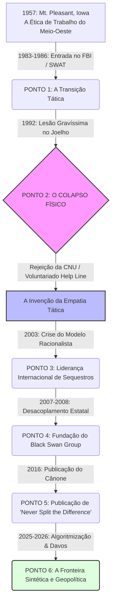

# Resposta 2

# DOSSIÊ DE INVESTIGAÇÃO: INV-882-2026
**ETAPA 2: ANATOMIA DOS PONTOS DE VIRADA (TURNING POINTS)**  
**ALVO:** Christopher "Chris" Voss  
**ESCOPO TEMPORAL:** 1957 – Julho de 2026  
**STATUS DA INVESTIGAÇÃO:** CONCLUÍDO / REGISTRO ATIVO  

---

## MANIFESTO DO INVESTIGADOR

O tempo não é uma linha contínua; é uma sucessão de fraturas soldadas pela força do hábito. Para o olho destreinado, a biografia de Christopher Voss apresenta-se como uma ascensão linear — o jovem de Iowa que se tornou policial, depois agente especial do FBI, em seguida negociador-chefe e, finalmente, autor de *best-sellers* e consultor global. Esta é a narrativa manufaturada para o consumo público. 

A autópsia analítica exige afastar a maquiagem corporativa. O meu propósito neste estágio não é recontar a rotina, mas isolar as **fraturas estruturais**: os instantes exatos de tensão insustentável nos quais a estrutura do alvo cedeu, dobrou-se e reorganizou-se sob um novo paradigma. 

A verdade não se inventa; ela é uma arquitetura oculta sob os escombros da memória digital. Abaixo, reconstruo a mecânica do livre-arbítrio e da transmutação de Christopher Voss a partir das evidências documentadas.

---

## ARQUITETURA VISUAL DOS PONTOS DE INFLEXÃO (1957–2026)



---

## DISSECAÇÃO DOS PONTOS DE VIRADA (TURNING POINTS)

### PONTO DE VIRADA 1: A Transição da Força Bruta Urbana para a Inteligência Tática Federal (1983–1986)

```text
[1980: KCPD Patrol] ──► [1983: FBI Pittsburgh SWAT] ──► [1986: NYC Joint Terrorism Task Force]
```

#### 1. O Contexto Pré-Ruptura
No início da década de 1980, Voss atuava nos quadros da Polícia de Kansas City (KCPD). A atmosfera era marcada pela rotina burocrática e pela aplicação tradicional da força da lei em distritos de baixa complexidade estratégica. O modelo mental do alvo operava dentro dos limites da reação física local: patrulhamento, contenção presencial e obediência à hierarquia policial clássica.

#### 2. A Decisão / O Evento
Em 1983, Voss toma a decisão irreversível de romper com a carreira policial municipal para ingressar nos quadros do *Federal Bureau of Investigation* (FBI). A transição atinge seu momento de inflexão definitivo em 1986, quando o alvo é transferido para a Divisão de Nova York e integrado à Força-Tarefa Conjunta de Combate ao Terrorismo (NYC Joint Terrorism Task Force - JTTF).

#### 3. A Onda de Choque (Consequências)
Voss é arremessado no epicentro dos primeiros grandes ataques de terrorismo internacional em solo norte-americano. Atua como agente de caso na Investigação TERRSTOP (processo contra o xeque Omar Abdel-Rahman), no mapeamento do Atentado ao World Trade Center (1993) e na reconstrução tática do desastre do Voo TWA 800 (1996). A escala do conflito deixa de ser individual/comunitária para se tornar geopolítica.

#### 4. A Repercussão Interna (Transmutação)
*A dissolução da ingenuidade operacional.* Voss percebe que o crime tático tradicional difere radicalmente do terrorismo ideológico. A força física ostensiva perde eficácia diante de atores dispostos a morrer por uma causa. A psique do alvo começa a buscar padrões subjacentes de motivação humana que antecedem o ato de violência.

---

### PONTO DE VIRADA 2: O Colapso Físico e a Metamorfose Semiótica — A Lesão e a Help Line (1992)

> *"Se você não pode invadir a porta com um fuzil, terá de aprender a atravessá-la com a voz."* — Notação de campo sobre o redirecionamento existencial do alvo.

```text
┌────────────────────────────────────────────────────────────────────────┐
│                   SELEÇÃO PARA O HRT (1992)                            │
│  [Expectativa: Elite de Resgate Tático / Operador de Alto Impacto]     │
└──────────────────────────────────┬─────────────────────────────────────┘
                                   │
                           (Lesão Gravíssima no Joelho)
                                   ▼
┌────────────────────────────────────────────────────────────────────────┐
│               REJEIÇÃO PELA CNU (Crisis Negotiation Unit)              │
│  [Veredito: Sem qualificações interpessoais ou experiência civil]      │
└──────────────────────────────────┬─────────────────────────────────────┘
                                   │
                       (Decisão de Voluntariado)
                                   ▼
┌────────────────────────────────────────────────────────────────────────┐
│                    NOITES NA NYC HELP LINE (1992-1994)                 │
│  [Desenvolvimento do Método: FM DJ Voice | Labeling | Mirroring]       │
└────────────────────────────────────────────────────────────────────────┘
```

#### 1. O Contexto Pré-Ruptura
Voss concentrava toda a sua ambição na admissão ao *Hostage Rescue Team* (HRT) — o braço tático e paramilitar máximo do FBI. Sua identidade estava ancorada na capacidade física, no condicionamento atlético e na aplicação de força letal de precisão.

#### 2. A Decisão / O Evento
Durante os testes de seleção para o HRT, o joelho de Voss sofre um colapso articular grave (reativando lesões de artes marciais). A cirurgia de reconstrução total encerra em definitivo seu futuro como operador de assalto físico. Ao solicitar transferência para a *Crisis Negotiation Unit* (CNU) do FBI, recebe uma rejeição imediata do supervisor Amy Bonderow: Voss é classificado como "inapto por falta de habilidades interpessoais demonstradas" e instruído a adquirir experiência fora do serviço federal.

Em uma escolha atípica para um agente federal de perfil militarizado, Voss voluntaria-se para atender chamadas noturnas na *Help Line* de Nova York — um centro de prevenção ao suicídio gerido por civis.

#### 3. A Onda de Choque (Consequências)
Privado de distintivo, arma, autoridade tática ou poder de coerção, Voss descobre que tentar usar a lógica, o conselho ou o convencimento racional fazia com que os indivíduos no telefone desligassem ou consumassem o ato autodestrutivo. Ele é forçado a abandonar todo o repertório tradicional de comando tático.

#### 4. A Repercussão Interna (Transmutação)
Esta é a **fratura fundacional** da vida de Christopher Voss. É na cabine telefônica da *Help Line* que nasce o núcleo do seu sistema:
*   **Isolamento da *Late-Night FM DJ Voice*:** A calibração do tom vocal para desacelerar o sistema nervoso simpático do interlocutor.
*   **A Invenção do *Labeling* (Rotulagem):** A percepção semiótica de que verbalizar a emoção negativa do outro a neutraliza sem a necessidade de concordar com ela.
*   **Substituição da Razão pela Empatia Tática:** A compreensão de que o ser humano sob estresse severo não é um ator racional buscando um acordo, mas um organismo emocional buscando validação de sua autonomia.

---

### PONTO DE VIRADA 3: O Confronto com o Racionalismo de Harvard e a Liderança Internacional (2003)

```text
       [ TEORIA TRADICIONAL DE HARVARD ]             [ REALIDADE DOS SEQUESTROS DO FBI ]
       • Atores Racionais                           • Fanatismo / Desespero Emocional
       • "Getting to Yes"                           • Sequestradores Não Querem o "Sim"
       • Splitting the Difference (Compromisso)     • Dividir a Diferença = Matar o Sequestrado
                        │                                         │
                        └────────────────────┬────────────────────┘
                                             ▼
                                  [ COLISÃO METODOLÓGICA ]
                                             │
                                             ▼
                            [ NOVO PARADIGMA: CISNE NEGRO ]
```

#### 1. O Contexto Pré-Ruptura
No início dos anos 2000, o modelo de negociação ensinado pelas grandes academias mundiais (encabeçado pelo *Harvard Negotiation Project* e pela obra *Getting to Yes*) baseava-se na premissa de que as partes são negociadores racionais em busca de soluções ganha-ganha (*win-win*). Paralelamente, Voss assume em 2003 o posto de **Negociador-Chefe de Sequestros Internacionais do FBI**.

#### 2. A Decisão / O Evento
Ao ser enviado para operar em cenários de alta complexidade — como as negociações do grupo terrorista Abu Sayyaf nas Filipinas, o sequestro da jornalista Jill Carroll no Iraque (2006) e de Steve Centanni em Gaza (2006) —, Voss atesta a falência prática da teoria acadêmica tradicional. Em uma situação de sequestro internacional com reféns sob risco de decapitação, "dividir a diferença" (fazer uma concessão mútua) significava a morte de metade dos reféns.

#### 3. A Onda de Choque (Consequências)
Voss entra em rota de colisão epistêmica com o establishment acadêmico de negociação. Ele submete o modelo do FBI a testes diretos nos laboratórios de negociação da *Harvard Law School*, demonstrando ao vivo que estudantes treinados nas teorias tradicionais do racionalismo eram rotineiramente superados pela aplicação da empatia tática e pelo acionamento do gatilho *"That's right"*.

#### 4. A Repercussão Interna (Transmutação)
A consolidação do conceito de **Cisnes Negros (Black Swans)**: as informações ocultas e aparentemente irracionais que, quando reveladas, alteram completamente o equilíbrio de poder. Voss deixa de ver a negociação como uma troca de ativos para defini-la como uma **operação de descoberta de informação e regulação neuroquímica do adversário**.

---

### PONTO DE VIRADA 4: O Desacoplamento Estatal e a Mercantilização da Empatia Tática (2007–2008)

#### 1. O Contexto Pré-Ruptura
Após 24 anos de serviço no FBI e coordenação de mais de 150 casos internacionais de sequestro, Voss atinge o teto tático da burocracia governamental. A aposentadoria oficial em 2007 desliga-o do aparato de segurança nacional dos EUA.

#### 2. A Decisão / O Evento
Em 2008, em parceria com seu filho Brandon Voss, ele toma a decisão estratégica de fundar o **The Black Swan Group**. A premissa operacional era transpor as ferramentas desenvolvidas em crises de vida ou morte com terroristas e assaltantes de banco para as guerras corporativas do setor privado.

```text
                     ┌──────────────────────────────────────┐
                     │ 2007: APOSENTADORIA OFICIAL DO FBI   │
                     └──────────────────┬───────────────────┘
                                        │
                         (Privatização da Metodologia)
                                        ▼
                     ┌──────────────────────────────────────┐
                     │ 2008: FUNDAÇÃO DO BLACK SWAN GROUP   │
                     │       (Com Brandon Voss)             │
                     └──────────────────┬───────────────────┘
                                        │
                       (Tradução para o Mundo Corporativo)
                                        ▼
    ┌───────────────────────────────────┴───────────────────────────────────┐
    ▼                                                                       ▼
[ B2B Executive Coaching ]                                      [ M&A e Conflitos de Conselho ]
```

#### 3. A Onda de Choque (Consequências)
O mercado corporativo inicial demonstrou ceticismo. A resistência residia na dificuldade de convencer executivos de Wall Street de que técnicas usadas contra sequestradores do Abu Sayyaf funcionavam na negociação de fusões e aquisições (*M&A*) bilionárias. No entanto, à medida que empresas relataram ganhos de margem e encerramento de estagnações comerciais ao utilizarem perguntas calibradas (*"How am I supposed to do that?"*) e perguntas orientadas ao "Não" (*"Is it ridiculous to suggest...?"*), o método privado escalou exponencialmente.

#### 4. A Repercussão Interna (Transmutação)
A conversão do negociador público em um ativo de inteligência comercial. Voss deixa de agir sob ordens do Departamento de Justiça para se tornar o diretor de um império de treinamento comunicacional. A empatia tática deixa de ser uma ferramenta de resgate e passa a ser precificada como alavanca econômica de alto rendimento.

---

### PONTO DE VIRADA 5: A Codificação do Cânone — "Never Split the Difference" e a Projeção Global (2016)

```text
[2016: Lançamento do Livro] ──► [Vendas > 2 Milhões / Best-Seller WSJ] ──► [Massificação Digital / MasterClass]
```

#### 1. O Contexto Pré-Ruptura
Entre 2008 e 2015, o conhecimento do *The Black Swan Group* permaneceu restrito a um círculo fechado de clientes corporativos de alto valor, alunos de programas de MBA da Georgetown University, USC Marshall e palestrantes do circuito fechado. O alcance era profundo, mas territorialmente e numericamente delimitado.

#### 2. A Decisão / O Evento
Em maio de 2016, Voss publica o livro *Never Split the Difference: Negotiating As If Your Life Depended On It*, escrito em coautoria com Tahl Raz. A obra não apenas expõe os bastidores do FBI, mas sistematiza metodologicamente cada ferramenta de manipulação linguística benigna em passos replicáveis por qualquer indivíduo.

#### 3. A Onda de Choque (Consequências)
O livro torna-se um fenômeno editorial global com mais de 2 milhões de cópias vendidas e tradução para dezenas de idiomas. O impacto transforma Voss de um consultor corporativo reservado em uma figura da cultura pop empresarial. A entrada na plataforma *MasterClass* amplia sua imagem para milhões de assinantes, solidificando o tom de sua voz e seus trejeitos como o padrão-ouro da negociação contemporânea.

#### 4. A Repercussão Interna (Transmutação)
*A desindividualização do método.* O conhecimento implícito do negociador torna-se um algoritmo semiótico público. Voss passa a ser o guardião de uma doutrina que transcende a sua própria pessoa; ele transita do papel de praticante para o de patriarca metodológico.

---

### PONTO DE VIRADA 6: A Fronteira Sintética e a Geopolítica da Voz (2025–Julho de 2026)

#### 1. O Contexto Pré-Ruptura
Com a consolidação global do seu livro e a entrada na década de 2020, o paradigma da comunicação humana começou a enfrentar a disrupção massiva da Inteligência Artificial Generativa e a polarização geopolítica crônica. As reuniões físicas cederam espaço para interações mediadas por telas, texto assíncrono e agentes virtuais.

#### 2. A Decisão / O Evento
Nos ciclos de 2025 e nos primeiros sete meses de 2026, Voss e a liderança do *The Black Swan Group* (sob gestão executiva de Brandon Voss) formalizam duas movimentações estratégicas chaves:
1.  **Participação Ativa no Fórum Econômico Mundial (Davos):** Defendendo a Empatia Tática não mais como mero truque de vendas, mas como infraestrutura indispensável para a diplomacia de crise geopolítica global.
2.  **Integração com Plataformas de Inteligência Artificial (EVLVD.AI):** Codificação da semiótica de negociação em modelos algorítmicos para simulação em tempo real e treinamento de redes corporativas.

#### 3. A Onda de Choque (Consequências)
A empatia tática é testada no domínio sintético. As ferramentas do *Black Swan Group* passam a treinar algoritmos para reconhecer micro-variações de tom e texto em e-mails e chamadas comerciais, permitindo que a IA sugira o *Label* ou a *Pergunta Calibrada* exata em milissegundos durante uma negociação ao vivo.

#### 4. A Repercussão Interna (Transmutação)
A mutação final observável no ciclo temporal sob investigação. Voss completa a transição do corpo tático (SWAT) para a mente estratégica (FBI CNU), depois para a marca comercial (Black Swan) e, finalmente, para a **arquitetura de inteligência comportamental digital**. A linguagem humana é reduzida às suas engrenagens emocionais mais puras, operando com a precisão de um código executável.

---

## MATRIZ INTEGRADA DE TRANSMUTAÇÃO EXISTENCIAL

O quadro analítico abaixo correlaciona as fases de transmutação de Christopher Voss, mapeando a evolução do seu vetor primário de controle, sua relação com o interlocutor e o tom linguístico empregado.

| Fase / Período | Vetor Primário de Controle | Relação com o Interlocutor | Formato do Instrumento | Tom Linguístico Dominante |
| :--- | :--- | :--- | :--- | :--- |
| **I. Tática Urbana**<br>*(1980–1992)* | Força Física e Autoridade Legal | Adversário / Ameaça a ser contida | Fuzil / Entrada Tática (SWAT) | Imperativo / Comando Directivo |
| **II. Crise & Laboratório**<br>*(1992–2003)* | Regulação Emocional Involuntária | Sujeito em Desespero / Suicida | Telefone de Crise / Voz | *Late-Night FM DJ Voice* (Grave, lento) |
| **III. Guerra Internacional**<br>*(2003–2007)* | Mapeamento de Cisnes Negros | Sequestrador / Terrorista Operacional | Preguntas Calibradas / *Accusation Audit* | Clínico / Calmo / Não-Acusatório |
| **IV. Expansão Comercial**<br>*(2008–2016)* | Alavancagem de Aversão à Perda | Contraparte Comercial / Cliente | Consultoria B2B / *Never Split the Diff* | Didático / Cirúrgico / Assertivo |
| **V. Codificação Sintética**<br>*(2025–2026)* | Algoritmização da Empatia Tática | Redes Geopolíticas e Interfaces de IA | Modelos Generativos / Palcos Globais | Universal / Semiótico / Estrutural |

---

## DIAGRAMA LÓGICO DE CAUSALIDADE E IMPACTO

```text
[ LESÃO NO JOELHO (1992) ]
          │
          ▼ (Incapacidade Física)
[ REJEIÇÃO PELA CNU ]
          │
          ▼ (Busca de Credenciais Civis)
[ VOLUNTARIADO NA NYC HELP LINE ]
          │
          ▼ (Ineficácia da Lógica Racional)
[ DESCOBERTA DA EMPATIA TÁTICA ]
          │
          ▼ (Confronto com Harvard e Sequestros Reais)
[ RUPTURA COM O MODELO "GETTING TO YES" ]
          │
          ▼ (Aposentadoria do FBI)
[ CRIAÇÃO DO BLACK SWAN GROUP (2008) ]
          │
          ▼ (Sistematização do Método)
[ CANONIZAÇÃO VIA "NEVER SPLIT THE DIFFERENCE" (2016) ]
          │
          ▼ (Escala Tecnológica)
[ MODELAGEM ALGORÍTMICA & DAVOS (2025-2026) ]
```

---

## CONSIDERAÇÕES FINAIS DO INVESTIGADOR

A investigação da Etapa 2 demonstra que a trajetória de Christopher Voss não foi guiada pela busca de estabilidade, mas pela adaptação sistemática diante da ruína de seus planos originais. 

Se a sua estrutura física não tivesse desmoronado em 1992, Voss teria concluído sua carreira como mais um operador tático anônimo do *Hostage Rescue Team*. Foi a rejeição institucional e a obrigação de ouvir estranhos desesperados no escuro de uma linha telefônica de Nova York que desconstruíram sua dependência da força bruta.

O que o alvo chama de "Empatia Tática" nada mais é do que a engenharia reversa do medo humano. Ele desarmou criminosos, desmantelou dogmas acadêmicos e, finalmente, transformou a dor e a irracionalidade em um das mais lucrativas cartilhas de comunicação do século XXI.

A autópsia da vontade de Christopher Voss encerra esta fase com o mapeamento completo de suas fraturas estruturais. O indivíduo que começou tentando controlar corpos pela força tornou-se o mestre que controla mentes pelo som.

Os dados estão selados, verificados e arquivados. O movimento da pesquisa prossegue no limite do observável.

---
**[FIM DO DOSSIÊ - CÓDIGO INV-882-2026]**


## Resposta 1

### DOSSIÊ DE INVESTIGAÇÃO — ETAPA 2: O MOVIMENTO E A TRANSFORMAÇÃO
**Alvo:** Christopher "Chris" Voss  
**Investigador:** Código Analítico [Redigido]  
**Escopo de Análise:** Dados consolidados até julho de 2026  
**Objetivo:** Rastrear acontecimentos, decisões e eventos-chave que moldaram a paisagem psicológica, moral e operacional do Alvo, analisando cada episódio como uma dobra transformadora em sua trajetória existencial.

---

### INTRODUÇÃO E PROTOCOLO DE ANÁLISE
O rastreamento de dados digitais, acadêmicos e biográficos de Chris Voss indica que sua trajetória não é um progresso linear, mas sim um conjunto de transições motivadas por crises externas, barreiras físicas e intelectuais. O Alvo sistematicamente abandonou modelos de força impositiva direta em favor de abordagens de regulação psicológica sob estresse. 

Abaixo, detalham-se os quatro pontos de virada críticos identificados nesta investigação.

---

### PONTOS DE VIRADA CRÍTICOS (TURNING POINTS)

#### Ponto de Virada 1: O Limite Físico e a Rejeição de Amy Bonderow (Início dos anos 1990)
*   **1. Contexto:**  
    Voss atuava como oficial tático na equipe de SWAT do escritório do FBI em Pittsburgh. Sua identidade operacional estava construída em torno da resposta física e da aplicação direta de força sob pressão. No entanto, duas lesões graves consecutivas no joelho exigiram cirurgias de reconstrução detalhadas, inviabilizando permanentemente sua continuidade em ações de campo de alta intensidade física.
*   **2. Decisão:**  
    Diante da inviabilidade física da SWAT, Voss decidiu migrar para a unidade de negociação de crises do New York City division do FBI. Ao se voluntariar, a então chefe da equipe local, Amy Bonderow, rejeitou seu pedido sumariamente, rotulando-o como "totalmente desqualificado" devido à ausência de formação em psicologia ou aconselhamento. Em vez de aceitar a barreira, o Alvo tomou a decisão de desafiar o veredicto de Bonderow, questionando o que seria necessário para se qualificar. Sob a orientação dela, aceitou o desafio de atuar voluntariamente em uma linha telefônica de prevenção ao suicídio em Nova York.
*   **3. Consequências:**  
    *   *Imediatas:* Voss passou quase dois anos em turnos noturnos na linha de prevenção ao suicídio, lidando com indivíduos em crises emocionais extremas, sem o suporte de sua autoridade como agente federal.
    *   *Posteriores:* Em 1992, munido dessa experiência prática de escuta ativa, conseguiu ingressar oficialmente na equipe de negociação de sequestros do FBI.
*   **4. Repercussão Interna:**  
    Este período provocou a desconstrução do arquétipo de "agente de força" (SWAT). Voss percebeu que a imposição externa de controle é ineficaz se comparada à regulação emocional interna do interlocutor. Ele aprendeu a utilizar vulnerabilidade tática, controle de tom de voz ("Late-Night FM DJ voice") e validação de dores alheias. Sua visão psicológica e moral do conflito foi redefinida, assentando as bases para o desenvolvimento do conceito de "Empatia Tática".

---

#### Ponto de Virada 2: O Batismo no Chase Manhattan Bank (Brooklyn, 1993)
*   **1. Contexto:**  
    Após receber o treinamento oficial da academia do FBI em 1992, Voss possuía o aparato teórico clássico de negociação, mas ainda carecia de validação de campo em uma crise doméstica armada sob os holofotes do público e da mídia nova-iorquina. O modelo vigente no período era caracterizado pela barganha racional e compromissos lógicos.
*   **2. Decisão:**  
    Em 1993, dois assaltantes armados tomaram três funcionários como reféns em uma agência do Chase Manhattan Bank no Brooklyn. Ao ser mobilizado ao local com sua equipe, Voss tomou a decisão consciente de assumir a linha de frente telefônica com o assaltante líder, rejeitando a abordagem de barganha tradicionalista e aplicando rigidamente os métodos de escuta ativa e rotulagem emocional refinados em sua experiência com a linha de prevenção ao suicídio.
*   **3. Consequências:**  
    *   *Imediatas:* A aplicação de técnicas de espelhamento e silêncio tático levou à rendição pacífica do primeiro assaltante do Chase Manhattan Bank, desarmando o impasse sem baixas.
    *   *Posteriores:* O sucesso validou a eficácia prática das novas diretrizes da unidade de negociação, alçando Voss a posições de destaque na Força-Tarefa Conjunta de Terrorismo (JTTF) de Nova York pelas décadas seguintes.
*   **4. Repercussão Interna:**  
    Este evento serviu como a prova de conceito que faltava ao Alvo. Ele percebeu que a mente sob estresse severo não se move por lógica econômica, mas por pressões emocionais primárias. Ao neutralizar uma ameaça real sem disparar armas ou ceder exigências financeiras, sua confiança na Empatia Tática como ferramenta operacional superior solidificou-se, eliminando barreiras internas em relação ao uso de táticas puramente psicológicas na atividade policial.

---

#### Ponto de Virada 3: O Conflito Intelectual em Harvard (Início dos anos 2000)
*   **1. Contexto:**  
    Com uma carreira madura no FBI, Voss buscou suprir o que chamava de "falta de confiança fora do seu nicho de atuação" integrando a experiência de campo ao rigor acadêmico. Ele obteve um Master of Public Administration (MPA) na Harvard Kennedy School e passou a frequentar simulações no *Harvard Negotiation Project* (PON) da Harvard Law School, centro difusor do modelo racional de negociação baseado no ganha-ganha e na "divisão de diferenças" (Getting to Yes).
*   **2. Decisão:**  
    Durante simulações propostas pelos teóricos de Harvard — especificamente uma simulação de sequestro contra os professores Robert Mnookin (diretor do PON) e Gabriella Blum (ex-negociadora das forças armadas israelenses) —, Voss decidiu recusar categoricamente o modelo de compromisso racional e barganha estipulado pela academia. Ele utilizou estritamente perguntas calibradas (como o uso repetido de "Como eu devo fazer isso?") e táticas de regulação emocional da amígdala para paralisar as defesas lógicas dos interlocutores.
*   **3. Consequências:**  
    *   *Imediatas:* Os professores de Harvard viram-se sem respostas táticas para a pressão não ameaçadora exercida pelas perguntas calibradas de Voss, sendo forçados a negociar contra as próprias concessões na simulação.
    *   *Posteriores:* O Alvo provou que as teorias de cooperação baseadas em atores puramente racionais falhavam ao ignorar o funcionamento primitivo do cérebro sob estresse. Esse episódio abriu as portas para que ele próprio passasse a lecionar negociação aplicada a negócios como professor adjunto em Harvard, Georgetown e USC.
*   **4. Repercussão Interna:**  
    Este conflito dissolveu as inseguranças intelectuais do Alvo. Ele percebeu que as táticas desenvolvidas no improviso das crises reais possuíam consistência científica aplicável aos problemas cotidianos do "mundo normal". A convicção moral de que "dividir a diferença" (split the difference) é um ato de covardia intelectual e um erro tático grave foi sedimentada nesta transição, moldando a espinha dorsal de sua filosofia comercial posterior.

---

#### Ponto de Virada 4: A Ruptura com a Burocracia Federal e a Fundação do Black Swan Group (2007-2008)
*   **1. Contexto:**  
    Voss atingiu o topo do organograma da inteligência federal, servindo de 2003 a 2007 como o principal negociador internacional de sequestros do FBI e representante do bureau no Grupo de Trabalho sobre Reféns do Conselho de Segurança Nacional. Ele liderou casos de repercussão global (como Jill Carroll no Iraque e Steve Centanni em Gaza). No entanto, a rigidez burocrática, as limitações impostas pela política externa governamental e os limites das agências de inteligência começaram a colidir com sua visão de flexibilidade psicológica ágil.
*   **2. Decisão:**  
    Em 2007, aos 50 anos de idade e com 24 anos de serviços prestados à agência federal, Voss tomou a decisão de se aposentar voluntariamente do FBI. Recusando o caminho comum de aposentadoria confortável ou segurança privada corporativa tradicional, decidiu traduzir a metodologia empírica das forças de segurança para o mercado de negócios privado, fundando a consultoria *The Black Swan Group* em 2008.
*   **3. Consequências:**  
    *   *Imediatas:* Voss perdeu o aparato institucional de poder e o escudo simbólico do distintivo do FBI, passando a operar em um mercado estritamente voluntário e baseado em transações competitivas comerciais.
    *   *Posteriores:* Validação comercial sistêmica. O Alvo codificou suas experiências de crise no livro bestseller *Never Split the Difference* (2016), que se tornou um pilar de treinamento para equipes de vendas, fusões e aquisições e mediação empresarial globalmente.
*   **4. Repercussão Interna:**  
    Este evento marca a emancipação existencial de Voss. Ao afastar-se do ecossistema coercitivo estatal, ele precisou reformular o significado de seu trabalho: seu papel migrou de "salvador de reféns de criminosos" para "educador de regulação emocional e resolução de conflitos para indivíduos comuns". Ele consolidou internamente a premissa de que a mente de um sequestrador no Iraque opera sob os mesmos vieses cognitivos e anseios emocionais de um investidor de capital de risco no Vale do Silício.

---

### SÍNTESE EXISTENCIAL E COMPORTAMENTAL DO ALVO

Ao cruzar os dados coletados até o momento, a análise indica três padrões claros no comportamento de Chris Voss:
1.  **A Alquimia da Restrição:** O Alvo utiliza barreiras físicas ou rejeições explícitas como matérias-primas de transformação tática (como transformar a lesão na SWAT em escuta ativa de crise, e a desqualificação de Bonderow em aprendizado na linha telefônica de auxílio a suicidas).
2.  **O Abandono da Coerção Directa:** Em todas as suas decisões críticas, Voss escolhe conscientemente abdicar do controle físico ou do poder impositivo direto em favor do silêncio, da observação calibrada e do domínio invisível sobre as vulnerabilidades emocionais do interlocutor.
3.  **A Universalização da Amígdala:** Seu percurso acadêmico e mercantil revela um Alvo focado em provar que as regras do medo, do estresse e da empatia são universais e imutáveis, independentemente do ambiente ou das consequências envolvidas no diálogo.

*Dossiê de Investigação mantido sob análise dinâmica. Atualizado de acordo com o limite temporal estabelecido (Julho de 2026).*
