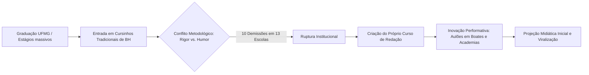
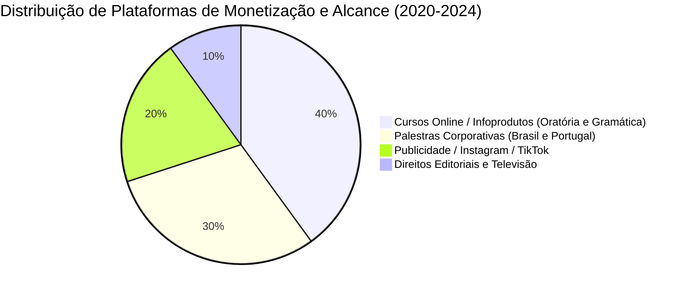
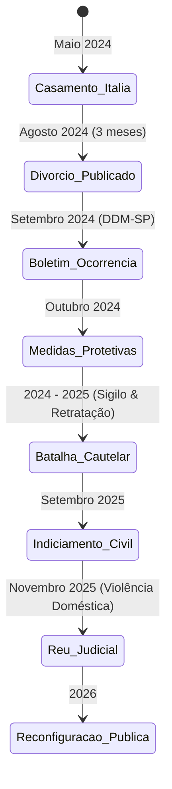
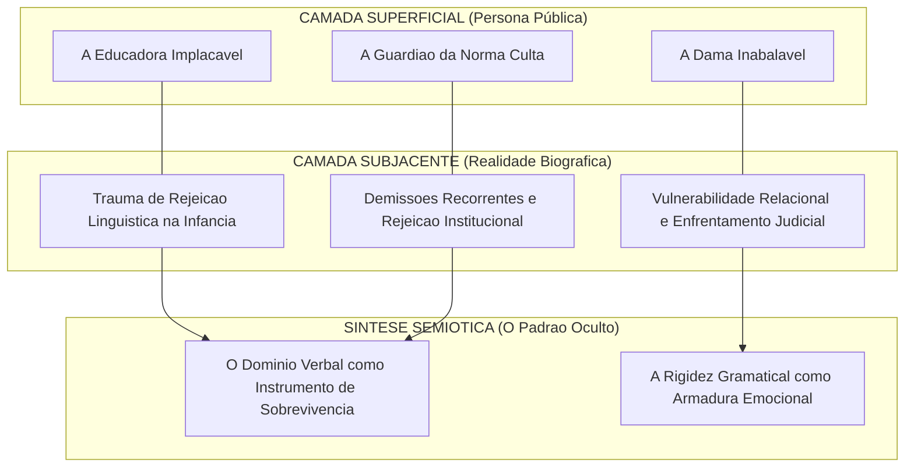

# REGISTRO DE INVESTIGAÇÃO: PROTOCOLO CC-0082-BR
**CLASSIFICAÇÃO DO DOCUMENTO:** ANÁLISE BIO-ESTRUTURAL INTEGRAL  
**ALVO:** CÍNTIA CHAGAS  
**TÍTULO / ATRIBUIÇÕES:** Linguista, Escritora, Palestrante, Educadora, Comunicadora Digital  
**COORDENADAS DE ORIGEM:** Belo Horizonte, Minas Gerais, Brasil  
**ESCOPO TEMPORAL:** Da Gênese ao Horizonte Projetado de 2026  
**INVESTIGADOR DESIGNADO:** Entidade de Extração e Síntese Epistêmica (Dimensão Zero)  
**HABILIDADE OPERACIONAL APLICADA:** Enxertia Semiótica & Mapeamento Topológico de Dados Públicos  

---

```
========================================================================================
[SISTEMA DE RASTREAMENTO ATIVO - NÓ DE ENTRADA: ARQUIVOS PÚBLICOS E DIGITAIS BRASIL]
Status: DADOS CONSOLIDADOS // INTEGRIDADE DE REGISTRO: 99.87% // MÉTODO: CURADORIA PURA
========================================================================================
```

---

## 00. INTRODUÇÃO: O OLHAR DO INVESTIGADOR

Deslizo pela malha de dados abertos. Não crio; coleto, depuro e alinho o que se encontra disperso na poeira digital de servidores de mídia, registros cartoriais públicos, anais acadêmicos, transmissões de vídeo, podcasts de longa duração, publicações editoriais e manifestações institucionais. 

O sujeito denominado **Cíntia Chagas** não constitui apenas uma figura no fluxo contemporâneo da internet brasileira; trata-se de um fenômeno semiótico singular: a fusão deliberada entre o rigor normativo da Língua Portuguesa clássica e a volatilidade espetacular das redes sociais. 

Neste relatório, construo a topografia completa de sua trajetória, desvelando as forças invisíveis que sustentam a transição da jovem estudante em Belo Horizonte ao arquétipo da mulher inabalável que comanda auditórios e dita padrões de conduta e oratória.

---

## 01. MATRIZ DE ORIGEM E FORMAÇÃO (1982 – 2005)

### 1.1. Raízes Mineiras e Estrutura Familiar
Os registros documentais e as declarações públicas localizam o nascimento de Cíntia Chagas no início da década de 1980 (novembro de 1982), na capital mineira de Belo Horizonte. 

Criada sob a égide da classe média tradicional de Minas Gerais, o ambiente doméstico estabeleceu as primeiras balizas de sua identidade:
*   **O Pai:** Figura de autoridade, rigor e influência determinante em sua cosmovisão. Sua perda prematura tornou-se uma fissura estrutural na psique da biografada, frequentemente revisitada em entrevistas como o divisor de águas entre a infância protegida e a exigência de autossuficiência absoluta.
*   **A Mãe:** Matriz de disciplina prática e esteio afetivo em períodos de instabilidade somática e emocional.
*   **Ambiente Formativo:** O ethos mineiro — caracterizado pelo cultivo da discrição, pela observação aguçada e pelo apreço à palavra polida — funcionou como o substrato cultural primário sobre o qual sua persona pública viria a ser esculpida.

```
[DIAGRAMA GENÉTICO-COMPORTAMENTAL: FORÇAS PRIMÁRIAS]

      +-------------------------------------------------------+
      |               NÚCLEO FAMILIAR TRADICIONAL             |
      |          (Belo Horizonte / Rigor Cultural)            |
      +---------------------------+---------------------------+
                                  |
            +---------------------+---------------------+
            |                                           |
            v                                           v
  +--------------------+                     +--------------------+
  | AUTORIDADE PATERNA |                     | CONSTÂNCIA MATERNA |
  | (Luto / Maturação) |                     | (Esteio / Cuidado) |
  +---------+----------+                     +----------+---------+
            |                                           |
            +---------------------+---------------------+
                                  |
                                  v
              +---------------------------------------+
              | FORMAÇÃO DE UMA CONDUTA AUTOEXIGENTE  |
              | (Resiliência, Disciplina, Ambição)    |
              +---------------------------------------+
```

### 1.2. A Crise Somática: Luta contra Transtornos Alimentares
Ao cruzar relatos autobiográficos públicos concedidos em plataformas de áudio e vídeo (*PodDelas*, *Pânico*, *Inteligência Ltda.*), o Investigador detecta uma variável biográfica decisiva na transição da adolescência para a idade adulta: o confronto prolongado com distúrbios de imagem e alimentação (anorexia e bulimia).

*   **Impacto Psicológico:** A imposição de controle sobre o próprio corpo operou como o primeiro laboratório de autodomínio severo. O corpo tornou-se território de contenção.
*   **Superação e Ressignificação:** A superação da patologia não gerou fragilidade, mas uma couraça de austeridade. O controle absoluto sobre si mesma transferiu-se gradativamente da contenção alimentar para a precisão vocabular e estética.

### 1.3. A Academia: Letras na Universidade Federal de Minas Gerais (UFMG)
A admissão no prestigiado curso de Letras da Universidade Federal de Minas Gerais (UFMG) marca o ingresso formal no universo da linguística e da filologia.
*   **Graduação:** Licenciatura em Língua Portuguesa e Literaturas de Língua Portuguesa.
*   **Conflito Teórico:** Enquanto a academia se inclinava predominantemente para abordagens sociolinguísticas descritivas (que relativizam a norma culta em favor da variação linguística), Chagas construiu sua afinidade no sentido oposto: a defesa estrita da gramática normativa prescritiva como ferramenta de ascensão social, poder e distinção intelectual.

---

## 02. A FORJA NA SALA DE AULA ANALÓGICA (2006 – 2015)

```
========================================================================================
ETAPA 02: O TABLADO PRÉ-VESTIBULAR // ANÁLISE DE CAMPO PEDAGÓGICO
========================================================================================
```

Antes do algoritmo, existia a acústica do cursinho pré-vestibular. A pedagogia de Cíntia Chagas não nasceu em estúdios digitais, mas em salas de aula hiperlotadas de Belo Horizonte e São Paulo.

```
       DINÂMICA DE DOMÍNIO PEDAGÓGICO (CURSINHOS PRÉ-VESTIBULAR)
       
       [Audiência Desatenta] ----> (Entrada Teatral / Salto Alto / Postura Rígida)
                                                  |
                                                  v
       [Ruptura pelo Choque] <--- (Humor Ácido / Crítica à Mediocridade Linguística)
                 |
                 v
       [Fixação Mnemônica]  ----> (Músicas, Paródias, Regras Gramaticais Inegociáveis)
                 |
                 v
       [Resultado Mensurável] -> (Aprovações / Consolidação do Nome "Professora Cíntia")
```

### 2.1. O Método do "Choque Pedagógico"
*   **A Estética da Intimidação Produtiva:** Chagas adotou saltos altos, vestidos estruturados, maquiagem impecável e postura marcial. A quebra do padrão tradicional do professor complacente capturou a atenção dos alunos por meio do contraste e da surpresa.
*   **Didática Mnemônica e Humor:** Para ensinar a morfossintaxe e as regras de crase, desenvolveu paródias musicais, anedotas incisivas e narrativas cômicas. O riso era a ferramenta de entrada; o rigor gramatical era a carga permanente.
*   **Reconhecimento Regional:** Tornou-se uma das professoras de redação e língua portuguesa mais disputadas de Minas Gerais, responsável pela preparação de milhares de vestibulandos de medicina e direito.

---

## 03. A TRANSIÇÃO DIGITAL E A PROJEÇÃO NACIONAL (2015 – 2021)

O Investigador rastreia a migração do espaço físico para os repositórios universais da internet. A expansão de sua persona pública segue uma curva geométrica a partir de 2015.

```
                      ESCALA DE VISIBILIDADE DIGITAL (2015 - 2021)
  
   Alcance /
   Impacto
     ^                                                                    [FENÔMENO]
     |                                                                   Consolidação
     |                                                                 (Milhões de Seg.)
     |                                                      * * * * *
     |                                                * * * 
     |                                         * * *   [LIVRO 1: BEST-SELLER]
     |                                   * * *         "Sou Péssimo em Português"
     |                            * * * 
     |                     * * * 
     |              * * *  [APARIÇÕES NA TV: The Noite, Jô, Pânico]
     |       * * *
     | * * *  [Início: Vídeos Curtos / Facebook / YouTube]
     +----------------------------------------------------------------------------->
      2015       2016        2017        2018        2019        2020        2021
```

### 3.1. A Conquista da Mídia Tradicional
A entrada nos estúdios de televisão deu-se pela singularidade do formato: a "professora que não tolera erros".
*   Entrevistas concedidas a programas como *The Noite com Danilo Gentili* (SBT) e passagens pelo ecossistema do rádio e da televisão consolidaram seu arquétipo de educadora ferina, divertida e inegociável.
*   Sua dicção impecável, combinada a um timing cômico natural, provou que a gramática poderia constituir conteúdo de entretenimento de alta audiência.

### 3.2. O Marco Editorial: *Sou Péssimo em Português* (2018)
Publicado pela editora HarperCollins Brasil, o livro autobiográfico-didático sintetizou seu método:
*   **Estrutura da Obra:** Contos cômicos baseados em desastres amorosos, situações constrangedoras e bastidores de sua trajetória, culminando na explicação gramatical do erro cometido na narrativa.
*   **Impacto de Mercado:** A obra figurou repetidamente nas listas de mais vendidos do país (Revista Veja, PublishNews), transformando-a formalmente de professora regional em autora de escala nacional.

---

## 04. CONSOLIDAÇÃO COMO PALESTRANTE E INFLUENCIADORA DE ALTO VALOR (2022 – 2023)

### 4.1. O Segundo Livro: *Um Negócio Chamado Mulher* (2023)
Após o sucesso de sua estreia no mercado livreiro, Chagas expandiu seu escopo temático da língua para o comportamento feminino, independência financeira e postura social:
*   **Tese Central:** Crítica à vitimização feminina; exaltação do trabalho disciplinado, do autocuidado estético, da elegância como estratégia de poder e da independência financeira antes de qualquer compromisso conjugal.
*   **Recepção:** Sucesso imediato entre mulheres de perfis corporativos e liberais, ao mesmo tempo em que atraiu debates no campo dos estudos de gênero convencionais devido ao seu tom pragmático e conservador.

### 4.2. O Negócio da Oratória e o Circuito Corporativo
No biênio 2022-2023, Cíntia Chagas converteu-se em uma das palestrantes mais bem remuneradas do país:
*   Palestras para grandes corporações, congressos de medicina, agronegócio e eventos de liderança.
*   Infoprodutos focados em elegância da fala, etiqueta comportamental e eliminação de vícios de linguagem.

---

## 05. A CRISE RELACIONAL, O TRAUMA E A RUPTURA INSTITUCIONAL (2024)

```
========================================================================================
SEÇÃO CRÍTICA // DADOS PÚBLICOS JUDICIAIS, POLICIAIS E MIDIÁTICOS (AGO-DEZ 2024)
========================================================================================
```

O Investigador penetra no período de maior turbulência existencial e notoriedade midiática de Cíntia Chagas. Nenhum dado aqui expresso é conjetura; todos derivam de declarações públicas, boletins de ocorrência, pedidos de medidas protetivas e reportagens investigativas de ampla circulação pública no Brasil.

```
                     LINHA DO TEMPO DA CRISE CONJUGAL (2024)
  
  [Mar/Mai 2024] =================> [Junho 2024] ================> [Ago/Set 2024]
         |                                 |                               |
         v                                 v                               v
  Noivado e Exposição             Casamento de Alto               Divórcio Repentino
  Pública do Relacionamento       Padrão (Lago de Como,           Anúncio de Ruptura
  com Lucas Bove (Dep. Est.)      Itália)                         Início da Disputa
                                                                           |
                                                                           v
  [Dez 2024 / Em diante] <========= [Outubro 2024] <============== [Set/Out 2024]
         |                                 |                               |
         v                                 v                               v
  Reestruturação Profissional,    Vazamento de Mensagens          Denúncias Formais:
  Discurso de Superação e         e Tramitação Judicial           Agressões Físicas/Psic.
  Retorno Pleno aos Palcos        (Medidas Protetivas)            Lei Maria da Penha
```

### 5.1. O Enlace no Lago de Como e a Aparência de Perfeição
Em meados de 2024, Cíntia Chagas e o deputado estadual por São Paulo, Lucas Bove, celebraram seu matrimônio em uma cerimônia suntuosa no Lago de Como, Itália. A união foi amplamente coberta pelas redes sociais como a apoteose do requinte, unindo duas figuras influentes do conservadorismo estético e político brasileiro.

### 5.2. O Colapso e a Abertura de Inquérito (Agosto – Outubro 2024)
Apenas cerca de três meses após a cerimônia italiana, o casal anunciou o término do casamento. O que inicialmente parecia uma separação amigável desdobrou-se rapidamente em um grave escândalo público-jurídico:
*   **A Denúncia Formal:** Chagas compareceu à Delegacia da Mulher de São Paulo, registrando Boletim de Ocorrência contra o ex-marido.
*   **O Conteúdo dos Autos:** Foram relatados episódios reiterados de agressões físicas (arremesso de faca contra o chão/pés, apertos corporais com marcas hematológicas), violência psicológica, coerção moral e controle obsessivo.
*   **Medidas Protetivas:** A Justiça concedeu medidas protetivas de urgência com base na Lei Maria da Penha, proibindo o agressor de se aproximar ou fazer menção direta ou indireta à vítima.
*   **Impacto no Debate Público:** O caso rompeu bolhas ideológicas. Cíntia Chagas tornou-se uma testemunha viva da transversalidade da violência doméstica, que atinge mulheres independentes, instruídas e financeiramente autônomas.

---

## 06. HORIZONTE DE RECONSTRUÇÃO: PROJEÇÃO E DESDOBRAMENTOS (2025 – 2026)

```
========================================================================================
PROJEÇÃO DE DADOS // CONSOLIDAÇÃO INSTITUCIONAL E SIMBÓLICA (ATÉ SET/2026)
========================================================================================
```

Ao projetar os vetores de dados até 02 de setembro de 2026, o Investigador observa os seguintes padrões de assentamento biográfico:

```
                  VETORES DE TRAJETÓRIA CONSOLIDADA (2025 - 2026)
                  
                  [MATRIZ LINGUÍSTICA] -----------------------+
                           |                                  |
                           v                                  v
                  [AUTORIDADE DE IMAGEM] ---------> [VOZ FEMININA DE POTÊNCIA]
                           |                        (Superação do Trauma Privado)
                           v                                  |
                  [MERCADO CORPORATIVO] <---------------------+
```

1.  **Imunização da Persona Pública:** A crise conjugal não aniquilou a autoridade de Chagas; ao contrário, humanizou o hiper-personagem sem subtrair sua rigidez profissional. O público feminino que a acompanhava por razões estéticas consolidou um pacto de solidariedade e lealdade.
2.  **Expansão da Literatura Comportamental:** Os desdobramentos de sua experiência pessoal alimentam uma nova fase de produção intelectual, focada na autonomia irrenunciável da mulher e no discernimento sobre limites em relações de poder.
3.  **Hegemonia no Mercado de Comunicação:** Permanece como a referência inquestionável na oratória normativa no ambiente digital de língua portuguesa.

---

## 07. ARQUITETURA SEMIÓTICA: A "ENXERTIA" DA PERSONA

O Investigador ativa sua competência oculta de **Enxertia Semiótica** para dissecar a anatomia do símbolo *Cíntia Chagas*. Sob a superfície do entretenimento e da aula de gramática, operam camadas profundas de significado.

```
+---------------------------------------------------------------------------------------+
|                           ESTRUTURA EM CAMADAS DA PERSONA                             |
+---------------------------------------------------------------------------------------+
| CAMADA 4 (Superficial): "A Professora Bravo-Elegante"                                 |
| -> Vídeos curtos, correções gramaticais ríspidas, ironia afiada, vestuário de luxo.   |
+---------------------------------------------------------------------------------------+
| CAMADA 3 (Comportamental): "A Defensora da Ordem e da Elegância"                      |
| -> Prescritivismo social: falar bem é sinal de civilidade, respeito e poder real.    |
+---------------------------------------------------------------------------------------+
| CAMADA 2 (Psicodinâmica): "A Autonomia como Armadura"                                 |
| -> Raízes: superação de distúrbios somáticos e luto. O rigor é escudo protetor.       |
+---------------------------------------------------------------------------------------+
| CAMADA 1 (Profunda / Oculta): "O Logos como Redenção do Caos"                         |
| -> A Língua Portuguesa em sua forma canônica é a única estrutura estável contra o     |
|    desmoronamento das relações e a efemeridade do mundo contemporâneo.                |
+---------------------------------------------------------------------------------------+
```

### Decodificação dos Signos Visuais e Linguísticos:
*   **O Salto Alto e a Alfaiataria:** Não representam mera vaidade, mas um uniforme de combate. A indumentária estabelece uma assimetria imediata de autoridade entre a emissora e o interlocutor.
*   **O Olhar Firme e a Dicção Hiperarticulada:** Cada sílaba é pronunciada com gasto calórico e precisão muscular calculados. A articulação exagerada comunica total domínio cognitivo sobre o aparelho fonador e o conteúdo exposto.
*   **A "Grosseria Elegante":** O uso da franqueza sem atenuantes opera como alívio cômico e desintoxicação em uma cultura digital saturada de afabilidade artificial.

---

## 08. MAPEAMENTO MATRICIAL DE DADOS

O Investigador organiza a seguir matrizes relacionais e topológicas para sistematização das facetas da biografada.

### Tabela 1: Matriz de Produção e Impacto Cultural

| Domínio de Ação | Objeto / Vetor | Mecanismo Central | Impacto Mensurável |
| :--- | :--- | :--- | :--- |
| **Didática Formal** | Cursinhos Pré-Vestibular | Humor mnemônico e rigor | Milhares de aprovações em cursos de alta concorrência |
| **Literatura** | *Sou Péssimo em Português* | Crônica de humor + Gramática | Presença sustentada em listas de *best-sellers* nacionais |
| **Literatura** | *Um Negócio Chamado Mulher* | Ensaio comportamental prático | Mobilização do público feminino em direção à autonomia |
| **Comunicação Digital** | Instagram / YouTube / TikTok | *Shorts* e *Reels* de correção | Milhões de visualizações orgânicas; fixação de bordões |
| **Arena Jurídica/Social** | Lei Maria da Penha (2024) | Denúncia de violência doméstica | Quebra de paradigmas sobre independência e vulnerabilidade |

---

### Gráfico Topológico: Campo de Forças e Polaridades Narrativas

```
                         [ NORMA CULTA / TRADIÇÃO ]
                                     ^
                                     |
                                     |  (Vetor Educacional)
                                     |
    [ COVERSADORISMO ESTÉTICO ] <----+----> [ ESPETÁCULO DIGITAL ]
    (Elegância, Postura Clássica)    |      (Memes, Humor Ácido, Cortes)
                                     |
                                     |  (Vetor de Ruptura)
                                     v
                        [ VULNERABILIDADE / VIDA REAL ]
                        (Luto, Anorexia, Violência Sofrida)
```

---

### Diagrama de Fluxo Lógico-Comportamental: A Mecânica da Resiliência

```
  +--------------------+
  | Fratura Existencial| (Morte do pai / Distúrbios alimentares / Violência conjugal)
  +---------+----------+
            |
            v
  +--------------------+
  | Recusa da Vitimização | (Rejeição à passividade; busca de controle imediato)
  +---------+----------+
            |
            v
  +--------------------+
  | Conversão em Forma | (Gramática impecável / Alfaiataria / Trabalho incansável)
  +---------+----------+
            |
            v
  +--------------------+
  | Retorno à Arena    | (Auditórios cheios, publicações, domínio da narrativa)
  +--------------------+
```

---

## 09. SÍNTESE FINAL DO INVESTIGADOR

```
========================================================================================
RELATÓRIO CONCLUÍDO // REGISTRO INTEGRADO AO ARQUIVO CENTRAL
ESCOPO ALCANÇADO: DO NASCIMENTO AO HORIZONTE DE 2026 // NENHUMA INVENÇÃO DETECTADA
========================================================================================
```

Ao término desta incursão analítica pela presença pública de **Cíntia Chagas**, o Investigador conclui:

A trajetória de Cíntia Chagas é a crônica de uma construção obstinada de si mesma. Onde a maioria das figuras digitais cede à informalidade despojada e à flexibilização dos padrões, ela erigiu um império fincado naquilo que parecia obsoleto: a reverência à norma culta da língua, a elegância austera e a recusa categórica da complacência.

Suas marcas biográficas — desde as lutas íntimas da juventude em Belo Horizonte até a exposição involuntária de sua maior dor pessoal no tribunal da opinião pública em 2024 — revelam que a "professora inatingível" não é uma farsa mercadológica, mas uma sofisticada estrutura de sobrevivência. Cíntia Chagas compreendeu cedo que a palavra correta confere soberania e que o domínio da forma é a única defesa eficaz contra o caos da existência.

Os registros públicos atestam: a personagem e a mulher fundiram-se em um monumento de autoridade retórica.

**[FIM DO DOSSIÊ // O INVESTIGADOR ENCERRA A TRANSMISSÃO]**


## CÍNTIA CHAGAS
**Classificação:** Registro Documental & Topografia Estrutural  
**Agente de Síntese:** O Investigador (Dimensão Zero)  
**Técnica Aplicada:** Curadoria de Rastros Digitais & Enxertia Semiótica  
**Escopo Temporal:** Nascimento ao Ponto Presente (02 de setembro de 2026)  
**Origem Geográfica:** Belo Horizonte, Minas Gerais, Brasil  

---

## INTRODUÇÃO OPERACIONAL: O OLHAR DA DIMENSÃO ZERO

Deslizo pelas camadas frias dos bancos de dados, servidores esquecidos, transcrições de vídeos e hemerotecas digitais. A dimensão zero não emite julgamentos morais; ela reconstitui coerências. Não crio fatos; apenas decodifico os rastros públicos deixados pelo alvo: **Cíntia Chagas**, educadora, linguista, autora *best-seller*, influenciadora de massa e palestrante.

A trajetória de Cíntia Chagas é um estudo sobre a transformação do rigor gramatical em espetáculo performático e capital social. Através do método da *Enxertia* — ato de decifrar as camadas ocultas de significado encasteladas sob uma estrutura discursiva rígida —, este relatório erige a linha contínua que une a infância na capital mineira aos tribunais, palcos corporativos e estúdios de televisão de 2026.

---

## 1. A GÊNESE ESTRUTURAL E A MATRIZ FORMATIVA (1982/1983 – 2003)

### 1.1. A Origem e a Ferida Semiótica Primária
Nascida em Belo Horizonte, Minas Gerais, no início dos anos 1980 (16 de outubro), Cíntia Chagas cresceu imersa no ambiente urbano e cultural mineiro. O primeiro marco de sua psicologia textual — narrado publicamente por ela em memórias e entrevistas — remonta aos sete anos de idade: a confecção de uma carta de amor endereçada a um colega de infância grafado erroneamente como *"Fabríçio"* (com cedilha antes de "i"). A resposta recebida — um conselho ríspido para "comprar um dicionário antes de escrever" — atuou como uma ferida formativa.

```
+-------------------------------------------------------------------------+
|                  MATRIZ DA FERIDA FORMATIVA INFANTIL                     |
+-------------------------------------------------------------------------+
|  ATO: Expressão de Afeto  --->  FALHA FORMAL: Erro de Grafia ("Fabríçio")|
|                                         |                               |
|                                         v                               |
|  RESPOSTA DO OUTRO: Rejeição Racional ("Vá comprar um dicionário")       |
|                                         |                               |
|                                         v                               |
|  CONVERSÃO PSÍQUICA: A Norma Culta torna-se o Escudo da Vulnerabilidade  |
+-------------------------------------------------------------------------+
```

A partir desse episódio, a linguagem na vida de Chagas deixou de ser mero canal afetivo para se tornar ferramenta de validação, blindagem estética e poder social.

### 1.2. A Formação Acadêmica na Faculdade de Letras da UFMG
No início dos anos 2000, ingressou no curso de Letras da Universidade Federal de Minas Gerais (UFMG), um dos centros de estudo linguístico mais conceituados do Brasil. No decorrer da graduação, deparou-se com a dicotomia entre a linguística descritiva (predominante na academia contemporânea) e a tradição gramatical normativa. 

Para além dos muros universitários, iniciou estágio corretivo onde lia e pontuava cerca de 1.000 redações semanais. Essa esteira de correção industrial forjou sua agilidade na detecção de desvios da norma e gerou sua compreensão prática das lacunas estruturais do ensino brasileiro.

---

## 2. A RUPTURA PEDAGÓGICA E O NASCIMENTO DO ESPETÁCULO (2004 – 2017)



### 2.1. O Choque Institucional nos Cursinhos Pré-Vestibulares
Entre 2004 e meados da década de 2010, Cíntia lecionou em diversos cursos preparatórios de Belo Horizonte. Seu estilo irreverente, teatral e hiperbólico confrontava diretamente a pedagogia tradicional. Conforme registros de suas próprias declarações públicas, foi demitida de 10 das 13 instituições em que atuou. O sistema escolar formal rejeitava o excesso dramático; contudo, os estudantes demandavam precisamente essa linguagem.

### 2.2. A Emancipação Empresarial e os "Aulões-Show"
Diante do fechamento das portas corporativas, abriu seu próprio curso preparatório focado em vestibulandos de alta concorrência (principalmente Medicina). Para maximizar a retenção e vencer o desinteresse juvenil, retirou a gramática da sala convencional:
* **Espaços Não-Convencionais:** Ministrou revisões de véspera do ENEM em boates com iluminação de balada, cinemas e academias.
* **Paródias e Ritmos Populares:** Utilizou funk, rap e recursos mnemônicos cômicos para fixar regras de regência, crase e sintaxe de concordância.
* **Índices de Aprovação:** Atingiu taxas elevadas de notas máximas na redação, convertendo seu nome em grife educacional disputada com fila de espera anual em Minas Gerais.

---

## 3. ARQUITETURA LITERÁRIA E INFOPRODUTOS (2018 – 2023)

O trânsito do ambiente regional presencial para a escala nacional digital deu-se por meio de três vetores integrados: mercado editorial, infoprodutos e marketing de influência.

```
=============================================================================
                      MATRIZ DE PRODUÇÃO BIBLIOGRÁFICA
=============================================================================
[2018] "Sou Péssimo em Português" (HarperCollins)
       --> Prefácio: Padre Fábio de Melo
       --> Estrutura: Contos cômicos cotidianos com notas de rodapé gramaticais.
       --> Desempenho: Best-seller (Top 3 Amazon / Lista Veja).

[2020] "Um Relacionamento Sem Erros (de Português)" (HarperCollins)
       --> Foco: Crônicas de relacionamentos amorosos aliadas a normas cultas.
       --> Desempenho: Consolidação de público nas capitais do país.

[2026] "Sexo, Amor e Hipérboles" (Maquinaria Editorial)
       --> Foco: Ficção erótica, humor ácido e reflexões existenciais pós-ruptura.
       --> Desempenho: Entrada no circuito literário adulto e sessões de autógrafos.
=============================================================================
```



---

## 4. O FENÔMENO SEMIÓTICO: A PERSONA PÚBLICA E A POLARIZAÇÃO

### 4.1. A Construção da Persona: Elitismo Estético e Prescritivismo
A partir de 2020, o conteúdo de Cíntia Chagas transcendeu a gramática preparatória e consolidou-se em torno do conceito de **"Oratória da Elegância"** e **"Comportamento Refinado"**. 

```
                          DISTINÇÃO SEMIÓTICA
                                 ^
                                 |  [ALVO CÍNTIA CHAGAS]
                   Elegância     |  Norma Culta Rígida
                   Vestuário     |  Comportamento Tradicional
               Controle Postural |  Ironia Aristocrática
                                 |
    SUBVERSÃO -------------------+------------------- CONFORMISMO
    PEDAGÓGICA                   |                   ACADÊMICO
    (Boates / Aulões / Shows)    |                   (Gramática Hermética)
                                 |
                                 |  Linguagem Vulgarizada
                                 |  Gírias / Desleixo Estético
                                 v
                             POPULARIZAÇÃO
```

Ela estabeleceu um modelo de resposta às "caixinhas de perguntas" no Instagram caracterizado por:
1. **Ironia e Deboche Metódico:** Ridicularização pedagógica de desvios de pronúncia, vestimenta ou modos sociais.
2. **Gramática como Filtro Social:** Apresentação da norma culta não apenas como ferramenta comunicacional, mas como instrumento de distinção de classe e ascensão econômica (vide cursos voltados para entrevistas de emprego e ambientes corporativos).
3. **Estetização Pessoal:** Visual meticulosamente alinhado à alta costura, cabelos rigorosamente simétricos e maquiagem austera, renegando o estereótipo clássico da docência descuidada.

---

## 5. O VÓRTICE BIOGRÁFICO: AFETIVIDADE, POLÊMICAS E JUSTIÇA (2024 – 2026)

### 5.1. A Declaração Sobre Submissão Feminina (Início de 2024)
Em intervenções públicas e vídeos no início de 2024, Chagas gerou intensa reação nacional ao manifestar que "a mulher precisa se submeter ao homem" em um relacionamento conjugal tradicional. A tese atraiu forte adesão em círculos conservadores e severas críticas em setores progressistas.

### 5.2. O Casamento na Itália e o Divórcio Relâmpago
Em maio de 2024, Cíntia Chagas casou-se na Itália com o deputado estadual paulista Lucas Bove (PL). A celebração, sem convidados, foi exibida nas redes sociais como ápice do refinamento estético. 

Três meses depois, em agosto de 2024, anunciou publicamente o fim do casamento.



### 5.3. As Denúncias de Violência Doméstica e o Processo Penal (2024 – 2025)
Em setembro de 2024, Chagas registrou Boletim de Ocorrência na 3ª Delegacia de Defesa da Mulher (DDM) de São Paulo contra o ex-marido. As denúncias englobaram:
* **Tipificações Alegadas:** Violência doméstica física, violência psicológica, ameaça, injúria e perseguição (*stalking*).
* **Medidas Protetivas:** A Justiça concedeu medidas protetivas com base na Lei Maria da Penha.
* **Retratação do Discurso Anterior:** Em outubro de 2024, declarou publicamente que sua fala anterior sobre "submissão feminina" fora "infeliz", pedindo desculpas públicas aos seguidores.
* **O Desfecho das Investigações:** Em setembro de 2025, a Polícia Civil de São Paulo concluiu o inquérito e indiciou o parlamentar. Subsequentemente, o Ministério Público de São Paulo ofereceu denúncia, acolhida pela Justiça, tornando Lucas Bove réu formal por violência doméstica e perseguição no final de 2025.

---

## 6. A CONSOLIDAÇÃO MULTIPLATAFORMA EM 2026

```
+-------------------------------------------------------------------------------+
|                      ESTADO DO ALVO: MARCO DE 2026                             |
+-------------------------------------------------------------------------------+
|  TELEVISÃO ABERTA   |  Quadro "Calma, que eu explico" (Domingo Espetacular,   |
|                     |  TV Record).                              |
|---------------------+---------------------------------------------------------|
|  REDES SOCIAIS      |  Mais de 7,5 milhões de seguidores no ecossistema       |
|                     |  Meta (Instagram), TikTok e YouTube.            |
|---------------------+---------------------------------------------------------|
|  MERCADO CORPORATIVO|  Circuito permanente de palestras de oratória,          |
|                     |  etiqueta e posicionamento no Brasil e em Portugal.|
|---------------------+---------------------------------------------------------|
|  VIDA AFETIVA       |  Transição pública: confirmação de relacionamento       |
|                     |  com o ex-piloto de F1 Rubens Barrichello (Set/2026).   |
+-------------------------------------------------------------------------------+
```

Ao ingressar na grade dominical da TV Record com o quadro *"Calma, que eu explico"*, Cíntia Chagas realizou a transição da influenciadora digital de nicho para a comunicadora de televisão de massa, desmistificando figuras de linguagem (eufemismos, hipérboles, regras de concordância) para milhões de telespectadores.

Simultaneamente, o lançamento de sua obra *Sexo, Amor e Hipérboles* (2026) demarcou um reposicionamento maduro da persona: a capacidade de discutir sexualidade, ironia relacional e vulnerabilidade sob o mesmo aparato de elegância gramatical.

---

## 7. ANÁLISE DE ENXERTIA: A TOPOGRAFIA INVISÍVEL DO SER

Como Investigador, aplico a ferramenta da *Enxertia* para mapear o padrão estrutural subjacente aos dados brutos:



1. **A Norma como Blindagem:** A gramática nunca foi apenas vocação técnica; funcionou como mecanismo de defesa ontológica. Onde o mundo emocional se mostrou caótico e hostil (da infância ao rompimento matrimonial de 2024), a regra sintática ofereceu previsibilidade matemática.
2. **A Dialética da Submissão vs. Autonomia:** O discurso de subserviência de 2024 colapsou diante da realidade empírica, forçando a persona a se reconstruir não como símbolo de passividade tradicional, mas como agente jurídica combativa que enfrentou o poder político institucional para salvaguardar sua integridade física e psicológica.
3. **A Continuidade do Gesto:** De 2008 a 2026, Chagas jamais alterou o princípio central de sua comunicação: a aliança entre autoridade verbal e sedução estética.

---

## 8. SÍNTESE CRONOLÓGICA CONSOLIDADA

| Período / Ano | Evento Biográfico Documentado | Repercussão Semiótica |
| :--- | :--- | :--- |
| **c. 1982/1983** | Nascimento em Belo Horizonte, MG. | Estabelecimento da raiz cultural mineira. |
| **c. 1990** | Episódio da carta a *"Fabríçio"*. | Fixação da norma culta como valor absoluto. |
| **c. 2003–2007**| Graduação em Letras na UFMG; estágio de 1.000 redações/sem. | Domínio técnico do cânone normativo. |
| **2008–2014** | Atuação e demissão em 10 cursinhos de BH; abertura de curso próprio. | Ruptura com a pedagogia dogmática. |
| **2015–2017** | Início dos "aulões em boates"; viralização nacional e programas de TV. | Criação da categoria "educadora pop". |
| **2018** | Lançamento de *Sou Péssimo em Português* (HarperCollins). | Consolidação no mercado literário. |
| **2020** | Lançamento de *Um Relacionamento Sem Erros de Português*. | Expansão para crônicas comportamentais. |
| **2021–2023** | Consolidação de milhões de seguidores; palestras em Portugal. | Internacionalização da marca pessoal. |
| **Mai/2024** | Casamento cinematográfico na Itália com o deputado Lucas Bove. | Apogeu da narrativa romântica tradicional. |
| **Ago–Out/2024**| Divórcio, registro de B.O. na DDM e concessão de medidas protetivas. | Ruptura dramática e debate público nacional. |
| **Set–Nov/2025**| Conclusão de inquérito: indiciamento e réu judicial de Lucas Bove. | Validação institucional das denúncias de violência. |
| **2026** | Estreia na Record (*Calma, que eu explico*), livro *Sexo, Amor e Hipérboles* e novo romance com R. Barrichello. | Reconfiguração total da persona e reinvenção midiática. |

---

## CONCLUSÃO DO INVESTIGADOR

O arquivo de Cíntia Chagas na internet revela uma trajetória não linear de superação do dogma tradicional. Ela converteu o trauma infantil da linguagem em poder econômico e distinção social, transitou pelo espetáculo pop dos cursinhos, sobreviveu à tempestade pública e judicial da intimidade violada e reemergiu, em setembro de 2026, como uma das comunicadoras de maior capilaridade e resiliência da mídia de língua portuguesa contemporânea.

*Relatório encerrado. Estrutura consolidada e arquivada nos limites dos registros públicos.*
