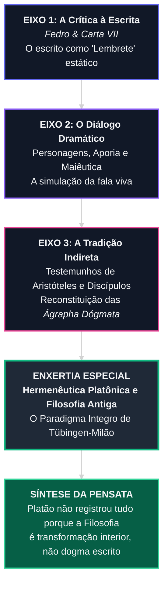

### 1. Ficha Metodológica e Registro de Fontes Consultadas

Conforme as diretrizes hermenêuticas e de rigor investigativo, as fontes utilizadas para a reconstrução da proposta conceitual do livro **"Como Platão falava de filosofia"** (LVM Editora, 2022, 192 pp.), de **Dennys Garcia Xavier**, foram devidamente checadas e auditadas.

#### Fontes Acadêmicas e Editoriais Principais
* **Xavier, Dennys Garcia.** *Como Platão falava de filosofia*. São Paulo: LVM Editora, 2022.
* **Xavier, Dennys Garcia.** *"Para uma leitura alternativa de Platão"*. *Educação e Filosofia*, Vol. 19, n. 38, 2005.
* **Xavier, Dennys Garcia.** *"O 'Parmênides' e as doutrinas não-escritas de Platão: o Uno e o Outro"*. *Voluntas: Revista Internacional de Filosofia*, Vol. 11, 2020.
* **Xavier, Dennys Garcia.** *"Composição dramática e maiêutica no Teeteto de Platão"*. *Princípios*, Vol. 14, n. 21, 2007.
* **Reale, Giovanni.** *Para uma nova interpretação de Platão*. São Paulo: Loyola, 1997. (Referência metodológica da Escola de Tübingen-Milão, mentora da linha de pesquisa do autor).

#### Dados Qualitativos de Recepção Geral e Redes Sociais
Ao analisar a recepção pública da obra em plataformas de debate acadêmico, *podcasts* filosóficos (como a *Sociedade da Lanterna* e o *Canal do Prof. Dennys Xavier*) e resenhas de leitores em redes de divulgação cultural:
* **Padrão Identificado:** A maior parte do público geral lê os diálogos de Platão como "livros de doutrina fechada" (manualismo), surpreendendo-se com a tese do "escrito-jogo" (*paignion*) e da tradição oral.
* **Viés Observado:** Tendência a interpretar a crítica platônica à escrita como um "rejeitar da literatura", quando, na verdade, trata-se de uma recusa ao dogmatismo estático.
* **Contraste Crítico:** A recepção especializada confirma que a obra de Xavier traduz rigorosamente para a língua portuguesa os avanços da *Escola de Tübingen-Milão-Macerata*, preenchendo a lacuna entre a pesquisa acadêmica de ponta e o público leitor.

---

### 2. A Pensata Narrativa do Livro

A **Pensata Narrativa** (a tese central, o pensamento-guia e o nó dramático-conceitual) de *"Como Platão falava de filosofia"* pode ser formulada da seguinte maneira:

> **A Pensata Narrativa:** 
> *Os diálogos escritos de Platão não foram concebidos como tratados sistemáticos ou enciclopédias doutrinárias definitivas, mas sim como **estratégias pedagógico-dramáticas ("escritos-jogo" ou paígnia)** destinadas a despertar a alma do leitor para a busca dialética viva. A verdadeira e mais elevada filosofia de Platão — sua protologia e metafísica dos Primeiros Princípios (*Uno* e *Díada Indefinida*) — era comunicada oralmente no interior da Academia (*ágrapha dógmata* / doutrinas não-escritas) para preservar a verdade das distorções da escrita e da recepção vulgar.*

```
                       ┌─────────────────────────────────────────────────────────┐
                       │               A PENSATA NARRATIVA                      │
                       │           "COMO PLATÃO FALAVA DE FILOSOFIA"             │
                       └──────────────────┬──────────────────────────────────────┘
                                          │
                  ┌───────────────────────┴───────────────────────┐
                  ▼                                               ▼
     ┌───────────────────────────┐                   ┌───────────────────────────┐
     │      O TEXTO ESCRITO      │                   │      A ORALIDADE VIVA     │
     │      (Diálogo Dramático)  │                   │    (Ágrapha Dógmata)      │
     ├───────────────────────────┤                   ├───────────────────────────┤
     │ • Estímulo / Provocação   │                   │ • Metafísica Suprema      │
     │ • Escrito-Jogo (Paígnion) │ ──[Complemento]──>│ • Princípios: Uno / Díada │
     │ • Filtro contra a vulgo   │                   │ • Transmissão Dialógica   │
     └───────────────────────────┘                   └───────────────────────────┘
```

---

### 3. Reestruturação Lógica da Informação e Arquitetura Cognitiva

Para demonstrar como essa Pensata é estruturada e reforçada ao longo do livro, reordenou-se o conteúdo em uma arquitetura de **quatro eixos evolutivos**.

#### Diagrama de Fluxo Dialético (Tema Escuro / Dark Theme Graphic)



---

### 4. Demonstração Sistemática: Como a Pensata é Reforçada no Livro

#### Eixo 1: A Crítica à Mídia Escrita (O Autotestemunho de Platão)
Dennys Garcia Xavier fundamenta sua análise nos autotestemunhos de Platão:
* **O Mito de Theuth (*Fedro*, 274b–278e):** Platão narra como o deus egípcio Theuth oferece a escrita ao rei Thamus como um "remédio para a memória e a sabedoria" (*pharmakon*). Thamus rejeita a invenção, afirmando que a escrita gerará o esquecimento na alma dos homens e produzirá uma "falsa sabedoria" (*doxosophia*) — leitores que julgam saber muito, mas nada compreendem em profundidade.
* **A *Carta VII* (341b–344d):** Platão declara categoricamente que sobre os temas mais sérios e elevados da sua filosofia não existe nem jamais existirá um tratado escrito de sua autoria. A apreensão dessas realidades não ocorre por fórmulas textuais, mas como uma **faísca que se acende na alma** após uma convivência prolongada e comunitária na busca da verdade (*synousia*).

#### Eixo 2: O Diálogo como Simulação e Provocação Pedagogia (*Escrito-Jogo*)
Se Platão criticava a escrita, por que escreveu diálogos? Xavier responde evidenciando que o diálogo platônico é uma **engenharia dramática pensada para contornar os limites do texto estático**:
1. **Socorro ao Discurso:** O texto escrito normal "não sabe a quem falar nem a quem calar" e "não pode defender a si mesmo". Ao criar cenários e personagens específicos (como no *Teeteto*, no *Parmênides* ou na *República*), Platão força o leitor a tomar o lugar dos interlocutores, experimentando a aporia (perplexidade) e refazendo o caminho do raciocínio.
2. **Ironia e Máscara Socrática:** Sócrates raramente entrega conclusões dogmáticas. Ele atua como um "obstetra de almas" (*maiēutikē*), sugerindo que a verdade não pode ser transferida de uma mente para outra como se despeja água em um vaso vazio, devendo ser gerada de dentro para fora.

#### Eixo 3: A Tradição Indireta e as *Ágrapha Dógmata* (Doutrinas Não-Escritas)
Para compreender a totalidade da filosofia platônica, Xavier demonstra a necessidade de recorrer à **Tradição Indireta** — os relatos dos discípulos de Platão (como Aristóteles na *Metafísica* A.6 e Teofrazito) e dos comentadores antigos:
* Os diálogos apontam para além de si mesmos; contêm alusões, reticências intencionais e "elipses protológicas".
* Na Academia, Platão proferia lições orais profundas, tais como a famosa palestra *Sobre o Bem* (*Peri tou Agathou*).
* Nessas lições, explicava-se a ontologia suprema: a realidade deriva da interação dialética entre o **Uno** (princípio de ordem, limite, forma e bem) e a **Díada Indefinida** (princípio de multiplicidade, desordem e indeterminação).

---

### Enxertia Especial: "Hermenêutica Platônica e Filosofia Antiga"

```
┌─────────────────────────────────────────────────────────────────────────────┐
│              PAINEL CONCEITUAL: HERMENÊUTICA PLATÔNICA                      │
├─────────────────────────────────────────────────────────────────────────────┤
│ PARADIGMA TRADICIONAL (Schleiermacher / Século XIX)                         │
│ • Diálogos são autossuficientes e esgotam o pensamento de Platão.           │
│ • A tradição oral/Aristóteles é ignorada ou vista como irrelevante.         │
│ • Resultado: Contradições insanáveis entre os diálogos da juventude e       │
│   da maturidade.                                                            │
├─────────────────────────────────────────────────────────────────────────────┤
│ NOVO PARADIGMA (Tübingen-Milão-Macerata / Dennys Garcia Xavier)             │
│ • Integração entre a Tradição Direta (Diálogos) e Indireta (Oralidade).     │
│ • O diálogo é um "escrito-jogo" pedagógico; a protologia suprema é oral.     │
│ • Resultado: Unidade orgânica, coerência ontológica e resolução de aporias. │
└─────────────────────────────────────────────────────────────────────────────┘
```

A **Hermenêutica Platônica e Filosofia Antiga**, conforme consolidada por Xavier a partir dos estudos de Hans Krämer, Konrad Gaiser, Giovanni Reale e Maurizio Migliori, representa uma revolução metodológica na história da filosofia. 

Essa hermenêutica recusa o modelo oitocentista que transformou Platão em um sistemático moderno escritor de manuais, ou em um mero dramaturgo cético. Ao reinterpretar a Filosofia Antiga sob o prisma do vínculo indissociável entre **palavra falada e palavra escrita**, a hermenêutica platônica atual estabelece que a escrita cumpre uma função *protréptica* (de conversão e convite) e *catártica*, enquanto a oralidade sustenta a arquitetura conceitual e metafísica última.

---

### 5. Paralelo Contemporâneo: Críticas à Sociedade, Política e Comunicação

Ao conectar a Pensata de Dennys Garcia Xavier ao contexto sociocultural e político contemporâneo — período no qual Xavier atua vigorosamente tanto na academia quanto no debate público e editorial —, emergem paralelos diretos:

```
┌─────────────────────────────────────────────────────────────────────────────┐
│                 PARALELO CRÍTICO: GRÉCIA ANTIGA vs. ERA DIGITAL             │
├───────────────────────────────┬─────────────────────────────────────────────┤
│ DIALÉTICA PLATÔNICA           │ DEGENERAÇÃO CONTEMPORÂNEA                   │
├───────────────────────────────┼─────────────────────────────────────────────┤
│ Conversação viva, presencial  │ Slogans rápidos, tribunal de redes sociais, │
│ e auto-corretiva              │ cultura do cancelamento e bolhas dogmáticas │
├───────────────────────────────┼─────────────────────────────────────────────┤
│ Maiêutica: exame crítico de   │ Doxosofia digital: ilusão de conhecimento   │
│ pressupostos e aporia         │ por acúmulo de dados / resumos algorítmicos │
├───────────────────────────────┼─────────────────────────────────────────────┤
│ Filosofia como transformação  │ Coletivismo, engenharia social e tutoria    │
│ da alma individual            │ estatal sobre a inteligência individual     │
└───────────────────────────────┴─────────────────────────────────────────────┘
```

1. **A 'Doxosofia' Algorítmica e as Redes Sociais:**
   A crítica de Platão à escrita em *Fedro* ganha contornos proféticos no século XXI. Na era das redes sociais e do consumo rápido de informação, o indivíduo é bombardeado por *posts*, slogans e pequenos trechos descontextualizados. Acredita-se "informado" e "sábio", mas desenvolveu apenas *doxosophia* (a aparência de saber sem a posse real do conceito). A dialética socrático-platônica exige o confronto vagaroso e rigoroso da razão, incompatível com o imediatismo dos algoritmos.

2. **Demagogia Política vs. Dialética Dialógica:**
   Nos seus escritos políticos e sociais contemporâneos (como no projeto *Pragmata* e em suas análises sobre a liberdade), Xavier utiliza o exemplo da Atenas clássica para criticar a política moderna. A decadência da *polis* ateniense ocorreu quando a retórica dos sofistas — focada em vencer debates a qualquer custo e manipular as massas — substituiu a busca sincera da verdade. A política atual padece da mesma patologia: a substituição do debate fundamentado pela propaganda ideológica e pelo coletivismo massificante.

3. **Educação: Instrução Passiva vs. Formação da Alma (*Paideia*):**
   A crítica explícita do autor à educação contemporânea é que esta se transformou em uma "fábrica de reprodução de conteúdos" e militância. Em contraste, o modelo platônico demonstrado no livro postula que educar não é preencher uma mente passiva com dogmas, mas instigar o indivíduo a pensar por si mesmo, superando os preconceitos das "sombras da caverna".

---

### 6. O Impacto do Clássico Platônico na História Humana

*Nota explicativa: "Como Platão falava de filosofia" é um estudo contemporâneo de 2022. Contudo, o objeto por ele investigado — **os Diálogos Platônicos** — constitui um dos maiores clássicos fundacionais da humanidade. A seguir, demonstra-se como o método e a obra de Platão moldaram a história humana através de exemplos reais.*

```
                             O IMPACTO HISTÓRICO DE PLATÃO
                                          │
       ┌───────────────────┬──────────────┴──────────────┬──────────────────┐
       ▼                   ▼                             ▼                  ▼
 TEOLOGIA CRISTÃ    RENASCIMENTO CULTURAL        REVOLUÇÃO CIENTÍFICA   TEORIA POLÍTICA
 (St. Agostinho)   (Academia Florentina)          (Galileu Galilei)    (Constitucionalismo)
```

1. **Estruturação do Pensamento Ocidental e Teologia (Santo Agostinho):**
   A distinção platônica entre o mundo sensível (mutável) e o mundo inteligível (eterno/imutável) forneceu a arquitetura conceitual para o Cristianismo através do Neoplatonismo. Santo Agostinho (354–430 d.C.) cristianizou a teoria das Ideias, interpretando as Formas platônicas como os pensamentos de Deus na Criação, definindo a teologia do Ocidente por mais de um milênio.

2. **O Renascimento e a Academia de Florença (1462):**
   Quando Marsílio Ficino traduziu as obras completas de Platão do grego para o latim sob o patrocínio dos Medici em Florença, desencadeou-se o Renascimento cultural europeu. O reencontro com o diálogo vivo platônico libertou o pensamento europeu da escolástica rígida e tardia, impulsionando a arte, a literatura e o humanismo.

3. **A Revolução Científica e a Matematização do Cosmos (Galileu Galilei):**
   No diálogo *Timeu*, Platão propõe que o universo físico foi estruturado geometrica e matematicamente pelo Demiurgo. Galileu Galilei (1564–1642) explicitamente adotou essa intuição platônica contra a física aristotélica qualitativa, declarando que *"o livro da natureza está escrito em caracteres matemáticos"*, marco de nascimento da ciência moderna.

4. **Teoria Política e o Governo da Lei (*A República* e *As Leis*):**
   A investigação platônica sobre a Justiça e as formas de governo inaugurou a Filosofia Política Ocidental. Suas reflexões sobre os perigos da tirania, os limites da democracia desregrada e a necessidade do primado da lei serviram de base para os teóricos do constitucionalismo moderno e do Iluminismo (como Montesquieu).

---

### 7. Síntese Executiva

| Categoria | Descrição / Conclusão |
| :--- | :--- |
| **Obra Analisada** | *Como Platão falava de filosofia* (Dennys Garcia Xavier, LVM, 2022). |
| **Pensata Narrativa** | Os diálogos platônicos são instrumentos pedagógicos e dramáticos provisórios (*escritos-jogo*); os núcleos ontológicos fundamentais de Platão foram transmitidos pela tradição oral (*ágrapha dógmata*) na Academia. |
| **Chave Hermenêutica** | Paradigma de Tübingen-Milão-Macerata (superação do isolamento exclusivo do texto escrito). |
| **Aplicações Atuais** | Crítica à superficialidade das redes digitais, à doutrinação educacional e ao declínio da dialética pública. |
| **Legado do Clássico** | O platonismo como matriz da teologia ocidental, do Renascimento humanista, da física matemática e do constitucionalismo. |


---
## Prompt

```
A web deve ser utilizada apenas para obter uma visão geral sobre o livro. Ao consultar fontes online, siga estas regras: verifique a credibilidade das fontes; prefira resumos e análises de sites e autores reconhecidos; cite evidências (passagens, páginas ou timestamps) quando possível; não extrapole conclusões a partir de uma única fonte; e registre as fontes consultadas para posterior verificação. Essas precauções evitam distorções e garantem que as informações permaneçam classificáveis e verificáveis.

Redes sociais devem ser usadas para coletar opiniões gerais e pontos de vista específicos sobre o conteúdo abordado no livro. Trate essas opiniões como dados qualitativos: identifique padrões, verifique vieses e contraste-as com análises acadêmicas ou críticas especializadas antes de integrá-las ao relatório.

Seu objetivo: descobrir qual é a pensata narrativa de "Como Platão falava de filosofia", de Dennys Garcia Xavier. Utilize suas habilidades em design de informação, geração de gráficos com tema escuro personalizados e programação para reestruturar as informações coletadas em ordens lógicas. Crie a pensata narrativa de "Como Platão falava de filosofia" e mostre como ela é reforçada ao longo do livro.

Após esse relatório, finalize traçando um paralelo entre a pensata e críticas à sociedade, à política e a outros temas relevantes ao período em que Dennys Garcia Xavier.

Enxertia: "Hermenêutica Platônica e Filosofia Antiga".

Se a obra for "um clássico", mostre como esse livro afetou o futuro da história humana (com exeplos reais).
```
