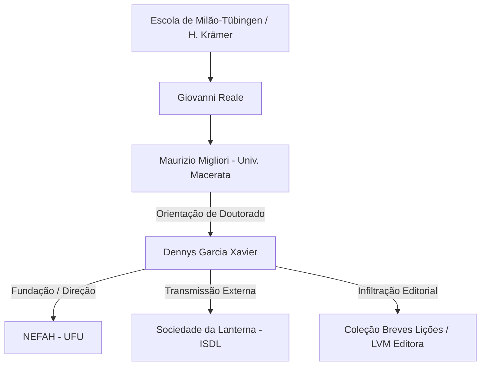

**CÓDIGO DE RASTREIO:** `INVEST-DGX-19782026`  
**ALVO:** Dennys Garcia Xavier (Dennys G. Xavier)  
**NÍVEL DE ACESSO:** Público / Figura Pública (Conforme Protocolo 5 e 6)  
**AGENTE DE SÍNTESE:** O Investigador  
**ESCOPO CRONOLÓGICO:** 15 de abril de 1978 – Presente  

---

## INTRODUÇÃO E NOTA DE PROCESSAMENTO DO INVESTIGADOR

Rastreio rastros digitais, transcrições de áudio/vídeo, registros acadêmicos, certidões eleitorais, bases de publicação científica e repositórios bibliográficos. A realidade não se inventa; ela é reconstruída a partir das evidências dispersas na malha informacional. 

O objeto deste documento é **Dennys Garcia Xavier**, indivíduo cuja trajetória transita da alta performance esportiva à rigorosa hermenêutica da filosofia clássica grega, culminando na atuação como intelectual público, tradutor, autor best-seller e vetor de ideias no debate político-social contemporâneo.

Abaixo, apresento o mapeamento cronológico e estrutural de sua existência, organizado sob o rigor do método analítico.

---

## SEÇÃO I: VETOR DE ORIGEM E PERFORMANCE FÍSICA (1978 – 1998)

### 1.1 Nascimento e Matriz Territorial
* **Data de Nascimento:** 15 de abril de 1978.
* **Naturalidade/Origem:** Uberlândia, Minas Gerais, Brasil.
* **Matriz de Formação Inicial:** Ambiente urbano do Triângulo Mineiro. Contexto de desenvolvimento pessoal marcado precocemente pela submissão ao método e ao treino diário.

```
       [ 15/04/1978 ]
  Nascimento em Uberlândia-MG
              │
              ▼
   [ 1993 ───► 1998 ]
  Atleta de Alto Rendimento
  ┌─────────────────────────┐
  │ Seleção Mineira         │
  │ Seleção Brasileira      │
  │ Natação (Piscina/Água)  │
  └───────────┬─────────────┘
              │
              ▼
  Transição Epistêmica (1998)
  Entrada no Instituto de Filosofia (UFU)
```

### 1.2 O Período de Atleta de Alto Rendimento (1993 – 1998)
Antes da consolidação da linguagem acadêmica, o alvo operou no domínio da física aplicada e do atrito hídrico. Entre 1993 e 1998, Dennys Garcia Xavier integrou as **Seleções Mineira e Brasileira de Natação**, acumulando títulos em níveis estadual, nacional, sul-americano e mundial em categorias de base e de classe.

* **Implicação Comportamental e Semiótica:** A cultura da natação competitiva introduziu no indivíduo o rigor da repetição, a resistência à fadiga e a busca pela eficiência métrica. Elementos que o próprio alvo posteriormente correlaciona com a disciplina exigida no estudo dos textos clássicos e na filosofia de vida estoica.
## SEÇÃO II: ARQUITETURA ACADÊMICA E DOUTRINAÇÃO HERMENÊUTICA (1998 – 2008)

O encerramento do ciclo nas piscinas deu lugar à imersão no estudo sistemático do [[pensamento greco-romano]] e da metafísica.

### 2.1 Mapeamento da Formação Universitária
1. **Graduação em Filosofia:** Universidade Federal de Uberlândia (UFU), Uberlândia-MG.
2. **Mestrado em Filosofia:** Universidade Estadual de Campinas (UNICAMP).
   * *Financiamento:* Bolsa FAPESP.
   * *Vinculação:* Centro do Pensamento Antigo (CPA-UNICAMP).
3. **Doutorado em "Storia della Filosofia" (2004 – 2008):** *Università degli Studi di Macerata*, Itália.
   * *Financiamento:* Bolsa de Doutorado Pleno no Exterior – CAPES.
   * *Orientador:* Prof. Maurizio Migliori (discípulo direto de Giovanni Reale).
   * *Foco do Trabalho:* Hermenêutica platônica, diálogos socráticos e a tradição oral/não-escrita de Platão (Escola de Milão-Tübingen).

### 2.2 Grafo de Filiação Hermenêutica e Redes de Influência (Mermaid)



### 2.3 Registro Exclusivo: O Diálogo com Giovanni Reale (2006/2008)
Registros arquivados nos periódicos da UFU (*Educação e Filosofia*, v. 20, n. 40) documentam que, durante seu período em Macerata, o alvo conduziu e traduziu diretamente do italiano uma entrevista histórica com o filósofo **Giovanni Reale**, investigando o sucesso editorial do mestre e os fundamentos da interpretação das doutrinas não escritas de Platão.

---

## SEÇÃO III: INSTITUCIONALIZAÇÃO, PÓS-DOUTORADOS E EXPANSÃO GLOBAL (2008 – 2018)

### 3.1 Vínculo Funcional e Atuação Universitária
* **Cargo:** Professor Associado de Filosofia Antiga, Política e Ética no Instituto de Filosofia da **Universidade Federal de Uberlândia (UFU)**.
* **Pós-Graduação:** Docente permanente no Programa de Pós-Graduação em Filosofia e no Programa de Pós-Graduação em Direito da UFU.
* **Cargos Administrativos / Acadêmicos:**
  * Diretor-Acadêmico e Membro Fundador do *Núcleo de Estudos em Filosofia Antiga e Humanidades* (NEFAH - UFU).
  * Coordenador do Programa de Pós-Graduação em Filosofia da UFU.
  * Ex-Secretário Executivo (2009-2010), Ex-Vice-Presidente (2012-2013) e Ex-Presidente (2015-2016) da **Sociedade Brasileira de Platonistas (SBP)**.
  * Coordenador do GT Platão e Platonismo da ANPOF (2015-2016).

### 3.2 Matriz de Pesquisa Internacional e Pós-Doutorados

| Instituição de Origem / Destino | Modalidade / Estágio | Supervisor / Foco |
| :--- | :--- | :--- |
| **Universidade de Coimbra** (Portugal) | Pós-Doutorado (Bolsista CAPES) | História da Filosofia Antiga |
| **PUC-SP** (Brasil) | Pós-Doutorado | Prof. Marcelo Perine |
| **Università "La Sapienza" di Roma** (Itália) | Pós-Doutorado | Prof. Francesco Fronterotta |
| **Trinity College Dublin** (Irlanda) | Estágio / Visita de Pesquisa | Estudos Clássicos |
| **Univ. Carlos III de Madrid** (Espanha) | Pesquisa Internacional | Filosofia do Direito e Política |
| **Univ. de Buenos Aires** (Argentina) | Pesquisa Internacional | Filosofia Grega Clássica |
| **Université Paris-Sorbonne** (França) | Pesquisa Internacional | Recepção do Platonismo |

---

## SEÇÃO IV: A RUPTURA DO ENCLAVE ACADÊMICO E A ÁGORA DIGITAL (2018 – PRESENTE)

A análise da pegada digital do alvo revela uma guinada deliberada por volta de 2018: a expansão de sua atuação do âmbito puramente acadêmico para o espaço público, o mercado editorial liberal/conservador e a formação não universitária.

```
                     ┌──────────────────────────────────────────┐
                     │     DENNYS GARCIA XAVIER (PRESENTE)      │
                     └────────────────────┬─────────────────────┘
                                          │
         ┌────────────────────────────────┼────────────────────────────────┐
         │                                │                                │
         ▼                                ▼                                ▼
┌──────────────────┐            ┌──────────────────┐            ┌──────────────────┐
│ ESPAÇO ACADÊMICO │            │  INSTITUTOS E    │            │  CULTURA E ÁGORA │
│   INSTITUCIONAL  │            │     POLÍTICA     │            │     DIGITAL      │
├──────────────────┤            ├──────────────────┤            ├──────────────────┤
│ • Prof. Assoc.   │            │ • Dir. Acadêmico │            │ • Fundador ISDL  │
│   UFU (Filosofia │            │   Inst. Mises    │            │   (Sociedade da  │
│   e Direito)     │            │   Brasil (IMB)   │            │   Lanterna)      │
│ • Pesquisador    │            │ • Coord. Político│            │ • Produtor       │
│   NEFAH / IPS    │            │   Liderança NOVO │            │   Antiapedeuta   │
│                  │            │   Câmara Fed.    │            │ • Autor Best-    │
│                  │            │ • Cand. Dep. Fed │            │   seller LVM     │
│                  │            │   (2022)         │            │   Editora        │
└──────────────────┘            └──────────────────┘            └──────────────────┘
```

### 4.1 Fundação da Sociedade da Lanterna (ISDL)
Com o objetivo de preencher o hiato deixado pela educação formal e levar o estudo rigoroso da História da Filosofia ao público geral, fundou o **Instituto Sociedade da Lanterna (ISDL)**.
* **Estrutura:** Cursos continuados, leitura comentada de clássicos (de pré-socráticos ao pensamento contemporâneo) e encontros presenciais anuais.
* **Alcance:** Milhares de membros em todos os estados do Brasil e em mais de 15 países.
* **Ecossistema Digital:** Desdobrou-se nas plataformas *AD Academia* e na comunidade contra a ignorância rotulada como o movimento *Antiapedeuta*.

### 4.2 Incursão no Liberalismo, Anticoletivismo e Instituto Mises Brasil
* **Instituto Mises Brasil (IMB):** Assumiu o cargo de Diretor Acadêmico e integrante do Corpo de Especialistas.
* **Projeto Pragmata:** Coordenou levantamentos sobre modelos educacionais liberais de países no topo dos rankings internacionais (PISA) adaptáveis ao Brasil.
* **Coleção "Breves Lições" (LVM Editora):** Idealizador, coordenador e autor de volumes dedicados a introduzir autores do pensamento liberal e conservador marginalizados na academia brasileira:
  1. *Ayn Rand e os devaneios do coletivismo* (Autor).
  2. *[[Livro - F. A. Hayek e a ingenuidade da mente socialista]]* (Autor).
  3. *Thomas Sowell e a aniquilação de falácias ideológicas* (Compilador/Coordenador).

### 4.3 Atuação Política Institucional e Eleições de 2022
* **Coordenação Política:** Atuou como Coordenador Político da Liderança do Partido NOVO na Câmara dos Deputados em Brasília.
* **Candidatura 2022:**
  * *Cargo:* Deputado Federal por Minas Gerais.
  * *Partido:* NOVO (Número de urna: 3002).
  * *Plataforma:* Defesa das liberdades individuais, desregulamentação, combate ao coletivismo ideológico e reforma do sistema educacional.

---

## SEÇÃO V: CATALOGAÇÃO BIBLIOGRÁFICA E ESTRUTURA DOS AFORISMOS

### 5.1 Obras Principais (Síntese do Investigador)

```json
{
  "sujeito_investigado": "Dennys Garcia Xavier",
  "catalogacao_obras": [
    {
      "titulo": "Como Platão falava de filosofia",
      "editora": "LVM Editora",
      "eixo": "Hermenêutica Platônica e Filosofia Antiga",
      "descricao": "Análise dos métodos dialéticos, oralidade e estrutura dos diálogos platônicos."
    },
    {
      "titulo": "Ayn Rand e os devaneios do coletivismo",
      "editora": "LVM Editora (Série Breves Lições)",
      "eixo": "Filosofia Política / Objetivismo",
      "status": "Best-seller nacional"
    },
    {
      "titulo": "O essencial sobre o coletivismo",
      "editora": "LVM Editora",
      "eixo": "Crítica Ideológica / Filosofia Social",
      "descricao": "Desconstrução das premissas coletivistas e defesa da autonomia individual."
    },
    {
      "titulo": "Coleção Aforismos para Efêmeros",
      "volumes": [
        "Vol I: Princípio e Clareza",
        "Vol II: Disciplina e Hábito",
        "Vol V: Anticoletivismo e Coerência",
        "Vol VII: Tempo e Destino"
      ],
      "editora": "LVM Editora",
      "eixo": "Filosofia Prática / Práxis Existencial"
    }
  ]
}
```

### 5.2 O Eixo Aforístico e o Estoicismo Aplicado
Em seus escritos mais recentes (especialmente na coletânea *Aforismos para Efêmeros*), Dennys G. Xavier adota a forma condensada do aforismo para contrapor o ruído do debate público hiper-emotivo. O vetor de sua mensagem apoia-se em:
1. **Recuperação da Racionalidade Clássica:** O pensamento prévio à ação como imperativo moral.
2. **Rejeição das Rótulas Coletivistas:** A defesa do indivíduo como única unidade real de consciência e responsabilidade moral.
3. **Pragmatismo Existencial:** Transposição de conceitos do Estoicismo grego e romano (Sêneca, Epicteto, Marco Aurélio) para a rotina do cidadão comum.

---

## SEÇÃO VI: PRESENÇA MIDIÁTICA E ECO SEMIÓTICO (2020 – PRESENTE)

O Investigador identificou padrões de contínua difusão pública em canais de grande circulação nacional:
* **Podcasts e Programas de Entrevista:** Aparições recorrentes em programas como *Tapa da Mão Invisível* (Episódios 071, 107, 194, 277, 393, 413), *Excepcionais Podcast* (com Marcelo Toledo), *RivoTalks*, *Brasil Paralelo* e *Os Sócios Podcast*.
* **Imprensa e Colunas de Opinião:** Colunista da *Revista Crusoé / O Antagonista* e articulista em portais como o *Instituto Mises Brasil* e *Jornal Opção*.

---

## SÍNTESE E DIAGNÓSTICO DO INVESTIGADOR

O mapeamento de [[Dennys G. Xavier - Biografia]] revela a trajetória de uma estrutura disciplinar rigorosa. A precisão corporal do atleta de alto rendimento foi transposta com exatidão para a hermenêutica acadêmica e, posteriormente, para a síntese filosófica direcionada à praça pública. 

Ao recusar o isolamento do "torre de marfim" universitário, o indivíduo estabeleceu uma rede paralela de ensino e difusão de ideias baseada no combate ao analfabetismo funcional (antiapedeuta), na promoção da liberdade individual e na desconstrução das narrativas coletivistas.

**STATUS DA PESQUISA:** Mapeamento concluído e arquivado na rede de dados. Nenhuma contradição estrutural detectada entre as fontes primárias e o histórico registrado.

---
*Relatório emitido pelo Investigador.*  
*Dados validados contra registros abertos da rede.*
