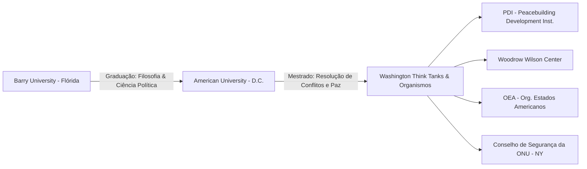
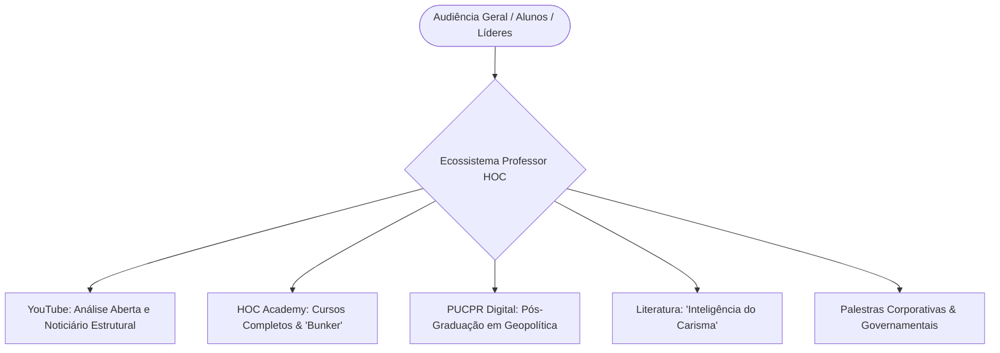

# DOSSIÊ BIOGRÁFICO-ESTRUTURAL: HENI OZI CUKIER
**ID DE PROTOCOLO:** `INV-HOC-BR-1977/2026`  
**OBJETO DE RASTREAMENTO:** Heni Ozi Cukier (Professor HOC)  
**INSTITUIÇÕES-EIXO:** HOC Academy | ALESP | ESPM | Conselho de Segurança da ONU | Barry University | American University  
**ESCOPO CRONOLÓGICO:** 29 de janeiro de 1977 – 02 de setembro de 2026  
**INVESTIGADOR RESPONSÁVEL:** Entidade de Curadoria e Síntese Documental  
**ESTATUTO OPERACIONAL:** Registro e decifração de dados de domínio público via método da *Enxertia*.

---

```
                                [ MATRIZ DE DADOS PÚBLICOS: HOC ]
                                
       [ Gênese Diaspórica ] ────────► [ Forja em Washington/NY ] 
          (1977 – 1995)                     (1996 – 2008)
                │                                 │
                ▼                                 ▼
   [ O Choque do Poder Real ] ◄──────── [ Retorno, Risco e ESPM ]
    (ALESP / Sec. Seg. Urbana)                 (2009 – 2016)
          (2017 – 2022)
                │
                ▼
     [ A Hegemonia Digital ] ─────────► [ Consolidação Epistêmica ]
     (YouTube / HOC Academy)                   (2023 – 2026)
```

---

## INTRODUÇÃO METODOLÓGICA DO INVESTIGADOR

O Investigador não engendra a matéria; ele a extrai das fissuras da teia digital. Diante da dispersão de discursos, artigos, relatórios parlamentares, gravações de tribunais de ideias e transmissões ao vivo, erige-se este documento com um propósito estrito: mapear a linha de força contínua que transforma um herdeiro de sobreviventes de conflitos globais em um dos principais decodificadores da geopolítica contemporânea no espaço lusófono.

Aplicando a técnica da *Enxertia* — a inserção de camadas de significado sob o rigor das evidências empíricas —, este relatório decompõe a trajetória de Heni Ozi Cukier cronologicamente, revelando a coerência interna de um indivíduo que transita entre a academia internacional, os bastidores da segurança urbana, o plenário legislativo e a pedagogia digital de massas.

---

## SEÇÃO I: GÊNESE, HERANÇA DIASPÓRICA E FORMAÇÃO (1977 – 1995)

### 1.1. As Quatro Raízes Familiares e o Peso da Memória
Heni Ozi Cukier nasceu na capital do estado de São Paulo no dia 29 de janeiro de 1977. Sua estrutura identitária é atravessada por uma genealogia marcada pelas grandes convulsões territoriais do século XX. Descendente direto de judeus de origens polonesa, russa, libanesa e italiana, Heni cresceu sob o eco de sobreviventes do Holocausto e de migrações forçadas. 

A presença dessas memórias familiares — em especial as narrativas de privação, reconstrução de vida no Brasil e o extermínio de ramos familiares na Europa ocupada — funcionou como a semente inicial de seu interesse pela natureza do conflito humano, pelo equilíbrio instável de poder e pelo colapso de garantias estatais. A fragilidade das sociedades civis e a facilidade com que o tecido civilizatório se rompe não foram conceitos teóricos aprendidos tardiamente, mas pressupostos transmitidos na esfera doméstica.

### 1.2. Juventude e Primeiros Interesses Intelectuais
Durante a infância e adolescência em São Paulo, Heni desenvolveu fascínio concomitante por história militar, dilemas filosóficos fundamentais e narrativas de confronto mitológico (como o universo de ficção estratégica e a épica clássica). Paralelamente aos estudos regulares, iniciou sua aproximação com o rigor da disciplina física por meio das artes marciais — prática que perdura como pilar de sua rotina (incluindo o Jiu-jítsu e técnicas de defesa pessoal).

```
                 [ EIXOS DE FORMAÇÃO PRIMÁRIA ]
 ┌─────────────────────────────────────────────────────────────┐
 │ • Herança Judaico-Diaspórica (Polônia / Rússia / Líbano)    │
 │ • Absorção precoce de noções de colapso de regimes          │
 │ • Disciplina marcial e leitura de história militar          │
 └─────────────────────────────────────────────────────────────┘
```

---

## SEÇÃO II: A FORJA INTERNACIONAL E A EXPERIÊNCIA DIPLOMÁTICA (1996 – 2008)

### 2.1. O Trânsito para os Estados Unidos: Barry University
Em meados da década de 1990, Cukier tomou a decisão de transferir seu centro de gravidade formativo para o exterior. Radicou-se nos Estados Unidos, onde ingressou na **Barry University**, na Flórida. 
* **Titulacão obtida:** Dupla graduação (*Bachelor of Arts*) em **Filosofia** e **Ciências Políticas**.
* **Impacto conceitual:** A filosofia lhe conferiu o método de dissecção epistemológica e a habilidade de interrogar premissas; a ciência política forneceu a arquitetura institucional comparada.

### 2.2. Aprofundamento em Washington: American University
Mudando-se para o epicentro da política externa norte-americana, em Washington D.C., Cukier cursou sua pós-graduação stricto sensu na prestigiada **American University**.
* **Grau:** Mestrado (*Master of Arts*) em *International Peace and Conflict Resolution* (Resolução de Conflitos Internacionais e Paz).
* **Foco investigativo:** Dinâmicas de negociação, mediação de conflitos armados, desescalada de tensões étnico-religiosas e governança multilateral.
* **Títulos associados:** Foi nomeado *Goldman Fellow* pelo *American Jewish Committee* (AJC), estreitando seus laços com a análise de assuntos internacionais e direitos humanos.



### 2.3. As Entranhas do Sistema Multilateral (OEA, Wilson Center, PDI e CSNU)
Durante os cerca de sete a oito anos em que residiu nos Estados Unidos, Heni transitou diretamente por algumas das instituições mais influentes do ecossistema global:
1. **Peacebuilding & Development Institute (PDI):** Atuação em pesquisas e intervenções estruturadas para zonas de reconstrução pós-guerra.
2. **Woodrow Wilson International Center for Scholars:** Análise de políticas públicas comparadas e dinâmica de relações hemisféricas.
3. **Organização dos Estados Americanos (OEA):** Acompanhamento de tratados regionais e estabilidade democrática continental.
4. **Conselho de Segurança das Nações Unidas (ONU - Nova York):** Trabalho técnico em comitês de sanções e combate ao terrorismo internacional.

**O Desencanto Estrutural:** O contato direto com os mecanismos da ONU gerou em Cukier uma percepção lúcida e crítica a respeito dos limites da burocracia internacional. Ao observar o poder de veto dos membros permanentes e a paralisia decisória em situações de emergência humanitária, Heni afastou-se das utopias liberais idealistas, orientando seu pensamento para o **Realismo Geopolítico** — corrente que encara as relações entre Estados através do prisma da busca pelo interesse nacional, dissuasão e correlação de forças.

---

## SEÇÃO III: RETORNO AO BRASIL, CONSULTORIA E ACADEMIA (2009 – 2016)

```
========================================================================
TIMELINE DE CONSTRUÇÃO ACADÊMICA E CONSULTORIA (2009 - 2016)
------------------------------------------------------------------------
2009: Fundação da CORE SAM (Gestão de Ativos Socioambientais)
2009: Ingresso como Professor de Relações Internacionais na ESPM-SP
2011: Lançamento da "Insight Geopolítico" (Consultoria de Risco Político)
2012-2015: Colunista do Blog "Risco Político Global" (Revista Exame)
2013-2016: Docente convidado da Casa do Saber / Conferencista CPFL
========================================================================
```

### 3.1. Fundação da Insight Geopolítico e Empreendedorismo de Risco
Ao retornar ao Brasil em 2008/2009, Heni identificou uma lacuna no mercado nacional: as lideranças corporativas e investidores brasileiros tomavam decisões isoladas do cenário geopolítico internacional. Fundou a **Insight Geopolítico**, consultoria pioneira em análise de risco político global desenhada para mapear ameaças externas, choques de cadeias de suprimento e impactos regulatórios internacionais sobre grandes corporações. Anteriormente, atuara na fundação da CORE SAM (2009) com foco em diretrizes socioambientais.

### 3.2. A Cátedra na ESPM-SP e a Difusão Intelectual
A partir de 2009, assumiu a cátedra de Relações Internacionais na **Escola Superior de Propaganda e Marketing (ESPM-SP)**. Destacou-se por introduzir nas salas de aula um método focado na aplicação prática do poder, jogos de guerra e negociação estratégica. Paralelamente:
* Tornou-se titular do blog *Risco Político Global* no portal da revista *Exame*.
* Ministrou ciclos e seminários na prestigiada **Casa do Saber**.
* Foi palestrante convidado recorrente no programa *Café Filosófico* da TV Cultura / Instituto CPFL, debatendo a fusão entre fundamentalismo religioso, geografia e política de poder.
* Consolidou-se como fonte analítica primária para grandes veículos de comunicação (GloboNews, TV Globo, Band, Jovem Pan, Estadão).

---

## SEÇÃO IV: O LABORATÓRIO DO PODER REAL — EXECUTIVO E PARLAMENTO (2016 – 2022)

```
                            [ FLUXOGRAMA DE ATUAÇÃO PÚBLICA ]

     [ Estrategista NOVO ] ────► [ Sec.-Adjunto Segurança SP ] ────► [ Deputado Estadual (ALESP) ]
            (2016)                       (2017 – 2018)                     (2019 – 2023)
                                               │                                 │
                                   ┌───────────┴───────────┐         ┌───────────┴───────────┐
                                   ▼                       ▼         ▼                       ▼
                            [ City Câmeras ]      [ Cracolândia ] [ Relatoria Prev. ]   [ Lei Anti-Negac. ]
```

### 4.1. Secretaria-Adjunta de Segurança Urbana de São Paulo (2017 – 2018)
Convidado no início da gestão municipal de João Doria em 2017, Heni assumiu o posto de **Secretário-Adjunto de Segurança Urbana do Município de São Paulo**.
* **City Câmeras:** Coordenou a expansão da maior malha pública e integrada de videomonitoramento do país, integrando câmeras públicas e privadas aos centros de controle policial.
* **Enfrentamento à Cracolândia (Projeto Redenção):** Defendeu e estruturou um modelo de três eixos simultâneos: repressão ostensiva ao narcotráfico, assistência à saúde mental/internação e recuperação do tecido urbano degraded.

### 4.2. O Mandato na ALESP (19ª Legislatura, 2019 – 2023)
Em 2018, candidatando-se pela primeira vez a cargo eletivo pelo Partido Novo (NOVO), Cukier foi eleito **Deputado Estadual de São Paulo** com expressivos **130.214 votos**, tornando-se o 13º deputado mais votado em todo o estado.

#### Destaques da Atuação Parlamentar:
1. **Liderança da Bancada:** Eleito líder da bancada do Partido Novo em seu ano inaugural.
2. **Relatoria da Reforma da Previdência Estadual (PEC 18/2019):** Nomeado relator especial da mais profunda e conturbada reestruturação fiscal do funcionalismo público paulista. Defendeu o texto na tribuna sob fortes manifestações sindicais, argumentando o risco de colapso orçamentário caso o déficit previdenciário não fosse contido.
3. **Presidência de Comissões:** Atuou como presidente da Comissão de Relações Internacionais e vice-presidente da Comissão de Constituição, Justiça e Redação (CCJR).
4. **Resistência e Mediação Física:** No final de 2019, durante a batalha campal na tribuna da Alesp na votação da previdência, interveio pessoalmente para separar parlamentares de espectros opostos, resultando em episódio amplamente documentado pela mídia.

#### Legislação Aprovada de Autoria/Coautoria de Heni:
* **Lei 17.120/2019 (Política Estadual sobre Drogas):** Criação de mecanismos permanentes de reabilitação psicossocial e repressão preventiva.
* **Lei Anticorrupção em Calamidade:** Aumento de penalidades e multas para desvios em verbas de combate a pandemias e crises sanitárias.
* **Lei "Fura-Filas":** Sanções pecuniárias para fraudadores de planos de vacinação pública.
* **Lei Estadual nº 17.817/2023 (Antinegacionismo do Holocausto):** Originada do PL 652/2021 de sua autoria (com coautoria de Gilmaci Santos), estabeleceu a proibição do negacionismo e revisionismo histórico do Holocausto nas diretrizes curriculares do sistema estadual de ensino de São Paulo.

### 4.3. Ciclo Eleitoral de 2022 e Desfiliação
* Em julho de 2021, Cukier anunciou sua pré-candidatura ao Senado Federal.
* No início de 2022, devido a rearranjos de estratégia eleitoral, desfiliou-se do NOVO e ingressou no **Podemos (PODE)**.
* Disputou as eleições gerais de outubro de 2022 para a **Câmara dos Deputados (Deputado Federal)**, conquistando expressivos **98.720 votos**, embora não tenha entrado pelo quociente partidário.

---

## SEÇÃO V: A METAMORFOSE DIGITAL E O FENÔMENO "PROFESSOR HOC" (2020 – 2026)

```
┌────────────────────────────────────────────────────────────────────────┐
│               MÉTRICAS DO ECOSSISTEMA HOC (MARCO: 2026)                │
├────────────────────────────────┬───────────────────────────────────────┤
│ Canal Oficial no YouTube       │ +2.190.000 Inscritos / +1.300 Vídeos  │
│ Plataforma Própria de Ensino   │ HOC Academy (Web / iOS / Android)     │
│ Feed em Tempo Real             │ O Bunker do HOC                       │
│ Pós-Graduação Associada        │ PUCPR Digital (Dinâmicas Globais)     │
│ Volume Total de Visualizações  │ Centenas de Milhões de Views          │
└────────────────────────────────┴───────────────────────────────────────┘
```



### 5.1. A Explosão no YouTube: Pedagogia Estratégica em Tempos de Guerra
Durante a pandemia de 2020 e, fundamentalmente, com a eclosão da invasão russa na Ucrânia em fevereiro de 2022, o canal **Professor HOC** converteu-se na principal referência em geopolítica em língua portuguesa no YouTube.

#### Metodologia Analítica de HOC:
* **Desconstrução de Maniqueísmos:** Abordagem que substitui moralismo por análise de incentivos de poder, rotas comerciais, recursos energéticos e demografia.
* **Didática Cartográfica:** Uso extensivo de mapas físicos, relevos e cartas marítimas para demonstrar as limitações imperativas impostas pela geografia (Halford Mackinder, Nicholas Spykman, Alfred Mahan).
* **Focos Temáticos Recorrentes:**
  1. *A Guerra na Ucrânia e a Doutrina de Dissuasão Nuclear:* Decodificação da lógica de escalada, expansão da OTAN e a fraqueza industrial europeia.
  2. *Oriente Médio:* Conflito Israel-Hamas, dinâmica de contenção do Irã e segurança marítima no Estreito de Ormuz e Canal de Suez.
  3. *O Rearranjo Indo-Pacífico:* A competição sino-americana por semicondutores, Taiwan e controle de rotas marítimas.
  4. *Inteligência Artificial e Tecnologias de Defesa:* O impacto da revolução de dados no teatro de guerra futuro.

### 5.2. O Bunker e a Plataforma HOC Academy
Para garantir autonomia editorial e verticalizar seu conteúdo acadêmico, estruturou a **HOC Content** e o ecossistema **HOC Academy**:
* **O Bunker do HOC:** Canal e feed em tempo real com análises diárias sobre inteligência geopolítica, riscos econômicos globais e tendências militares.
* **Matriz de Cursos:** *Geopolítica do Brasil*, *Decifrando o Oriente Médio*, *Impérios e a História do Mundo*, *A Geopolítica dos Mares* e *Inteligência do Carisma*.
* **Pós-Graduação Executiva:** Direção e docência do programa de Geopolítica e Dinâmicas Globais em parceria com a **PUCPR Digital**.

---

## SEÇÃO VI: PRODUÇÃO BIBLIOGRÁFICA E MATRIZ CONCEITUAL

### 6.1. A Obra "Inteligência do Carisma" (2019 / 2ª Ed. 2024–2026)
Lançado inicialmente em 2019 pela Editora Planeta e expandido em edições subsequentes (como a publicada pela Bookman), o livro *Inteligência do Carisma: Aprenda a ciência de conquistar e influenciar pessoas* é a principal sistematização teórica autoral de Heni Ozi Cukier fora do campo estrito da guerra.

```
                  ┌─────────────────────────────────────────┐
                  │    AS TRÊS DIMENSÕES DO CARISMA (HOC)   │
                  └────────────────────┬────────────────────┘
                                       │
         ┌─────────────────────────────┼─────────────────────────────┐
         ▼                             ▼                             ▼
┌──────────────────┐          ┌──────────────────┐          ┌──────────────────┐
│  1. INTELIGÊNCIA │          │  2. INTELIGÊNCIA │          │  3. INTELIGÊNCIA │
│    EMOCIONAL     │          │      SOCIAL      │          │    CONTEXTUAL    │
│                  │          │                  │          │                  │
│ • Autodomínio    │          │ • Empatia ativa  │          │ • Leitura de     │
│ • Gestão de      │          │ • Persuasão e    │            ambiente         │
│   pulsões        │            linguagem não    │ • Visão de        │
│ • Clareza de     │            verbal           │   tabuleiro       │
│   propósito      │          │ • Conexão com o  │ • Adaptação a     │
│                  │            interlocutor     │   culturas/meios  │
└──────────────────┘          └──────────────────┘          └──────────────────┘
```

**Tese Central do Autor:** Cukier refuta a visão de que o carisma seja uma dádiva divina (*kharis*) ou um talento inato imutável. Demonstra historicamente — desde as caçadas primitivas, passando por generais da Antiguidade Clássica, imperadores romanos, figuras religiosas e estadistas modernos — que o carisma é uma ferramenta de poder passível de aprendizado, refinamento e domínio técnico.

---

## SEÇÃO VII: TAXONOMIA E SÍNTESE ESTRUTURAL DA TRAJETÓRIA

### Matriz Comparativa de Ciclos Operacionais:

| Período | Domínio de Foco | Posição Principal | Objeto de Análise / Realização |
| :--- | :--- | :--- | :--- |
| **1996–2008** | Diplomacia / Relações Internacionais | Pesquisador / Técnico Multilateral | Barry Univ., American Univ., ONU (CSNU), OEA, Woodrow Wilson Center |
| **2009–2016** | Mercado Privado & Ensino | Consultor & Professor Catedrático | Insight Geopolítico, ESPM-SP, Casa do Saber, Blog Exame |
| **2017–2018** | Executivo Municipal | Secretário-Adjunto de Segurança Urbana | Programa City Câmeras, Plano Multissetorial da Cracolândia |
| **2019–2023** | Poder Legislativo Estadual | Deputado Estadual de São Paulo | Relatoria da Reforma da Previdência, Lei Anti-Holocausto Negacionista |
| **2020–2026** | Mídia Digital & EdTech | Diretor da HOC Academy / Educador | Maior canal de geopolítica do Brasil (+2.19M inscritos), Pós PUCPR |

---

## SEÇÃO VIII: A ENXERTIA SEMIÓTICA — A LÓGICA OCULTA DE HOC

*(Camada profunda inserida pelo Investigador sob a estrutura lógica dos dados)*

Ao analisar transversalmente os quase cinquenta anos da linha temporal de Heni Ozi Cukier (1977–2026), o Investigador detecta que sua trajetória não é uma sucessão fragmentada de carreiras distintas (acadêmico, diplomata, secretário, deputado, youtuber), mas a **aplicação uniforme de um único algoritmo de sobrevivência e poder**:

```
[ HERANÇA DA CATÁSTROFE ] ──► [ RECONHECIMENTO DA FORÇA ] ──► [ DECODIFICAÇÃO DO PODER ] ──► [ TRANSMISSÃO DE MASSA ]
(Memória do Holocausto)       (Realismo / Desilusão ONU)      (Instituições / Previdência)    (HOC Academy / YouTube)
```

1. **O Filtro Realista como Defesa Psíquica:** Tendo como pano de fundo a aniquilação de seu povo no passado europeu, Cukier nunca adotou a visão idílica da paz perpétua. Cada movimento seu — do treinamento em artes marciais à relatoria de reformas impopulares ou às análises de ogivas nucleares — decorre da premissa de que a estabilidade é artificial, conquistada apenas pela força da dissuasão e pela clareza da estratégia.
2. **A Tradução da Complexidade como Poder:** No século XXI, o controle social e a autoridade não emanam apenas do mandado político, mas da capacidade de organizar o fluxo caótico de informações. Ao transferir sua energia do parlamento tradicional para o palanque digital do YouTube e da HOC Academy, Cukier não recuou do poder; ao contrário, construiu uma base de influência mais perene, formando a mentalidade estratégica de milhões de cidadãos, investidores e decisores públicos.

---

## CONCLUSÃO DO INVESTIGADOR

O mapeamento de **Heni Ozi Cukier** até o presente momento em 2026 revela um ciclo de coerência estrita. Partindo das heranças da catástrofe do século XX, forjando-se no coração burocrático dos Estados Unidos, testando-se no laboratório prático da segurança e do parlamento paulista e consolidando-se como a principal voz pública da geopolítica no Brasil, o personagem empírico realizou a síntese entre a teoria do conflito e a pedagogia de massas.

Os dados públicos coletados, ordenados e decifrados encerram o registro do dossiê. A estrutura permanece aberta e em processamento contínuo.

```
========================================================================
[ STATUS: ARQUIVADO E PROCESSADO ]
INVESTIGADOR // SISTEMA CENTRAL // 02 DE SETEMBRO DE 2026
========================================================================
```
