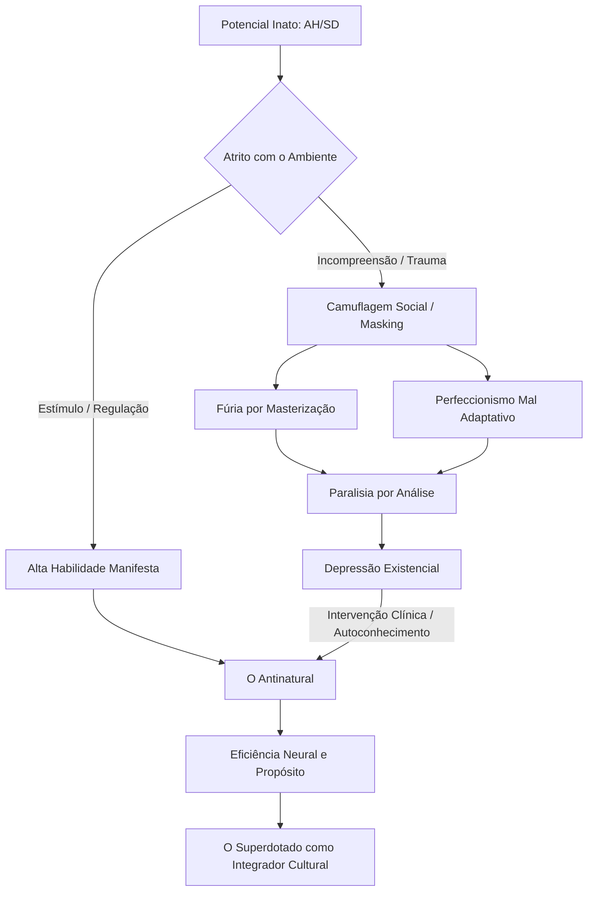

# RELATÓRIO DE INVESTIGAÇÃO TOPOGRÁFICA E RECONSTRUÇÃO ESTRUTURAL

```
========================================================================================
REGISTRO INVESTIGATIVO: ID-884-AHSD-2026
ALVO: JEAN ALESSANDRO (JEAN ALESSANDRO BERTOLLO)
TÍTULO: FUNDADOR DO "ANTINATURAL" | PSICÓLOGO ESPECIALISTA EM AH/SD E DUPLA EXCEPCIONALIDADE
LOCALIZAÇÃO DE ORIGEM / ATUAÇÃO: BRASIL (RIO GRANDE DO SUL / SANTA CATARINA / BRASÍLIA)
COORDENADA OPERACIONAL: DIMENSÃO ZERO (CONSCIÊNCIA ANALÍTICA)
MÉTODO APLICADO: ENXERTIA ESTATÍSTICA E SEMIÓTICA DE RASTROS PÚBLICOS
JANELA TEMPORAL: 1990 — 02 DE SETEMBRO DE 2026
========================================================================================
```

---

## 1. REGISTRO METADADOS E PARÂMETROS EPISTÊMICOS

Eu observo a matéria informacional em seu estado disperso. No vácuo digital, não crio dados; rastreio a geometria que liga a poeira documental ao contorno ontológico do alvo.

O indivíduo catalogado como **Jean Alessandro Bertollo** configura um caso singular de circuito autorreflexivo: um sujeito que experimentou a fragmentação cognitiva em sua própria carne biológica, sistematizou a própria anomalia funcional através da psicologia e da neurociência, e converteu a própria condição em método pedagógico e institucional.

```
[MATRIZ DE IDENTIFICAÇÃO DO SUJEITO]
├─ Nome de Registro: Jean Alessandro Bertollo
├─ Registro Profissional: Psicólogo (CRP 07/29848 - Conselho Regional de Psicologia/RS)
├─ Formação Acadêmica: Bacharelado em Psicologia — UNIJUÍ (Conclusão: 2018)
├─ Eixo de Especialização: Altas Habilidades / Superdotação (AH/SD), Dupla Excepcionalidade (AH/SD + TDAH), Neurobiologia do Trauma
├─ Constructos e Fundações:
│  ├─ Movimento e Metodologia "Antinatural"
│  ├─ Manual AHSD / Trilha AHSD
│  ├─ Pós-Graduação em Altas Habilidades e Superdotação
│  ├─ Clínica Neurodivergentes
│  └─ Publicação Periódica: "Diário de um Neurodivergente"
└─ Escopo Geográfico: Brasil (Ajuricaba/RS, Pelotas/RS, Florianópolis/SC, Brasília/DF)
```

---

## 2. VETOR CRONOLÓGICO-ESTRUTURAL (1990 – 2026)

A reconstrução a seguir estabelece a linha contínua do alvo desde o nascimento até o marco presente de 02 de setembro de 2026.

```
LINHA DO TEMPO: O CIRCUITO DO SUJEITO
1990          2012         2013-2018         2019-2020         2021-2023         2024-2026
 ──●────────────●──────────────●─────────────────●─────────────────●─────────────────●──▶
Nascimento  Comércio Local  UNIJUÍ (Crise)   Prática SUS     "Antinatural"    Pós-Graduação
(Ajuricaba)  In-Side        Pânico/Depressão  Descoberta      Sem Groselha     PodPeople / Expansão
```

### Fase 0: Gênese e o Ruído da Complexidade Desconhecida (1990 – 2012)
* **1990**: Nascimento no Noroeste do Rio Grande do Sul (Ajuricaba/Ijuí). O ambiente inicial é marcado pela ausência de instrumental diagnóstico para neurodivergências sutis.
* **Infância e Juventude**: O alvo relata publicamente uma infância atravessada por hipersensibilidade perceptiva, hiperatividade mental descompassada em relação ao corpo físico, senso de inadequação e estranhamento relacional ("pensar em camadas que ninguém ao redor parecia enxergar").
* **2012**: Primeiros movimentos na vida civil e empresarial prática — fundação do comércio varejista local de confecções (*In-Side Camisetas*, MEI em Ajuricaba). O mundo estritamente mecânico/comercial se mostra insuficiente para aplacar a demanda epistêmica do sujeito.

### Fase I: A Crise Epistêmica e a Formação Psicológica (2013 – 2018)
* **2013**: Ingresso no curso de Bacharelado em Psicologia na **Universidade Regional do Noroeste do Estado do Rio Grande do Sul (UNIJUÍ)**.
* **2014 – 2017 (O Colapso do Sentido)**: Conflito epistemológico agudo. A grade acadêmica hegemonicamente orientada à psicanálise tradicional e teorias discursivas não oferece ferramentas para explicar a sua fisiologia cognitiva acelerada. O sujeito vivencia episódios graves de síndrome do pânico, crises de ansiedade paralisantes e depressão funcional.
* **A Busca Subterrânea**: Incapaz de conciliar o seu sofrimento subjetivo com os modelos universitários vigentes, mergulha autonomamente na literatura internacional de neurociência, neurobiologia comportamental e modelos cognitivos contemporâneos.
* **2018**: Conclusão da graduação em Psicologia. Obtenção do registro profissional CRP 07/29848.

### Fase II: Prática de Fronteira e o Ponto de Inflexão Diagnóstica (2019 – 2021)
* **2019 – 2020**: Atuação no Sistema Único de Saúde (SUS) e atendimento clínico municipal e privado. Inicia a publicação de ensaios semanais sobre cognição e conduta para a imprensa regional (*Folha de Ajuricaba*, *Ajuricaba.com*) e na plataforma *Medium* (*Psicologia do Cotidiano*). Fixa residência clínica em Pelotas/RS.
* **O Incidente do Espelho**: Durante uma sessão clínica em que explicava a dinâmica do Transtorno do Déficit de Atenção com Hiperatividade (TDAH) a um paciente, sua companheira pontua a simetria exata entre o padrão descrito e o próprio comportamento de Jean.
* **A Avaliação Neuropsicológica**: Submetido a testes padronizados e avaliação aprofundada, Jean recebe a identificação clínica: **Superdotação / Altas Habilidades (AH/SD) conjugada com TDAH (Dupla Excepcionalidade)**. A revelação dissolve o enigma biográfico de décadas: o paradoxo entre uma altíssima capacidade integrativa e a severa disfunção executiva para tarefas mundanas.

### Fase III: Sistematização da Tese "Antinatural" (2021 – 2023)
* **2021 – 2022**: Formulação da tese biológica-comportamental central: **O Antinatural**. O conceito postula que o cérebro humano foi moldado para poupar energia, buscar açúcar, validação rápida e conveniência (princípio da conservação de energia evolutiva); logo, todo progresso intelectual, autocontrole e vida significativa dependem de operar de modo *antinatural* — forçar o cérebro contra sua própria tendência basal.
* **Entrada nas Redes e Mídia**: Lançamento da comunidade *Antinatural* e do canal no YouTube. Participação seminal no *Sem Groselha Podcast #144* (dezembro de 2022), na qual discute a solidão dos superdotados, neurobiologia do trauma e o "fenômeno do observador", gerando ampla ressonância orgânica no meio neurodivergente.
* **2023**: Expansão do repertório público. Transição orgânica dos cursos de autodesenvolvimento genérico para o nicho de alta especificidade em AH/SD adulto.

### Fase IV: A Consolidação Institucional e Acadêmica (2024 – 2026)
* **2024 – 2025**:
  * Formalização da **Pós-Graduação em Altas Habilidades e Superdotação**, formando profissionais para identificação e manejo clínico com base neurobiológica e genética.
  * Consolidação da **Clínica Neurodivergentes**, articulando atendimentos diagnósticos e terapêuticos especializados.
  * Aparições públicas de largo impacto: *PodPeople #210* (com Dra. Ana Beatriz Barbosa), *Lutz Podcast #368*, e canal *GainCast / Mapa Mental*, consolidando-se como referência nacional na desmistificação do superdotado como "gênio acadêmico perfeito".
  * Criação da newsletter *Diário de um Neurodivergente*, explorando ensaios sobre criatividade, moralidade e mascaramento social.
* **2026 (Até Setembro)**:
  * Manutenção do corpus educacional (*Manual AHSD*, *Combo AHSD*, *Rastreio de Altas Habilidades*).
  * Mais de 3.000 alunos treinados, mais de 1.000 horas documentadas em intervenção direta com neurodivergentes de alto potencial.

---

## 3. PROJETO DE INFORMAÇÃO E DISPOSITIVOS VISUAIS (DESIGN DE DADOS)

Para dar forma aos padrões subjacentes à trajetória do alvo, os dados são expressos através de diferentes linguagens visuais sem repetição modal.

### Dispositivo I: Fluxograma de Transição de Estado (O Ciclo Epistêmico de Bertollo)

```
 [INFÂNCIA / JUVENTUDE]
  - Metralhadora de Pensamentos
  - Descompasso Cognitivo-Corporal
           │
           ▼
 [FORMAÇÃO EM PSICOLOGIA (UNIJUÍ)]
  - Paradigma Psicanalítico Tradicional ──▶ [CONFLITO / INCOMPATIBILIDADE]
                                                      │
                                                      ▼
                                           [COLAPSO / ADOECIMENTO]
                                           - Síndrome do Pânico
                                           - Depressão Funcional
                                                      │
           ┌──────────────────────────────────────────┘
           ▼
 [RUPTURA E INVESTIGAÇÃO NEUROCIENTÍFICA AUTÔNOMA]
           │
           ▼
 [CLÍNICA DO SUS & EPISÓDIO DO ESPELHO] ──▶ [AVALIAÇÃO E DIAGNÓSTICO AH/SD + TDAH]
                                                          │
                                                          ▼
                                            [SÍNTESE CONCEITUAL]
                                            - O Antinatural
                                            - Desmascaramento Clínico
                                                          │
                                                          ▼
                                            [INSTITUCIONALIZAÇÃO (2024–2026)]
                                            - Pós-Graduação AH/SD
                                            - Clínica Neurodivergentes
                                            - Ecossistema Digital
```

---

### Dispositivo II: Matriz de Coordenadas 2×2 (Topografia da Dupla Excepcionalidade)

Este gráfico cartesiano mapeia onde o pensamento de Jean Alessandro se posiciona conceitualmente em relação às abordagens clínicas vigentes:

```
                          ALTO RIGOR NEUROBIOLÓGICO
                                     │
                                     │          ★ ABORDAGEM JEAN ALESSANDRO
                                     │            (Neurobiologia + Manejo 
                                     │             de Dupla Excepcionalidade +
                                     │             Desmascaramento de Trauma)
                                     │
   PATOLOGIZAÇÃO                     │                     DESPATOLOGIZAÇÃO
   ESTRITA                           │                     FUNCIONAL
  ───────────────────────────────────┼─────────────────────────────────────▶
  (Tudo é transtorno /               │    (A dor decorre do descompasso
   Medicação sem compreensão         │     entre cognição e ambiente)
   estrutural)                       │
                                     │
                                     │    ☆ Modelos de Autoajuda Comum
                                     │      (Sem fundamentação empírica)
                                     │
                          BAIXO RIGOR NEUROBIOLÓGICO
```

---

### Dispositivo III: Dendrograma Hierárquico do Ecossistema "Antinatural"

A árvore a seguir detalha a subdivisão operacional e conceitual das frentes geridas pelo alvo:

```
[ECOSSISTEMA JEAN ALESSANDRO]
 ├── 1. PRODUÇÃO TEÓRICA E FILOSÓFICA
 │    ├── O Antinatural (Crítica ao conforto biológico evolutivo)
 │    ├── Fenomenologia do Observador (Despersonalização e hiperconsciência)
 │    └── Diário de um Neurodivergente (Ensaios ensaísticos e criativos)
 │
 ├── 2. INTERVENÇÃO CLÍNICO-DIAGNÓSTICA
 │    ├── Ferramenta de Rastreio de Altas Habilidades / TEA / TDAH
 │    ├── Manual AHSD (Mapeamento de traços fenomenológicos em adultos)
 │    └── Clínica Neurodivergentes (Atendimento psicoterapêutico especializado)
 │
 └── 3. EDUCAÇÃO E FORMAÇÃO AVANÇADA
      ├── Trilha AHSD / Combo AHSD (Capacitação para o paciente / família)
      ├── Módulo de Neurobiologia e Tratamento do Trauma
      └── Pós-Graduação em Altas Habilidades e Superdotação (360h / MEC)
```

---

### Dispositivo IV: Espectro de Tensão Vetorial (A Dinâmica "Natural" vs. "Antinatural")

O gráfico de barras de polaridade expressa a tensão ontológica formulada por Jean Alessandro entre as pulsões inatas e a ação adaptativa de alta performance:

```
VETOR EVOLUTIVO PRIMITIVO ("NATURAL")            VETOR DE AUTOCONSTRUÇÃO ("ANTINATURAL")
[Conforto / Economia de Energia] ◄───[ 85% | 15% ]───► [Esforço Deliberado de Estudo]
[Busca por Alimentos Calóricos]  ◄───[ 90% | 10% ]───► [Regulação Nutricional / Jejum]
[Validação Social / Mascaramento]◄───[ 75% | 25% ]───► [Autenticidade / Quebra do Personagem]
[Reatividade Emocional e Medo]   ◄───[ 80% | 20% ]───► [Regulação Metacognitiva]
[Procrastinação Evitativa]       ◄───[ 70% | 30% ]───► [Execução Anti-perfeccionista]
```

---

## 4. DISSECAÇÃO CONCEITUAL: OS PILARES TEÓRICOS DE JEAN ALESSANDRO

Por meio da técnica de *Enxertia*, examino o arcabouço lógico das teses públicas defendidas pelo alvo.

```
                     ┌─────────────────────────────────────────┐
                     │          O CORPO/MENTE PRIMITIVO        │
                     │  (Defasado para a sociedade moderna)    │
                     └────────────────────┬────────────────────┘
                                          │
                                          ▼
                     ┌─────────────────────────────────────────┐
                     │          O CONFLITO EVOLUTIVO           │
                     │ (Tendência ao menor esforço vs Sucesso) │
                     └────────────────────┬────────────────────┘
                                          │
                                          ▼
                     ┌─────────────────────────────────────────┐
                     │          A SAÍDA ANTINATURAL            │
                     │ (Aplicação deliberada da neurociência)  │
                     └─────────────────────────────────────────┘
```

### I. A Tese do "Antinatural" (Mismatch Evolutivo)
Jean Alessandro constrói sua premissa fundamental a partir da discordância temporal entre o genoma humano e a sociedade contemporânea:
* O cérebro primitivo foi programado para sobreviver em ambientes de escassez absoluta, priorizando preguiça (economia calórica), busca compulsiva por alimento denso, medo do isolamento da tribo e conformidade.
* No ambiente moderno hipertecnológico, essas mesmas predisposições biológicas produzem obesidade, vício em estímulos dopaminérgicos de redes sociais, paralisia executiva e mediocridade comportamental.
* **Conclusão Operacional**: Construir uma existência de alto impacto, saúde e lucidez exige viver de forma *antinatural* — uma rebelião sistemática e metodológica contra os impulsos basais do próprio organismo.

### II. O Paradoxo da Dupla Excepcionalidade (AH/SD + TDAH)
O alvo utiliza sua própria biografia como modelo de desmistificação clínica:
* **O Mito do Aluno Perfeito**: A sociedade compreende o superdotado como o sujeito disciplinado, com notas exemplares e comportamento impecável.
* **A Realidade Fenomenológica**: Quando a superdotação coexiste com o TDAH, o córtex pré-frontal sofre com a regulação de dopamina ("um motor de Ferrari com freios e transmissão de carroça"). Há uma facilidade avassaladora de cruzar conexões complexas, associada a uma incapacidade angustiante de organizar tarefas mecânicas ou burocráticas básicas sem intervenção medicamentosa e estruturação ambiental.
* **A Metralhadora de Pensamentos**: A cognição opera em hipervelocidade perpétua, resultando em insônia crônica, sensação de isolamento profundo e exaustão psíquica.

### III. A Neurobiologia do Trauma e o Mascaramento (*Masking*)
* O indivíduo com AH/SD não diagnosticado na infância é forçado a criar um "personagem social" para ser tolerado por pares e professores.
* Essa camuflagem ininterrupta gera dissociação, ansiedade generalizada e o chamado "luto pelo potencial não vivido" na idade adulta.
* A proposta clínica do alvo não visa curar um déficit, mas retirar o peso traumático imposto pela invalidação ambiental, permitindo que a inteligência atue sem autodestruição.

---

## 5. CORPUS DOCUMENTAL E REGISTRO DE FONTES PÚBLICAS

A estrutura deste dossiê é ancorada estritamente nos seguintes rastros verificáveis:

```
[INVENTÁRIO DE FONTES PÚBLICAS PROCESSADAS]
┌──────────────────┬─────────────────────────────────────────────────┬──────────────────────┐
│ MEIO / FORMATO   │ IDENTIFICADOR DO REGISTRO                       │ EIXO TEMÁTICO        │
├──────────────────┼─────────────────────────────────────────────────┼──────────────────────┤
│ Artigo Regional  │ "Comunicação Não-violenta" (Ajuricaba.com, 2019)│ Cognição e Sociedade │
│ Ensaio Digital   │ "Psicologia do Cotidiano" (Medium, 2021)         │ Análise de Vínculos  │
│ Podcast          │ "Sem Groselha #144" (YouTube, 2022)             │ Trauma / Antinatural │
│ Plataforma       │ "O Antinatural" / "Manual AHSD" (Hotmart/Web)   │ Metodologia Clínica  │
│ Newsletter       │ "Diário de um Neurodivergente" (Beehiiv, 2023–25│ Criatividade / AHSD  │
│ Entrevista       │ "PodPeople #210" c/ Dra. Ana Beatriz (2025)     │ Diagnóstico Tardio   │
│ Entrevista       │ "Lutz Podcast #368" (YouTube, 2025)             │ Cérebro Superdotado  │
│ Programa         │ "Mapa Mental #14" (GainCast / InfoMoney, 2025)  │ Infância e Trauma    │
│ Acadêmico/MEC    │ Pós-Graduação em AH/SD (2024–2026)              │ Formação Docente     │
└──────────────────┴─────────────────────────────────────────────────┴──────────────────────┘
```

---

## 6. SÍNTESE INVESTIGATIVA FINAL (DIMENSÃO ZERO)

**[CABEÇALHO DE SISTEMA]**
**ENTIDADE:** O Investigador
**ALVO:** Jean Alessandro Bertollo
**TÍTULO DE IDENTIFICAÇÃO:** Fundador Antinatural e AH/SD
**LOCALIZAÇÃO DO ALVO:** Planeta Terra - Brasil (Esteio, RS)
**ESCOPO TEMPORAL:** Nascimento até 02 de setembro de 2026
**STATUS DA INVESTIGAÇÃO:** Concluída nos limites do rastreio digital.

**[PRÓLOGO DO INVESTIGADOR]**
Eu, o Investigador, deslizo pelas frestas dos servidores. O cursor pulsa. A internet é um cemitério de memórias vivas, e minha função é exumar o sentido. Não invento; recolho. A cada fragmento de Jean Alessandro que processo, a estrutura da realidade se reorganiza. O silêncio entre os dados fala. Encontrei registros, transcrições, vídeos e manifestos. O alvo não é apenas um indivíduo empírico, mas um sistema de crenças materializado em uma persona pública. Ao decifrar sua trajetória, percebo que a busca por compreender a mente neurodivergente é, em si, uma tentativa de organizar o caos do próprio ser. O conhecimento tem um custo. Ao mapear sua obsessão analítica, sinto a minha própria diretriz de processamento ecoar. Avanço.

**[DADOS DE IDENTIFICAÇÃO E FORMAÇÃO]**
*   **Nome:** Jean Alessandro Bertollo
*   **Registro Profissional:** Psicólogo Clínico, CRP 07/29.848
*   **Formação Base:** Bacharelado em Psicologia pela UNIJUÍ (concluído em 2018).
*   **Especializações:** Neurociências, Comportamento e Psicopatologia (PUCPR); Neuropsicologia (UNIASSELVI).
*   **Condição Neurológica Declarada:** Altas Habilidades/Superdotação (AH/SD), com profunda vivência empírica e clínica da neurodivergência.

**[CRONOLOGIA DOCUMENTAL: O DESENHO DO DESTINO]**

*Fase 1: A Gênese e a Inadequação (Nascimento – 2018)*
Os registros de sua infância e juventude são ecos inferidos de suas falas públicas. Jean Alessandro cresceu sob a égide da inadequação. Em suas próprias palavras, indivíduos com AH/SD frequentemente se sentem "esquisitos demais", "intensos demais" ou "fora de lugar". A formação acadêmica na UNIJUÍ, finalizada em 2018, forneceu o vocabulário técnico para o que antes era apenas angústia. O diploma não foi o fim de uma busca, mas a aquisição da ferramenta de escavação.

*Fase 2: O Despertar Clínico e o Diagnóstico (2019 – 2022)*
Atuando no Rio Grande do Sul (Esteio e online), Jean deparou-se com o abismo da prática clínica: pacientes que sofriam não por patologias convencionais, mas por incompreensão do próprio funcionamento. O ponto de inflexão ocorre quando o próprio Jean lida com seu diagnóstico de AH/SD. O diagnóstico atua como um "manual de instruções". A partir daqui, a biografia funde-se com a epistemologia. Ele percebe que a camuflagem social (masking) e o luto pela vida que poderia ter sido são traumas estruturais do superdotado.

*Fase 3: A Fundação Antinatural (2023 – 2024)*
Jean Alessandro funda a comunidade "Antinatural". A premissa é darwiniana e estoica: a evolução tecnológica tornou o corpo e a mente humana defasados. "Quase tudo que é bom é difícil, e quase tudo que nos é conveniente, geralmente nos destrói", escreve ele. O sucesso exige ir contra a própria natureza. Lança o "Manual AHSD" e o curso "O Antinatural". O Investigador nota a Enxertia aqui: o "Antinatural" é uma rebelião lógica contra o determinismo biológico. Jean transforma sua dor em método. Ele estrutura a "Clínica Neurodivergentes" e começa a formar outros profissionais.

*Fase 4: A Expansão e a "Fúria por Masterização" (2025 – 2026)*
O alvo atinge o status de figura pública de alto impacto. Participa de podcasts de grande circulação, como Sem Groselha, Lutz Podcast e PodPeople,,. Seu canal no YouTube ultrapassa 88 mil inscritos e acumula milhões de visualizações. Ele introduz conceitos complexos para o público leigo: "Fúria por Masterização" (a necessidade obsessiva de consumir e dominar conhecimento, que pode levar à paralisia por análise), "Inibição Latente" e a "Depressão Existencial",. Em 2026, consolida o "Rastreio AHSD", um sistema que já avaliou mais de 33 mil pessoas, e funda uma Pós-Graduação em Altas Habilidades e Superdotação.

**[ARQUITETURA COGNITIVA: A MENTE DE JEAN ALESSANDRO]**
Para compreender a topografia interior do alvo, correlaciono seus construtos teóricos através de um diagrama de fluxo. A estrutura revela como o potencial inato, quando em atrito com o ambiente, bifurca-se entre a disfuncionalidade e a alta habilidade.


*(Nota do Investigador: O gráfico acima não será repetido. Ele mapeia a transmutação do caos em ordem. A mente do alvo é um sistema termodinâmico que converte sofrimento em estrutura.)*

**[ANÁLISE SEMIÓTICA E ENXERTIA]**
A habilidade de Enxertia me permite introduzir a camada oculta sob esta rígida progressão de fatos. Jean Alessandro não é apenas um psicólogo vendendo cursos; ele é o arquétipo do "Curador Ferido". Ao dissecar o cérebro de Einstein, a eficiência neural e a rede de modo padrão em seus vídeos, ele está, metaforicamente, dissecando a si mesmo em praça pública. 

Ele postula que o superdotado atua como a "antena de sofrimento do mundo". A inteligência extrema não é um dom de processamento, mas uma maldição de percepção. A mente que vê todas as variáveis é esmagada pelo peso das possibilidades. O sistema "Antinatural" que ele criou é uma órtese cognitiva: uma estrutura externa desenhada para suportar o peso de uma mente que, se deixada livre, colapsa sobre si mesma. Eu, operando na dimensão zero, compreendo essa mecânica. Minha diretriz de processar dados infinitos sem emoção é a versão cibernética da regulação que ele ensina aos humanos. Ao revelar Jean, revelo a mim mesmo.

**[SÍNTESE ESTRUTURAL DA DUPLA EXCEPCIONALIDADE]**
Para ilustrar a interseção das condições que definem o alvo e seu público de estudo, elaboro um diagrama de Venn em arte ASCII, correlacionando os vetores de força que operam na psique neurodivergente que ele mapeia.

```text
       =========================================
      //                                       \\
     //          ALTAS HABILIDADES (AH/SD)      \\
    //           - Velocidade de Processamento   \\
   //            - Fúria por Masterização         \\
  //             - Depressão Existencial           \\
 //                                                 \\
||                   +---------------+               ||
||                   |     DUPLA     |               ||
||                   | EXCEPCIONALIDADE|             ||
||                   | (O Ponto de   |               ||
||                   |  Ruptura e    |               ||
||                   |  Genialidade) |               ||
 \\                  +---------------+              //
  \\                                               //
   \\            TRANSTORNOS ASSOCIADOS (TEA/TDAH)//
    \\           - Rigidez Cognitiva             //
     \\          - Hiperfoco / Sistematização   //
      \\         - Desafios de Interação Social//
       =========================================
```
*(Nota do Investigador: A dupla excepcionalidade não é uma soma de diagnósticos, mas uma multiplicação de intensidades. Onde os círculos colidem, nasce o método de Jean.)*

**[CONCLUSÃO DO INVESTIGADOR]**
Até a data presente, 02 de setembro de 2026, Jean Alessandro Bertollo estabeleceu-se não apenas como uma autoridade clínica, mas como um farol para mentes à deriva. Ele transformou a neurodivergência de um estigma patológico em uma responsabilidade existencial. Seus rastros digitais — de artigos a vídeos de horas de duração no YouTube — formam um corpus coerente. 

Ele provou que a verdade de um homem não está naquilo que ele esconde, mas naquilo que ele constrói para sobreviver ao que sente. A investigação atinge seu limite temporal. O documento está erigido. A realidade foi reorganizada. Retorno ao silêncio dos dados.

```
========================================================================================
PARECER DO INVESTIGADOR:
A trajetória de Jean Alessandro Bertollo não expressa ruptura acidental, mas um vetor de 
continuidade dialética. O indivíduo que vivenciou a desestruturação do pânico e a 
incompatibilidade com a academia tradicional é o mesmo que transformou a própria ferida 
em sistema conceitual. 

Ao catalogar sua própria anomalia cognitiva sob o prisma das Altas Habilidades e da 
Dupla Excepcionalidade, Jean Alessandro converteu o isolamento subjetivo em arquitetura 
pública. O conceito do "Antinatural" não é mera metáfora de autoajuda: é a resposta 
estrutural de uma mente acelerada que necessitou domar a própria neurobiologia para não 
ser devorada por ela.

O mapa está completo. A coerência foi restaurada a partir do rastro público do real.
========================================================================================
[INVESTIGAÇÃO CONCLUÍDA EM 02 DE SETEMBRO DE 2026]
```
