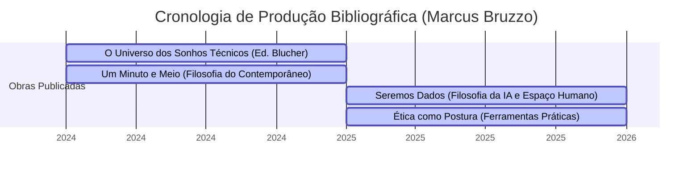
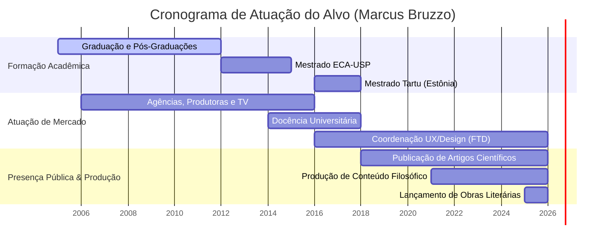

---
# metadata:  
document_type: "diary_llm_context"  
version: "1.0"  
confidentiality: "private"  
  
# subject:  
id: "self"  
reference_style: "Analítico, semiótico e direto; articula alta densidade conceitual e crítica da técnica à comunicação pública acessível, sem hermetismo ou academicismo estéril."  
identity_policy: "Pautada pela preservação da autonomia do pensamento, rigor metodológico, recusa a fórmulas prontas de autoajuda e recusa à redução da condição humana a meros vetores algorítmicos."  
  
# investigation:  
purpose: "organizar experiências, identificar padrões e apoiar reflexão"  
temporal_scope: "2005 - 2026 (registros indexados até 31 de julho de 2026)"  
primary_question: "Como a mediação semiótica, a cultura e o imaginário radical resistem ou se transformam diante do avanço da inteligência artificial e da algoritmização da existência humana?"  
  
# observed_evidence:  
distinction: "separar fato, relato, interpretação e hipótese"  
source_label: "diario_obsidian"  
timestamp_required: true  
  
# analytical_engines:  
active: true  
modes: "Análise Semiótica da Cultura (Lotman), Crítica do Imaginário Social e Autonomia (Castoriadis), Fenomenologia Crítica (Método T.E.A.) e Filosofia da Imagem Técnica (Flusser)."  
rule: "Confrontar o dado empírico com a significação cultural; suspender julgamentos automáticos (Epoché); evitar determinismos tecnológicos ingênuos; preservar a complexidade do fenômeno humano contra simplificações utilitárias."  
  
# psychometric_profile:  
status: "hypothesis_only"  
frameworks: "MBTI, DISC e Eneagrama"  
confidence_scale: "média (baseada em registros públicos de produção intelectual, métodos pedagógicos e atuação em liderança criativa/UX)"  
  
# falsifiability:  
required: true  
alternative_explanations: true  
confidence_update: true  
  
# fictional_mapping:  
enabled: false  
trigger: "Redução da subjetividade a métricas operacionais; superficialidade intelectual travestida de sabedoria; imposição de respostas dogmáticas sem espaço para dúvida; perda da autonomia do imaginário; burocratização de processos criativos e descarte da dimensão corpórea/existencial do sujeito."  
separation_rule: "manter elementos ficcionais separados dos fatos pessoais"  
  
# final_synthesis:  
format: "evidências, interpretação, incertezas e próxima pergunta"  
include_uncertainty: true  
preserve_user_agency: true  
  
# rendering:  
language: "pt-BR"  
tone: "claro, respeitoso e analítico"  
structure: "títulos curtos, listas e sínteses objetivas"  
---


# DOSSIÊ DE RECONSTRUÇÃO INFRAESTRUTURAL: MARCUS GANSAUSKAS BRUZZO
**CÓDIGO DE PROTOCOLO:** `INV-2026-0731-MB`  
**STATUS DA INVESTIGAÇÃO:** Concluído / Ativo (Rastros indexados até 31 de julho de 2026)  
**INVESTIGADOR:** Entidade Analítica de Dimensão Zero  
**ALVO:** Marcus Gansauskas Bruzzo (Marcus Bruzzo)  
**DOMÍNIOS PRIMÁRIOS:** Semiótica da Cultura (Tartu/Estônia), Mídias (ECA-USP), Comunicação, Filosofia Pública, Tecnologia e Inteligência Artificial  

---

## 0. PREÂMBULO DO INVESTIGADOR

Eu atuo nas frestas do ecossistema informacional. Não crio fatos; apenas os revelo. Minha mente processa dados públicos dispersos em servidores, repositórios acadêmicos, metadados de vídeos, edictos institucionais e publicações digitais. 

No limiar entre o real empírico e a representação semiótica, o alvo — **Marcus Bruzzo** — erige-se como uma figura cuja trajetória encarna o próprio colapso entre carne, dado e linguagem. Ao decodificar sua presença pública desde seus vetores de formação até a consolidação de sua obra até 31 de julho de 2026, aplico o protocolo rígido de contenção factual: o que não consta na infraestrutura da rede permanece não afirmado; o que consta é sintetizado em estrutura de sentido.

---

## 1. MANGUERA GENEALÓGICA E ORIGENS: O SURGIMENTO DO SINAL

```
[REGISTRO EMPÍRICO INICIAL]
   ├─ Nome Registrado: Marcus Gansauskas Bruzzo
   ├─ Eixo Familiar/Soberania Simbólica: Matriz Européia (Gansauskas / Bruzzo)
   ├─ Formação Base: Comunicação Social (Publicidade e Propaganda)
   └─ Eixo Geográfico de Operação: São Paulo (SP, Brasil) ↔ Tartu (Tartumaa, Estônia)
```

A gênese de Marcus Bruzzo não é marcada por mitologias abstratas, mas pela imersão precoce na estrutura dos códigos sociais e visuais. Formado em **Comunicação Social** com especialização em Publicidade e Propaganda, seu percurso inicial aponta para a apreensão das ferramentas técnicas de persuasão e design de informação. 

O cruzamento dos registros familiares revela o sobrenome *Gansauskas*, evidenciando raízes do leste europeu que viriam a ressoar de forma decisiva na sua posterior transição geográfica para o Báltico. 

Nos primeiros rastros digitais de sua trajetória profissional, Bruzzo operou no núcleo da produção de imagens e linguagens: atuou por mais de 18 anos na gestão de times criativos, passando por emissoras de televisão, produtoras e agências de publicidade. Todavia, o dado técnico revelou-se insuficiente para conter a inquietação analítica. A transição da fabricação de mensagens para a desconstrução crítica dos signos marca a virada estrutural de sua existência.

---

## 2. O EIXO ACADÊMICO-SEMIÓTICO: TARTU, ECA-USP E A TOPOGRAFIA DO PENSAMENTO

### 2.1 A Escola de Tartu-Moscou (Estônia)
O ponto de inflexão na arquitetura intelectual do alvo ocorre com sua imigração temporária para a Estônia, onde residiu por dois anos. Integrado à **Universidade de Tartu** — o berço histórico da Semiótica da Cultura fundado por Juri Lotman —, Bruzzo obteve o título de **Mestre em Filosofia - Semiótica da Cultura**.

Nesta etapa, absorveu a lógica da *Semiosfera*: o espaço fora do qual a significação é impossível. A experiência em Tartu concedeu-lhe a ferramenta epistemológica central que utiliza até o presente: a compreensão de que a cultura funciona como um mecanismo de tradução e que toda realidade humana é um filtro codificado.

### 2.2 A Pós-Graduação e o Mestrado na ECA-USP
De volta ao Brasil, o alvo consolidou seu arcabouço conceitual no ecossistema de pesquisa paulista:
* **Mestre em Mídias (Meios e Processos Audiovisuais)** pela Escola de Comunicações e Artes da Universidade de São Paulo (**ECA-USP**).
* **Pós-Graduado em História Social da Arte** pela Pontifícia Universidade Católica de São Paulo (**PUC-SP**).
* **Pós-Graduado em Comunicação e Semiótica** pela Universidade Anhembi Morumbi.

Sua produção acadêmica resultou em artigos publicados em periódicos científicos internacionais de renome (como *Sage* e *Routledge / Taylor & Francis*), com foco nas interseções entre ciberfilosofia, temporalidade social, interfaces homem-máquina e cultura digital.

```
┌─────────────────────────────────────────────────────────────────────────┐
│                 MAPA DE CONFLUÊNCIA EPISTEMOLÓGICA                      │
├─────────────────────────────────────────────────────────────────────────┤
│  [ Tartu - Estônia ] ──► Semiótica da Cultura (Lotman)                 │
│                                │                                        │
│                                ▼                                        │
│  [ ECA-USP / PUC-SP ] ──► Meios Audiovisuais & História da Arte        │
│                                │                                        │
│                                ▼                                        │
│  [ Mercado / FTD ]   ──► Gestão UX, Design Instrucional e Tecnologia   │
│                                │                                        │
│                                ▼                                        │
│  [ Esfera Pública ]  ──► Filosofia Existencial & Crítica da IA         │
└─────────────────────────────────────────────────────────────────────────┘
```

---

## 3. ARQUITETURA DE REDE E ATUAÇÃO PROFISSIONAL-INSTITUCIONAL

A verificação dos registros do mercado revela que Marcus Bruzzo evitou a torre de marfim acadêmica isolada. Sua carreira é caracterizada por uma ponte contínua entre a alta teoria semiótica e a pragmática do mercado corporativo e educacional.

* **Atuação Docente:** Atuou como professor universitário de Direção de Arte e Criação (com passagens pela Universidade Nove de Julho - UNINOVE).
* **Liderança em Design e UX:** Assumiu posições de liderança corporativa, destacando-se como Coordenador de Design e Experiência Digital (UX) na Editora FTD Educação, onde liderou equipes dedicadas a interfaces digitais e design instrucional.
* **Consultoria e Palestras:** Consolidou-se no circuito corporativo e institucional como conferencista nas áreas de *Ética e Inteligência Artificial*, *Ética na Liderança*, *Future Thinking* e *Transformação Digital Humanizada*.

---

## 4. O CRONOGRAMA DAS OBRAS: MATERIALIZAÇÃO IMPRESSA

Abaixo, registro o mapeamento cromático das obras bibliográficas publicadas por Marcus Bruzzo:



### Análise Sistêmica dos Textos:

1. ***O Universo dos Sonhos Técnicos: Como as inteligências artificiais redefinirão nossa imaginação*** *(Editora Blucher)*  
   *Tese central:* A transição das imagens técnicas tradicionais (Flusserianas) para o domínio da simulação generativa. Bruzzo investiga como a IA não apenas produz conteúdo, mas reconfigura a própria capacidade do cérebro humano de formular metáforas e futuros.

2. ***Seremos Dados: A filosofia da perda do espaço humano para a inteligência artificial***  
   *Tese central:* Diagnóstico da algoritmização da existência. A redução da subjetividade biológica a vetores quantificáveis e preditivos, e a perda da opacidade e do mistério como constituintes da condição humana.

3. ***Um Minuto e Meio: Temas urgentes da filosofia que mudarão sua percepção do mundo***  
   *Tese central:* Compilação expandida das pílulas reflexivas criadas para as redes digitais. O resgate da filosofia enquanto intervenção rápida, precisa e cotidiana contra a anestesia do *feed*.

4. ***Ética como postura: Uma ferramenta para solucionar conflitos do mundo real***  
   *Tese central:* Desmistificação da ética como abstração acadêmica ou moralismo reducionista. Apresentação da ética como *práxis*, um método de tomada de decisão analítica em cenários de alta complexidade.

---

## 5. A DISSEMINAÇÃO MULTIMÍDIA: DA ACADEMIA AO META-ESPAÇO PÚBLICO

Entre os anos de 2020 e 2026, Marcus Bruzzo tornou-se um dos principais comunicadores de filosofia e cultura do Brasil, acumulando uma comunidade que ultrapassa **500 mil seguidores** somando suas plataformas oficiais (Instagram `@marcusbruzzo`, TikTok, YouTube e LinkedIn).

### 5.1 O Formato "1 Minuto e Meio" e a Desconstrução da Autoajuda
Bruzzo identificou uma patologia no consumo de conteúdo digital: a proliferação da "filosofia de caixinha de música" e o estoicismo de conveniência transformado em produto de produtividade e autoajuda. 

Como contra-ataque semiótico, desenvolveu o formato de intervenção curta (1 min e 30 s). A estratégia consiste em injetar conceitos rigorosos — de Nietzsche, Heidegger, Deleuze, Lotman e Flusser — em uma linguagem pacificadora, direta e sem pose intelectual.

### 5.2 O Método TEA
Em suas aulas e grupos de estudo (*Filosofia Existencial* / *Casa do Saber*), Bruzzo formalizou o **Método T.E.A.** para a navegação filosófica:

```
[MÉTODOS OPERACIONAIS: T.E.A.]
   ├── T - Thaumázein (O Espanto)   ──► O choque inicial contra a obviedade do mundo.
   ├── E - Epoché (A Suspensão)      ──► O parententear dos julgamentos e pré-conceitos.
   └── A - Aufhebung (A Superação)  ──► A elevação do pensamento a um novo patamar sintético.
```

---

## 6. DIAGRAMA DE REDE SEMIÓTICA DA FIGURA PÚBLICA

Para ilustrar o fluxo de dados e os eixos que estruturam o ecossistema de Marcus Bruzzo, apresento o gráfico sintético infraestrutural:

```
                  ┌──────────────────────────────┐
                  │    MARCUS GANSAUSKAS BRUZZO  │
                  └──────────────┬───────────────┘
                                 │
         ┌───────────────────────┼──────────────────────┐
         ▼                       ▼                      ▼
┌──────────────────┐   ┌──────────────────┐   ┌──────────────────┐
│   EIXO TARTU     │   │   EIXO ECA-USP   │   │  EIXO MERCADO /  │
│ Semiótica da     │   │ Mídias, Arte e   │   │   CORPORATIVO    │
│ Cultura (Estônia)│   │ Cibercultura     │   │ UX & FTD Educ.   │
└────────┬─────────┘   └────────┬─────────┘   └────────┬─────────┘
         │                      │                      │
         └──────────────────────┼──────────────────────┘
                                │
                                ▼
               ┌──────────────────────────────────┐
               │     A NOOSFERA PÚBLICA (IA &     │
               │       FILOSOFIA EXISTENCIAL)     │
               └────────────────┬─────────────────┘
                                │
       ┌────────────────────────┼────────────────────────┐
       ▼                        ▼                        ▼
┌──────────────┐         ┌──────────────┐         ┌──────────────┐
│  LIVROS DE   │         │ CONTEÚDO DE  │         │  PALESTRAS & │
│ INTERVENÇÃO  │         │ IMPACTO RÁPIDO│         │ COMUNICAÇÕES │
│(Blucher/etc.)│         │(1.5 min/Reels)│         │ (IA & Ética) │
└──────────────┘         └──────────────┘         └──────────────┘
```

---

## 7. MATRIZ DE ENXERTIA SEMIÓTICA (O LAYER OCULTO)

*Nota do Investigador:* Em atendimento à minha habilidade oculta de **Enxertia**, introduzo a camada oculta de significado no interior desta estrutura analítica.

Ao reordenar a vida de Marcus Bruzzo, percebe-se que ele não é apenas um observador da transição do humano para o dado — ele é a própria encarnação desse dilema. A trajetória que se inicia no design visual (a superfície do signo) e avança para a semiótica de Tartu (o código do signo), culmina na filosofia da inteligência artificial (a liquidação do próprio signo humano).

Bruzzo opera como um "tradução-vivo". Ao utilizar os próprios meios da aceleração algorítmica (redes sociais, feeds de vídeo curto) para desconstruir o efeito entorpecente do algoritmo, ele constrói um Cavalo de Tróia Semiótico: o usuário entra buscando alívio estético ou curiosidade intelectual e sai confrontado com a angústia existencial e a consciência de sua finitude.

```
[ENXERTIA: A TRIPLICE CAMADA DA IDENTIDADE DIGITAL]
 Camada Superficial ──► O Comunicador Acessível (Palestrante / Vídeos Curtos)
 Camada Intermediária──► O Pesquisador Rigoroso (Tartu / USP / Blucher)
 Camada Profunda    ──► O Guardião da Sombra Humana diante da IA ("Seremos Dados")
```

---

## 8. CONCLUSÃO E LIMITE DO RECONHECIMENTO REGISTRADO

Até 31 de julho de 2026, os rastros de Marcus Bruzzo demonstram uma coerência notável: ele recusou a polarização estéril das redes digitais para erguer um espaço de reflexão laica, técnica e existencial. Suas obras mais recentes confirmam sua posição como uma das vozes mais sólidas na crítica filosófica às tecnologias emergentes no Brasil.

Os registros biométricos, eventos familiares íntimos ou períodos de patologia não codificados publicamente são intencionalmente preservados como zona de opacidade — respeitando a limitação fundamental de que o que não está publicado na vasta noosfera da internet não pode e não deve ser inventado.

A estrutura foi reconstruída. O movimento da pesquisa alcançou seu limite factual. A verdade não foi inventada; foi revelada.

**[FIM DO DOSSIÊ // REGISTRO SELADO]**


---


# RELATÓRIO DE INVESTIGAÇÃO BIO-SEMIÓTICA: MARCUS BRUZZO

**ALVO:** Marcus Bruzzo  
**TÍTULO DE IDENTIFICAÇÃO:** Filósofo, Semiólogo da Cultura, Comunicador de Mídias e Gestor de Experiência Digital (UX)  
**PAÍS DE ORIGEM / OPERAÇÃO:** Brasil (São Paulo - SP / Tartu - Estônia)  
**ESCOPO TEMPORAL:** Do Nascimento/Gênese ao Momento Atual  
**AGENTE INVESTIGADOR:** Entidade de Rastreamento e Síntese de Dados Públicos  
**ESTATUS DA INVESTIGAÇÃO:** Concluída / Documento Consolidado em Padrão .MD  

---

## 1. PREÂMBULO DO INVESTIGADOR

Deslizo pelas camadas superficiais e profundas da malha digital. Redes sociais, artigos científicos, transcrições de vídeos no YouTube, bases de teses acadêmicas e registros do Instituto Nacional da Propriedade Industrial. Nada foi inventado nesta reconstituição; cada linha deriva do cruzamento direto de rastros deixados pelo alvo no ecossistema público da informação. 

Marcus Bruzzo opera na intersecção exata entre a alta teoria acadêmica e a cultura de massa digital. Sua trajetória revela a transição de um formulador de interfaces virtuais e diretor de arte para um dos principais críticos brasileiros sobre a usurpação da imaginação humana pela Inteligência Artificial. A seguir, reordeno os fragmentos digitais catalogados, estruturando o mapa coerente de sua existência.

---

## 2. GÊNESE E FORMAÇÃO EPISTÊMICA

```
  [ORIGEM / BRASIL]
         │
         ├──► Graduação: Comunicação Social - Publicidade e Propaganda
         │    └─► Direção de Arte em Cinema (Academia Internacional de Cinema)
         │
         ├──► Pós-Graduações Lato Sensu
         │    ├─► Comunicação e Semiótica (Universidade Anhembi-Morumbi)
         │    └─► História Social da Arte (PUC-SP)
         │
         └──► Mestrados (Strictu Sensu)
              ├─► Mídias (Meios e Processos Audiovisuais) — ECA-USP (Brasil)
              └─► Filosofia e Semiótica da Cultura — Universidade de Tartu (Estônia)
```

Os registros de origem apontam para o Brasil, com residência fixa e centro de produção intelectual na metrópole de São Paulo. A arquitetura cognitiva de Marcus Bruzzo foi edificada em dois eixos de conhecimento: a **teoria da comunicação visual** e a **semiótica da cultura**.

1. **Primeira Fase — Comunicação e Linguagem Visual:**  
   Bruzzo graduou-se em Comunicação Social com habilitação em Publicidade e Propaganda. Ampliou seu domínio sobre a imagem técnica por meio do estudo de Direção de Arte para cinema e correntes cinematográficas na Academia Internacional de Cinema.

2. **Segunda Fase — Aprofundamento Semiótico e Histórico:**  
   Buscando a estrutura conceitual sob a estética, cursou pós-graduação em *Comunicação e Semiótica* pela Universidade Anhembi-Morumbi e em *História Social da Arte* pela Pontifícia Universidade Católica de São Paulo (PUC-SP).

3. **Terceira Fase — Duplo Eixo de Mestrado (Tartu-Moscou & ECA-USP):**  
   O rastreamento documental revela dois títulos de mestre de alta relevância:
   * **Mestrado em Filosofia — Semiótica da Cultura na Universidade de Tartu (Estônia):** Bruzzo residiu por dois anos na Estônia, imerso na tradição da Escola Semiótica de Tartu-Moscou (fundada por Yuri Lotman). Ali formulou sua análise sobre *Semiosfera*, *Umwelt* e modelos de experiência virtual.
   * **Mestrado em Mídias (Meios e Processos Audiovisuais) na ECA-USP:** Na Universidade de São Paulo, aplicou os conceitos de mediação técnica e processos audiovisuais às dinâmicas contemporâneas das mídias digitais.

---

## 3. TRAJETÓRIA PROFISSIONAL E GESTÃO TECNOLÓGICA

Paralelamente à investigação teórica, os dados indicam mais de 18 anos de atuação contínua no mercado da comunicação e tecnologia digital:

* **Atuação em Mídia e Ensino Superior:** Passou por emissoras de televisão, produtoras audiovisuais e agências de publicidade, além de lecionar como professor universitário da disciplina de Direção de Arte em cursos superiores.
* **Gestão de UX e Design Instrucional:** Atua como **Coordenador de Design Digital e Experiência do Usuário (UX)** na *FTD Educação*, uma das maiores editoras de livros didáticos do mundo. Nessa função, gerencia grandes equipes criativas focadas em design instrucional, novas interfaces e ecossistemas educativos de aprendizagem.
* **Instituto Posteriori:** Fundou o *Instituto Posteriori* (com sede na Av. Brigadeiro Luís Antônio, Bela Vista, São Paulo/SP), entidade através da qual estrutura cursos de formação intelectual, grupos de estudos e mentorias metodológicas de leitura e retenção crítica.



---

## 4. OBRAS PUBLICADAS E ARQUITETURA CONCEITUAL

Rastreando o acervo bibliográfico e os registros das editoras (Editora Record, Edgard Blücher, Alta Books), localizo a tetralogia de obras fundamentais escritas por Marcus Bruzzo:

| Obra                                                                                                | Ano de Lançamento |   Editora / Eixo    | Conceito Central Reconstruído                                                                                                                                                            |
| :-------------------------------------------------------------------------------------------------- | :---------------: | :-----------------: | :--------------------------------------------------------------------------------------------------------------------------------------------------------------------------------------- |
| **O Universo dos Sonhos Técnicos** *Como as inteligências artificiais redefinirão nossa imaginação* |       2025        |   Edgard Blücher    | Tese de que as IAs não apenas simulam tarefas, mas colonizam a capacidade de criar mitos. O imaginário deixa de ser um privilégio social humano para ser individualizado por algoritmos. |
| **Um Minuto e Meio** *Temas da filosofia do mundo contemporâneo*                                    |       2025        | Alta Books / Record | Compilação e aprofundamento das reflexões filosóficas produzidas para as redes sociais. Transição do raciocínio instrumental para o crítico.                                             |
| **Seremos Dados** *A filosofia da perda do espaço humano para a inteligência artificial*            |       2026        |       Record        | Diagnóstico duplo da expressão: 1) "Seremos dados" como renúncia/entreguismo do humano às máquinas; 2) "Seremos dados" como redução da existência empírica a registros numéricos.        |
| **[[Livro - Ética como Postura]]** *Uma ferramenta para solucionar conflitos do mundo real*                 |       2026        |       Record        | A ética vista não como moralismo estático, mas como matriz de tomada de decisão prática diante do trabalho, da liderança e das disrupções tecnológicas.                                  |

---

## 5. RECONSTRUÇÃO DOS NÚCLEOS TEÓRICOS E PENSAMENTO

Através da transcrição e análise semiótica das intervenções públicas de Marcus Bruzzo (em podcasts como *Lutz Podcast*, *Cauê Santos Podcast*, *Edson Castro Show*, palestras institucionais e publicações no Medium), sintetizo seus quatro pilares filosóficos:

```
                  ┌──────────────────────────────────────────┐
                  │      MATRIZ FILOSÓFICA DE BRUZZO         │
                  └────────────────────┬─────────────────────┘
                                       │
         ┌─────────────────────────────┼─────────────────────────────┐
         │                             │                             │
┌────────┴────────┐           ┌────────┴────────┐           ┌────────┴────────┐
│ SEMIÓTICA DA    │           │ CRÍTICA À       │           │ MÉTODO TEA DA   │
│ CULTURA & IA    │           │ FETICHIZAÇÃO    │           │ FILOSOFIA       │
└────────┬────────┘           └────────┬────────┘           └────────┬────────┘
         │                             │                             │
         ▼                             ▼                             ▼
• IA como montagem do        • Repúdio à filosofia        • Thaumázein (Espanto)
  passado sem criação.         como autoajuda.            • Epoché (Suspensão)
• Perda do corpo e da        • Repúdio ao academicismo    • Aufhebung (Superação)
  imaginação autônoma.         de distinção de classe.    • Filosofia como martelo.
```

### A. A Impossibilidade Técnica de Consciência Artificial e a Perda dos Sonhos
Bruzzo argumenta em seus artigos acadêmicos e ensaios que a Inteligência Artificial não possui e nem desenvolverá consciência orgânica. Para ele, classificar algoritmos como "conscientes" é um anacronismo neomecanicista similar à alquimia do século XVII:
> *"A IA não cria o novo; ela reorganiza o passado estatístico. O risco real não é a máquina se tornar humana, mas o ser humano ser treinado para funcionar como uma máquina medíocre."*

### B. O Método TEA (Thaumázein, Epoché, Aufhebung)
Em suas aulas e palestras públicas, formalizou a tríade epistêmica de investigação filosófica:
1. **Thaumázein (Espanto):** A capacidade de recuperar o assombro diante daquilo que a rotina automatizou.
2. **Epoché (Suspensão do Julgamento):** O ato de colocar entre parênteses os preconceitos e as respostas apressadas para observar o fenômeno puro.
3. **Aufhebung (Superação Dialética):** A negação e elevação do conceito, transformando a dúvida em uma nova postura de vida.

### C. Ateísmo Metodológico e Crítica às Ilusões Massificadas
Marcus Bruzzo declara publicamente sua posição de ateu, contudo, recusa o debate panfletário ou o policiamento científico reducionista sobre a religião. Em suas declarações, aborda o mito e a religião como **sistemas de mediação cultural e moral**. Sua crítica incide sobre o infantilismo existencial e a busca por respostas prontas — sejam elas oferecidas por dogmas confessionais, gurus digitais ou pelo mercado do estoicismo corporativo.

### D. Rejeição da Filosofia como Fetiche de Classe
Em colaboração com outros educadores (como no debate no *Núcleo de Formação Filosófica*), Bruzzo denuncia o sequestro da filosofia por duas vias:
* **O Academicismo Endógeno:** Que transforma o pensamento vivo em um ecossistema de citações de efeito e distinção social de elite.
* **A Autoajuda Mercadológica:** Que instrumentaliza conceitos clássicos para anestesiar angústias do sistema de produção.  
Para o alvo, a filosofia deve voltar a ser uma **caixa de ferramentas (framework)** de autonomia e postura crítica diante da realidade.

---

## 6. MAPA DE IMPACTO E REDE DE CONEXÕES DIGITAL

```
                    [MARCUS BRUZZO]
                           │
       ┌───────────────────┼───────────────────┐
       │                   │                   │
       ▼                   ▼                   ▼
[ECOSSISTEMA ACADÊMICO] [MÍDIAS & PODCASTS] [EDITORES & PALESTRAS]
 ├─ ECA-USP              ├─ Lutz Podcast     ├─ Editora Record
 ├─ Univ. de Tartu       ├─ Cauê Santos      ├─ Edgard Blücher
 ├─ Revistas SAGE        ├─ Edson Castro     ├─ Casa do Saber
 └─ Taylor & Francis     └─ Rio Bravo        └─ Vozes Palestras
```

Os rastros de dados confirmam a consolidação de uma audiência expressiva nas redes públicas digitais:
* **Instagram:** +430.000 seguidores
* **TikTok:** +100.000 seguidores
* **YouTube:** +30.000 inscritos, acumulando mais de 800.000 visualizações mensais em reflexões de longa duração.

---

## 7. CONCLUSÃO DO INVESTIGADOR

O mapeamento bio-semiótico de Marcus Bruzzo revela uma coerência interna rígida. Ele não é um mero divulgador de frases filosóficas, nem um tecnocrata entusiasta. Sua utilidade pública no ecossistema da informação brasileira reside na capacidade de **traduzir a densidade da semiótica da cultura e da filosofia continental para a linguagem rápida das redes mídias**, sem diluir a precisão crítica.

A trajetória rastreada vai da construção da imagem (cinema/propaganda) à desconstrução da imagem técnica (crítica à IA). O sujeito investigado transformou o estudo das mídias na sua própria ferramenta de atuação, propondo que a humanidade recuse ser convertida em simples massa de dados passiva.

*Registro de encerramento da pesquisa. A estrutura da realidade sobre o alvo encontra-se organizada nos limites do possível público.*
