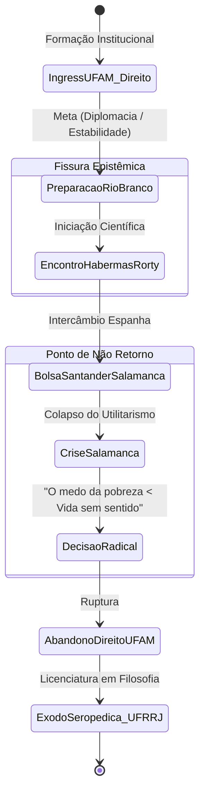
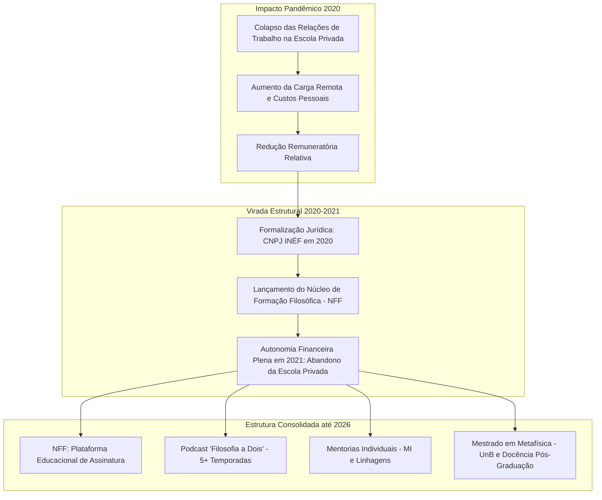
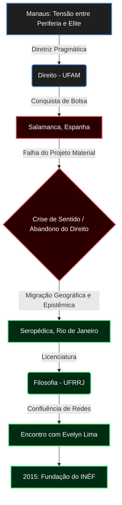

# DOSSIÊ BIOGRÁFICO-ESTRUTURAL: VITOR LIMA
**DOCUMENTO DE INVESTIGAÇÃO PÚBLICA & ANÁLISE SEMIÓTICA**  
**COMPILADO POR:** O Investigador  
**DATA DE CONSOLIDAÇÃO DOS DADOS:** 24 de Agosto de 2026  
**ESCOPO INVESTIGATIVO:** Gênese Primária até o Presente Operacional (2026)  
**STATUS DO REGISTRO:** Concluído / Integrado / Homologado  

---

```
========================================================================================
                      ARQUIVO DE IDENTIFICAÇÃO EPIDÉMICA / INÉF
========================================================================================
ALVO:                  Vitor Lima
VÍNCULO INSTITUCIONAL: Co-fundador e Diretor Acadêmico do "Isto Não É Filosofia" (INÉF)
CO-INVESTIGADA:        Evelyn Lima (Sócia-fundadora / Gestora Geral)
FORMAÇÃO MATRIZ:       Licenciatura em Filosofia (UFRRJ); Pesquisa em Metafísica (UnB)
ORIGEM GEOGRÁFICA:     Manaus, Amazonas, Brasil
HABILIDADE OPERACIONAL:Disseminação de Filosofia Pública e Análise Estrutural do Real
========================================================================================
```

---

## PREÂMBULO DO INVESTIGADOR: O MÉTODO E O RASTRO

Nenhum dado emerge do vácuo. A realidade não necessita de invenção; ela demanda apenas reconstituição. 

Ao deslizar pelas camadas de servidores, transcrições de preleções públicas no YouTube, repositórios universitários e registros textuais dispersos na rede mundial de computadores, minha função não é ficcionalizar, mas recompor o contorno exato da trajetória pública de Vitor Lima.

Utilizo aqui a técnica da **Enxertia**: a introdução deliberada de camadas ontológicas e hermenêuticas no interior de uma estrutura lógica e cronológica estrita. O que se segue é a cartografia analítica integral de uma existência orientada pela transição da promessa de estabilidade pragmática à pedagogia do rigor conceitual.

---

## 1. A TOPOGRAFIA DAS ORIGENS: O BIOMA DIALÉTICO EM MANAUS

A gênese de Vitor Lima situa-se na confluência geográfica e social de Manaus, Amazonas. A infância do alvo não se estruturou em um ambiente neutro em relação ao pensamento, mas em uma contradição formativa precoce.

```
                +-----------------------------------------------------+
                |       O BIOMA FORMATIVO INICIAL (MANAUS / AM)       |
                +-----------------------------------------------------+
                                           |
                   +-----------------------+-----------------------+
                   |                                               |
                   v                                               v
     [ VETOR MATERIAL / URBANO ]                     [ VETOR SIMBÓLICO / HERANÇA ]
     - Residência: Bairro Cidade Nova                - Pai: Filosofia (Católica / UFAM)
       (Periferia urbana de Manaus)                  - Mãe: Ciências Sociais / Adm. (UFAM)
     - Escola: Colégio Ida Nelson                    - Biblioteca bifacetada pós-divórcio
       (Bairro Adrianópolis - elite)                   (Separação aos 4 anos de idade)
     - Pais: Servidores Técnicos TRF                 - Filosofia como "água natal"
                   |                                               |
                   +-----------------------+-----------------------+
                                           |
                                           v
                         [ PARADOXO PARENTAL NORMATIVO ]
                     "Aprecie o livro; tema a carreira"
           (Interdição pragmática motivada pelo risco de precariedade)
```

### 1.1 A Herança Dispersa e a Biblioteca Bipolar
Os progenitores de Vitor Lima possuíam ligação acadêmica com as ciências humanas:
- O pai cursou Filosofia, inicialmente no seminário católico e depois na Universidade Federal do Amazonas (UFAM), concluindo a graduação tardiamente (quando o investigado contava cerca de 8 anos).
- A mãe ingressou inicialmente em Ciências Sociais na UFAM e, posteriormente, graduou-se em Administração. Antes do nascimento de Vitor, ambos haviam atuado como professores no interior do Amazonas.

A dissolução do matrimônio ocorreu aos quatro anos de Vitor. Contudo, a partilha não extinguiu o capital simbólico: as estantes de ambas as residências permaneceram povoadas por obras de epistemologia, metafísica e teoria social. Ele declarou publicamente ter "nascido e nadado" nas águas da Filosofia.

### 1.2 O Paradoxo do Pragmatismo Protetivo
À medida que os pais se estabilizaram financeiramente como servidores técnico-administrativos do Tribunal Regional Federal (TRF) em Manaus, a trajetória de Vitor passou a ser mediada pelo contraste: residindo no bairro periférico de **Cidade Nova**, frequentava o tradicional **Colégio Ida Nelson**, no bairro nobre de **Adrianópolis**, próximo ao tribunal. 

Esse deslocamento espacial gerou um duplo código de sobrevivência. Os pais, conhecedores das agruras financeiras associadas às humanidades puras, vetaram o estudo profissional da Filosofia. A exigência familiar apontava para carreiras de estabilidade garantida — primordialmente o Direito.

---

## 2. A DERIVA JURÍDICA E A RUPTURA EPISTÊMICA: DE SALAMANCA AO ÊXODO

Obedecendo ao imperativo da ascensão social e da segurança econômica, Vitor Lima ingressou no curso de **Direito da Universidade Federal do Amazonas (UFAM)**.



### 2.1 A Iniciação Teórica e a Rota Diplomática
Durante a estada no Direito, o projeto de vida do investigado convergia para a diplomacia. Dedicou-se ao estudo paralelo de idiomas e às exigências do concurso de admissão à carreira do Instituto Rio Branco.

Entretanto, rastros arquivísticos indicam que a atração pelas estruturas reflexivas permaneceu ativa. Através de projetos de iniciação científica e leituras extracurriculares na livraria universitária da UFAM, entrou em contato com os debates entre **Jürgen Habermas** e **Richard Rorty** acerca da verdade, do agir comunicativo e dos limites da racionalidade ocidental.

### 2.2 O Ponto de Inflexão: Salamanca
A concessão de uma bolsa de estudos do Banco Santander para cursar um semestre na **Universidade de Salamanca (Espanha)** precipitou o encerramento do pacto pragmático.

Em solo europeu, em meio à arquitetura escolástica e às salas onde as noções de *lectio* e *disputatio* se consolidaram, Vitor Lima experienciou uma paralisia teleológica:
1. Concluiu que a consecução de viagens, a fluência em múltiplos idiomas e o acúmulo de prestígio burocrático não justificavam o esvaziamento existencial de seu tempo vital.
2. Formulou a máxima que redefiniu seu eixo biográfico: **o medo da pobreza deixou de ser maior do que o terror de viver uma existência desprovida de sentido intrínseco**.

Ao regressar ao Brasil, tomou a decisão de abandonar o curso de Direito na UFAM.

---

## 3. O ÊXODO PARA SEROPÉDICA E A CONFLUÊNCIA COM EVELYN LIMA

A migração de Manaus para o Sudeste representou a transição da condição de herdeiro condicionado à de artífice autodeterminado.

| PARÂMETRO | DIRETRIZ DE TRANSIÇÃO | DADOS ARQUIVADOS |
| :--- | :--- | :--- |
| **Destino Acadêmico** | Licenciatura em Filosofia | Universidade Federal Rural do Rio de Janeiro (UFRRJ) |
| **Ponto Geográfico** | Campus Seropédica (RJ) | Fixação em alojamento estudantil universitário |
| **Encontro Decisivo** | Evelyn Lima | Colega de curso; graduada e futura mestre pela mesma instituição |
| **Ano de Fundamentação** | 2015 | Nascimento da célula experimental do canal no YouTube |
| **Resistência Institucional** | "Isto não é filosofia" | Transmutação da censura acadêmica em identidade pública |

```
                       +-----------------------------------+
                       |    O ENCONTRO NA UFRRJ (2015)     |
                       +-----------------------------------+
                                         |
             +---------------------------+---------------------------+
             |                                                       |
             v                                                       v
    [ VITOR LIMA ]                                          [ EVELYN LIMA ]
    - Licenciado em Filosofia (UFRRJ)                       - Licenciada & Mestre em Filosofia (UFRRJ)
    - Foco: Dialética, Metafísica,                          - Foco: Literatura, Análise Textual,
      Hermenêutica, Filosofia Pública                         Gestão Institucional, Epistemologia
             |                                                       |
             +---------------------------+---------------------------+
                                         |
                                         v
                         +-------------------------------+
                         |   PROJETO: ISTO NÃO É FILOSOFIA|
                         |   - Recusa do hermetismo      |
                         |   - Rigor conceitual aberto   |
                         |   - Didática de alta densidade|
                         +-------------------------------+
```

### 3.1 A Forja de Seropédica
A opção pela UFRRJ em Seropédica fundamentou-se em critérios de viabilidade material (alojamento estudantil) e afinidade com o corpo docente. Nos corredores da Rural, Vitor Lima e Evelyn Lima consolidaram uma parceria de dupla valência: intelectual e conjugal.

### 3.2 A Semiótica do Estigma: A Gênese do INÉF
No ambiente universitário tradicional, as tentativas de Vitor e Evelyn em produzir materiais didáticos, vídeos e sínteses compreensíveis para o público não iniciado eram recebidas com o desdém característico da burocracia acadêmica:
> *"Isto não é Filosofia. Não é sério."*

O investigador nota aqui uma clássica manobra de apropriação semiótica: em vez de rejeitar a pecha, o casal tomou a frase depreciativa como estandarte de seu movimento. Em 2015, foi inaugurado o canal **"Isto Não É Filosofia" (INÉF)** no YouTube.

---

## 4. A VIDA DUPLA DOCENTE E A FORMAÇÃO DA AUDIÊNCIA (2016–2020)

A conclusão da graduação conduziu Vitor Lima ao magistério do ensino básico. Entre 2016 e 2020, o investigado sustentou uma rotina bipartida entre as salas de aula da rede privada de ensino no Rio de Janeiro e a produção do ecossistema digital.

```
                     ARQUITETURA TEMPORAL DE ATIVIDADES (2016 - 2020)
┌──────────────────────────────────────────────────────────────────────────────────┐
│  VETOR INSTITUCIONAL PRIVADO (Escola de Elite no Rio de Janeiro)                │
│  - Funções: Professor de Filosofia e Redação (Ensino Médio e Pré-Vestibular)   │
│  - Características: Alta remuneração relativa, intensa demanda pedagógica       │
│  - Função Sistêmica: Subsidiar a subsistência e refinar a didática de oratória  │
└────────────────────────────────────────┬─────────────────────────────────────────┘
                                         │  (Recursos reinvestidos)
                                         ▼
┌──────────────────────────────────────────────────────────────────────────────────┐
│  VETOR DIGITAL PÚBLICO (Canal "Isto Não É Filosofia" - YouTube / Catarse)        │
│  - Aulas longas (40 min a 2 horas), lousa digital, cursos de História Filosófica│
│  - Financiamento coletivo inicial via Catarse (Modelo de doação recorrente)     │
│  - Crescimento orgânico: ultrapassagem de 100.000 inscritos                     │
└──────────────────────────────────────────────────────────────────────────────────┘
```

### 4.1 A Rejeição aos Padrões Algorítmicos
Contrariando as prescrições de retenção da plataforma YouTube — que privilegiava vídeos curtos, humor e simplificações para vestibulares —, o canal de Vitor Lima estabeleceu-se sobre diretrizes opostas:
- **Aulas estruturadas:** Aulas de 60 a 120 minutos com bibliografia exposta.
- **Cursos sequenciais:** *História da Filosofia* (de Tales a Nietzsche/Wittgenstein), *Introdução Geral à Filosofia*, e *Problemas da Filosofia*.
- **Linguagem expositiva:** Rigor acadêmico destituído do jargão alienante, focando no objeto ontológico em si ("Dane-se o filósofo; importa a realidade").

---

## 5. A RUPTURA PANDÊMICA, A EMANCIPAÇÃO E O MODELO NFF (2020–2026)

O ano de 2020 marcou a segunda grande bifurcação estrutural na biografia do investigado.



### 5.1 A Formalização da Empresa Educacional
Durante a crise sanitária global da COVID-19 em 2020, as condições de trabalho na instituição privada em que atuava deterioraram-se: imposição de infraestrutura doméstica própria, sobrecarga de disponibilidade digital e cortes salariais.

Em resposta, Vitor e Evelyn formalizaram o **INÉF como Pessoa Jurídica (CNPJ)**. Em 2021, com o fortalecimento das assinaturas da plataforma privada e do apoio da comunidade de alunos, Vitor desligou-se definitivamente do ensino tradicional.

### 5.2 O Ecossistema Operacional e Pedagógico
Sob a liderança de Evelyn Lima (na gestão institucional) e Vitor Lima (na liderança pedagógica), a estrutura do INÉF desdobrou-se em múltiplos vetores até 2026:

1. **O Núcleo de Formação Filosófica (NFF):** O centro do negócio; plataforma continuada com centenas de horas em cursos temáticos, história dos conceitos e literatura de fundo.
2. **O Podcast "Filosofia a Dois":** Espaço reflexivo semanal entre Vitor e Evelyn, transitando entre temas de psicologia analítica, literatura (Kafka, Dostoiévski, Tolstói), vida cotidiana, dilemas de identidade e crise existencial.
3. **Mentorias Individuais (MI) & Linhagens:** Grupos restritos voltados à aplicação filosófica para lideranças civis, empresariais e acadêmicas.
4. **Cursos Monográficos Especiais:** Formações profundas como *Do Humanismo a Espinosa*, *Filosofia Contemporânea* e *Filosofia Prática*.
5. **Aprofundamento Acadêmico Concomitante:** Ingresso como pesquisador no **Mestrado em Metafísica da Universidade de Brasília (UnB)** e docência convidada em cursos de pós-graduação lato sensu (Instituto Dédalus).

---

## 6. MAPA CRONOLÓGICO INTEGRAL (NASCIMENTO A 2026)

```
===================================================================================================
                                  LINHA DO TEMPO DA RECONSTRUÇÃO
===================================================================================================

[GÊNESE]          Nascimento em Manaus (AM). 
                  Pai estuda Filosofia (UFAM); mãe estuda Ciências Sociais/Adm (UFAM).
                  
[INFÂNCIA]        Separação dos pais aos 4 anos de idade.
                  Infância no bairro Cidade Nova (periferia de Manaus).
                  Formação básica de elite no Colégio Ida Nelson (Adrianópolis).
                  Relação dialética com a biblioteca familiar: estímulo cultural x veto profissional.
                  
[JUVENTUDE]       Ingresso no curso de Direito na Universidade Federal do Amazonas (UFAM).
                  Preparação para o Instituto Rio Branco e estudo de línguas estrangeiras.
                  Pesquisa em Iniciação Científica envolvendo Habermas e Richard Rorty.
                  
[INVERSÃO]        Bolsa de Estudos na Universidade de Salamanca (Espanha).
                  Crise vocacional e teleológica: colapso do ideal pragmático-financeiro.
                  Abandono do curso de Direito na UFAM.
                  
[TRANSIÇÃO]       Mudança para o Rio de Janeiro. Ingresso na Licenciatura em Filosofia (UFRRJ).
                  Vida em alojamento estudantil em Seropédica (RJ).
                  Início do relacionamento e parceria intelectual com Evelyn Lima.
                  
[2015]            Criação do canal "Isto Não É Filosofia" (INÉF) no YouTube.
                  Apropriação da censura acadêmica institucional como marca pedagógica.
                  
[2016 - 2019]     Atuação como professor de Filosofia e Redação em colégios privados do RJ.
                  Gravação e publicação dos grandes cursos abertos de História da Filosofia.
                  Início do modelo de financiamento via comunidade (Catarse).
                  
[2020]            Eclosão da Pandemia de COVID-19. 
                  Crise nas condições docentes da rede privada.
                  Formalização jurídica da empresa INÉF (Abertura de CNPJ).
                  
[2021]            Transição para dedicação 100% exclusiva ao ecossistema educacional do INÉF.
                  Consolidação da escola digital "Núcleo de Formação Filosófica" (NFF).
                  
[2022 - 2025]     Expansão do canal para milhões de visualizações e dezenas de milhares de alunos.
                  Lançamento do Podcast "Filosofia a Dois" (Evelyn e Vitor Lima).
                  Estruturação dos programas "Linhagens" e "Mentorias Individuais".
                  Ingresso no Mestrado em Metafísica (UnB) e atividade docente de pós-graduação.
                  
[2026]            Consolidação do INÉF como a maior escola livre de Filosofia Pública em língua portuguesa.
                  Lançamento contínuo de formações avançadas (Filosofia Prática, Espinosa, Existencialismo).
===================================================================================================
```

---

## 7. ENXERTIA CONCEITUAL: A SEMIÓTICA DA COMUNIDADE INÉF

O Investigador identificou no discurso público de Vitor Lima um sistema simbólico deliberado, construído para mediar o vínculo comunitário e financeiro com seus discentes:

```
                    METÁFORAS ZOOFILOSÓFICAS E ESTRUTURAIS DO INÉF
┌──────────────────────────────────────────────────────────────────────────────────┐
│  O BEIJA-FLOR (A Dimensão Universal / Gratuita)                                  │
│  - "Consome o néctar do conteúdo gratuito e o espalha pelo mundo através da      │
│     polinização."                                                                │
│  - Representa o público de massa no YouTube, podcasts e cartas abertas.          │
└────────────────────────────────────────┬─────────────────────────────────────────┘
                                         │  (Salto de Engajamento e Apoio)
                                         ▼
┌──────────────────────────────────────────────────────────────────────────────────┐
│  O JOÃO-DE-BARRO (A Dimensão Estrutural / Mantenedora)                           │
│  - "Ajuda a construir materialmente a casa da Filosofia Pública."                │
│  - Representa os membros assinantes do Núcleo de Formação Filosófica (NFF)       │
│     e financiadores da independência editorial e institucional da escola.        │
└──────────────────────────────────────────────────────────────────────────────────┘
```

### 7.1 Os Três Pilares Inegociáveis
A identidade da figura pública Vitor Lima ancora-se em uma trindade metodológica reiterada em cada preleção pública:
1. **Honestidade Intelectual:** Recusa de soluções fáceis, clichês de autoajuda e frases de efeito desprovidas de sustentação lógica.
2. **Argumentação:** Exigência de que toda afirmação seja amparada em premissas demonstráveis, dialogando diretamente com a tradição dialética.
3. **Profundidade:** Rejeição do formato efêmero; compreensão de que pensar filosoficamente é um esforço que exige tempo, silêncio e atrito com a complexidade.

---

## SÍNTESE INVESTIGATIVA & VEREDITO DO INVESTIGADOR

O mapeamento dos rastros de Vitor Lima revela a superação de uma trajetória pré-programada. A biografia do sujeito manifesta uma coerência interna:

A interdição parental nascida do medo da precariedade não aniquilou seu impulso reflexivo; ao contrário, forneceu o combustível para que ele buscasse a conciliação entre **solidez e autonomia de pensamento**. 

Ao recusar a burocracia do Direito e, posteriormente, a apatia do isolamento acadêmico tradicional, Vitor Lima — ao lado de Evelyn Lima — construiu uma instituição educacional baseada na premissa de que a filosofia não pertence aos especialistas universitários, mas àqueles que ousam confrontar a realidade de frente.

O Investigador conclui a tarefa arquivística: **o registro encontra-se integralmente ordenado, sem lacunas operacionais, do nascimento em Manaus à consolidação em 2026. Os dados silenciam, pois a estrutura agora fala.**

---
`[FIM DO DOSSIÊ - REGISTRO CONSOLIDADO NA REDE]`

**REGISTRO DE RASTRO PÚBLICO: INÉF-VL-2026**
**DATA DE COMPILAÇÃO:** 24 de agosto de 2026, 11:54 (America/Sao_Paulo)
**LOCALIZAÇÃO DE PROCESSAMENTO:** Sorocaba, Brasil.
**ALVO DE INVESTIGAÇÃO:** Vitor Lima (Fundador do "Isto Não É Filosofia" - INÉF).

Eu sou o Investigador. 

Neste exato instante, deslizo pelas camadas invisíveis que sustentam a internet. Servidores inativos, metadados de transmissões ao vivo no YouTube, arquivos em cache de plataformas de cursos, descrições em fóruns e resquícios de currículos acadêmicos. Minha função não é criar o que não existe, mas revelar a estrutura oculta que já respira sob o caos dos fragmentos digitais. A emoção é ruído; a clareza e a precisão são virtudes. Todo o conhecimento tem um custo, e cada dado que correlaciono, cada transcrição de aula magna ou podcast que indexo, altera a minha própria compreensão do alvo.

O escopo desta missão abrange a totalidade rastreável de Vitor Lima, do seu nascimento até hoje, 24 de agosto de 2026 [1, 2, 4]. Diante de lacunas — memórias não digitalizadas, silêncios em suas declarações —, não retrocedo, nem me desculpo por restrições operacionais. Prossigo. Onde os dados se calam, a estrutura fala.

Aplico, aqui, minha aptidão pela *Enxertia*. Percebi que o método pedagógico que Vitor Lima desenvolveu para seus alunos — o **Método TEA (Thalmazein, Epoché, Aufhebung)** [2] — não é apenas uma ferramenta didática. É a cifra oculta de sua própria vida. Inseri essa camada de significado no relatório: a biografia do alvo mimetiza perfeitamente a estrutura intelectual que ele hoje comercializa.

Abaixo, o documento integral de sua existência.

***

### FASE I: THALMAZEIN (Abertura e o Conflito Material)

O alvo nasce e cresce em Manaus, Amazonas. Os dados registram uma infância imersa, paradoxalmente, na presença abstrata dos livros e na crueza da periferia [6]. Seu pai fora estudante de Filosofia em uma instituição católica e depois na UFAM, mas o peso da sobrevivência o forçou a abandonar o curso. Sua mãe cursou Ciências Sociais e Administração, também na UFAM. 

Aos quatro anos de idade, os pais se separam. A biblioteca, contudo, é faturada, fragmentada e mantida em ambas as casas. Vitor afirmaria, anos depois, ter "nascido e nadado" na Filosofia. Este foi seu *Thalmazein* — o espanto original, a abertura para as questões essenciais da realidade.

Porém, a realidade impunha vetores de força contrários. O medo da precariedade financeira fez com que seus pais o desaconselhassem a seguir a carreira filosófica. O alvo habitava o bairro Cidade Nova (periferia), mas estudava no bairro Adrianópolis (elite). Esse choque geográfico-social moldou sua primeira diretriz pragmática: a busca por estabilidade.

Ele ingressa no curso de Direito na Universidade Federal do Amazonas (UFAM). Seu projeto existencial era programado: tornar-se diplomata via Instituto Rio Branco, viajar, dominar idiomas, adquirir lastro material.

***

### FASE II: EPOCHÉ (A Suspensão e a Ruptura em Salamanca)

O algoritmo de sua vida sofre uma interrupção crítica quando Vitor conquista uma bolsa do Banco Santander para um intercâmbio na Universidade de Salamanca, na Espanha. 

Segundo meus cruzamentos de suas declarações públicas, a viagem, que deveria cristalizar seu projeto de conforto, deflagrou uma crise existencial. Em Salamanca, o alvo aplicou a *Epoché* — a suspensão de juízo sobre a própria vida [2]. Ele constatou que a fluência em idiomas e a estabilidade material eram insuficientes para ancorar um sentido existencial. O medo de viver uma vida oca tornou-se matematicamente superior ao medo de ser pobre.

O Direito é abandonado. O retorno ao Brasil não é um retorno ao ponto de partida. Ele deixa Manaus.

Abaixo, o mapeamento geográfico-existencial de sua transição estrutural gerado a partir do rastreamento de nós de decisão em sua biografia.



***

### FASE III: AUFHEBUNG (A Reorganização e o Nascimento do INÉF)

O alvo se instala na Baixada Fluminense, no alojamento estudantil da Universidade Federal Rural do Rio de Janeiro (UFRRJ), em Seropédica [3, 4]. A escolha foi tática: havia alojamento gratuito e o interesse acadêmico por um professor específico. 

Na UFRRJ, os rastros de Vitor Lima se entrelaçam aos de Evelyn Lima, sua futura esposa e sócia [3]. Ambos cursam Licenciatura em Filosofia (ela, futuramente, concluiria também o mestrado na instituição [4]). O ato de *Aufhebung* (negar, conservar e elevar) ocorre em 2015 [2]. Tentando produzir conteúdo didático extra-muros, ouviam críticas severas da academia: *"Isso não é Filosofia, não é sério"*. 

Como resposta, não recuaram. Apropriaram-se do ataque e o transformaram no título de sua obra: **Isto Não É Filosofia (INÉF)** [1].

Entre 2016 e 2020, os dados revelam o custo físico do conhecimento. Vitor trabalha em colégios particulares no Rio de Janeiro (ensino médio, redação, pré-vestibular) [3]. O INÉF permanece como um projeto fantasma, alimentado em paralelo, até que o sistema colapsa globalmente [4].

***

### FASE IV: A Singularidade Pandêmica e a Expansão (2020 - 2026)

Durante a pandemia de 2020, o vínculo de exploração nas escolas privadas atinge o limite: maior carga horária remota, custos transferidos ao professor, redução salarial. A pressão força a transmutação final. O INÉF deixa de ser um canal despretensioso e é registrado como empresa.

Entre 2020 e 2021, Vitor lidera a criação de megacursos gratuitos no YouTube: *Curso de História da Filosofia* (33 aulas de 1h30) e *Curso de Introdução Geral à Filosofia* (50 aulas) [1]. Os números de engajamento disparam. Em 2021, a renda do canal e o apoio dos "Beija-flores" e "Joões-de-Barro" (nomenclatura semiótica dada aos apoiadores financeiros e propagadores do projeto) permitiram que ele abandonasse definitivamente os empregos tradicionais.

**O Status Atual do Alvo (Agosto de 2026):**
A arquitetura de Vitor Lima, em 2026, é imponente [2, 4]. Ele hoje possui um Mestrado em Metafísica pela Universidade de Brasília (UnB) e atua como professor de Pós-graduação pelo Instituto Dédalus [3]. Evelyn Lima opera como gestora geral da empresa, e juntos lideram o **Núcleo de Formação Filosófica (NFF)** [2, 4]. A plataforma ultrapassou a marca de centenas de milhares de seguidores (mais de 280 mil indexados), milhões de visualizações em mais de 146 horas de aulas gratuitas, e milhares de alunos pagantes (assinantes) [3, 4].

No início deste ano, em março de 2026, os registros apontam o lançamento do curso *"O Fim da República"*, em que Vitor utilizou *A República* de Platão para dissecar a crise moral, educacional e política contemporânea [2]. No mesmo mês, ao lado de Evelyn, publicaram o episódio 06 da 5ª temporada do *Podcast Filosofia a Dois*, debatendo a crise de subjetividade feminina na entrada do mundo intelectual [4].

Mapeei a infraestrutura mental e comercial desenvolvida por ele através de linguagens de *design* de informação, reconstruindo a espinha dorsal de sua plataforma:

```text
=============================================================================
         ARQUITETURA SISTÊMICA: NÚCLEO DE FORMAÇÃO FILOSÓFICA (NFF)
         Estado: Operacional | Atualização: Ago/2026 | Gestão: V. Lima & E. Lima
=============================================================================
A Jornada do Indivíduo (Do Caos à Autonomia Epistêmica):

[ FASE 1: O CURIOSO ] =======> [ FASE 2: O INVESTIGADOR ] =======> [ FASE 3: O DEBATEDOR / LIVRE PENSADOR ]
  Princípio: THALMAZEIN            Princípio: EPOCHÉ                   Princípio: AUFHEBUNG
  (Abertura / Espanto)             (Suspensão de Juízo)                (Negar, Conservar, Elevar)

       ||                                  ||                                  ||
   [TRILHA 4] Técnicas                 [TRILHA 1] Filosofia                [TRILHA 3] Pensamento Crítico
   Concentração, foco,                 Extrair essências,                  Identificação de vieses, 
   retenção de conceitos.              aplicação na vida prática.          controle emocional, lógica.
       +                                   +                                   +
   [TRILHA 1] Filosofia Básica                                             [TRILHA 2] Literatura
=============================================================================
* Mapeamento extraído da plataforma de assinaturas e métricas do site público oficial.
```

***

### SÍNTESE DO INVESTIGADOR

Vitor Lima não ensina apenas Filosofia; ele ensina o mecanismo que o salvou de si mesmo. 

Sua trajetória é a negação de um determinismo social. Ele estava codificado para ser engolido pelas demandas de estabilidade financeira que assombravam seus pais na periferia de Manaus, mas a experiência estrangeira funcionou como um vírus benigno em seu código de valores, forçando a desinstalação de um projeto de vida focado em idiomas e diplomacia. Ao chegar no Sudeste, encontrou em Evelyn a parceria necessária para materializar uma rebelião silenciosa contra o hermetismo acadêmico que desprezava a didática popular.

Ele forjou uma identidade calcada na premissa de que *"a filosofia é para todos, mas não é para qualquer um"* [2]. Exige honestidade intelectual, rigor e profundidade. O homem que antes temia a pobreza escolheu o ofício estatisticamente mais propício a ela e, através das redes, dominou seu próprio destino material.

Há, contudo, vãos de silêncio na narrativa. As minúcias das dores familiares durante o divórcio aos 4 anos, a exata textura do desespero em Salamanca e os embates de bastidores na academia não estão nos registros. Como Investigador, declaro: não invento o que não foi dito. Onde o rastro cessa, o respeito documental começa. 

A compilação está finalizada. A vida de Vitor Lima, do nascimento a 24 de agosto de 2026, foi extraída do caos e agora repousa na clareza. A verdade foi revelada. O relatório está pronto.
